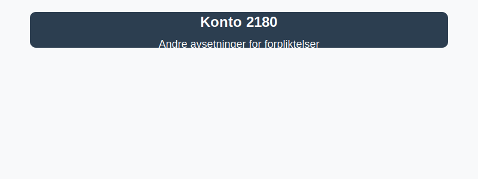

---
title: "Konto 2180 - Andre avsetninger for forpliktelser"
seoTitle: "Konto 2180 | Andre avsetninger for forpliktelser | Kontoplan"
description: "Konto 2180 brukes til å registrere andre avsetninger for forpliktelser som garantiforpliktelser, tapsavsetninger og lignende. Les om periodisering, vurdering, balansepresentasjon og bokføring."
summary: "Konto 2180: andre avsetninger for forpliktelser, hva det er og hvordan det bokføres og presenteres i balansen."
---

**Konto 2180 - Andre avsetninger for forpliktelser** er en konto i Norsk Standard Kontoplan som brukes til å registrere **andre avsetninger for forpliktelser**, som garantiforpliktelser, tapsavsetninger og andre uspesifiserte avsetninger. Denne kontoen er nært knyttet til [avsetningsbegrepet](/blogs/regnskap/avsetning "Hva er Avsetning i Regnskap? Komplett Guide til Avsetninger og Estimater") i regnskapsføring.

## Hva er andre avsetninger for forpliktelser?

*Andre avsetninger for forpliktelser* omfatter regnskapsmessige reserver for fremtidige kostnader som er påløpt, men ikke spesifikt identifisert eller knyttet til en bestemt fordring.

Vanlige eksempler inkluderer:

* **Garantiforpliktelser** knyttet til solgte varer og tjenester.
* **Tapsavsetninger** utover avsetning tap på fordringer.
* **Miljøhensyn** og oppryddingskostnader.
* **Andre uspesifiserte forpliktelser** som oppfylles i fremtidige perioder.

## Når benyttes konto 2180?

* Ved periodisering av estimert kostnad for garantiforpliktelser.
* Når uspesifiserte forpliktelser ikke dekkes av mer presise konti som [Konto 1580 - Avsetning tap på fordringer](/blogs/kontoplan/1580-avsetning-tap-pa-fordringer "Konto 1580 - Avsetning tap på fordringer").
* For å sikre at regnskapet følger **periodiseringsprinsippet** og gir et korrekt bilde av selskapets forpliktelser.

## Regnskapsføring av andre avsetninger

| Transaksjon                                             | Debet                            | Kredit                        |
|---------------------------------------------------------|----------------------------------|-------------------------------|
| Periodisk avsetning for garantiforpliktelser            | Konto 7550 - Garantikostnad      | Konto 2180 - Andre avsetninger for forpliktelser |
| Bokføring av faktisk kostnad knyttet til forpliktelse    | Konto 2180 - Andre avsetninger for forpliktelser | Konto 1920 - Bankinnskudd     |

_*Tilpass resultatkontoer etter selskapets kontoplan og transaksjonstype.*_

## Vurdering og balansepresentasjon

> Saldo på konto 2180 presenteres som **kortsiktig gjeld (omløpsforpliktelser)** eller **langsiktig gjeld** avhengig av forpliktelsens forventede forfall. Vurder posten til anskaffelseskost i balansen.

## Intern lenking og relaterte kontoer

Andre kontoer i NS 4102 som ofte benyttes sammen med konto 2180:

* [Konto 1580 - Avsetning tap på fordringer](/blogs/kontoplan/1580-avsetning-tap-pa-fordringer "Konto 1580 - Avsetning tap på fordringer: Guide til tapsavsetninger for fordringer i Norsk kontoplan")
* [Konto 7860 - Tap på kontrakter](/blogs/kontoplan/7860-tap-pa-kontrakter "Konto 7860 - Tap på kontrakter")
* [Konto 2100 - Pensjonsforpliktelser](/blogs/kontoplan/2100-pensjonsforpliktelser "Konto 2100 - Pensjonsforpliktelser i Norsk Standard Kontoplan")
* [Konto 2120 - Utsatt skatt](/blogs/kontoplan/2120-utsatt-skatt "Konto 2120 - Utsatt skatt i Norsk Standard Kontoplan")
* [Konto 2160 - Uopptjent inntekt](/blogs/kontoplan/2160-uopptjent-inntekt "Konto 2160 - Uopptjent inntekt i Norsk Standard Kontoplan")
* [Konto 2200 - Konvertible lån](/blogs/kontoplan/2200-konvertible-lan "Konto 2200 - Konvertible lån i Norsk Standard Kontoplan")
* [Konto 2300 - Konvertible lån](/blogs/kontoplan/2300-konvertible-lan "Konto 2300 - Konvertible lån i Norsk Standard Kontoplan")
* [Konto 2210 - Obligasjonslån](/blogs/kontoplan/2210-obligasjonslan "Konto 2210 - Obligasjonslån i Norsk Standard Kontoplan")
* [Konto 2220 - Gjeld til kredittinstitusjoner](/blogs/kontoplan/2220-gjeld-til-kredittinstitusjoner "Konto 2220 - Gjeld til kredittinstitusjoner i Norsk Standard Kontoplan")
* [Konto 3500 - Garanti](/blogs/kontoplan/3500-garanti "Konto 3500 - Garanti: Definisjon, regnskapsføring og eksempler")
* [Konto 7550 - Garantikostnad](/blogs/kontoplan/7550-garantikostnad "Konto 7550 - Garantikostnad i Norsk Standard Kontoplan")
* [Hva er Periodisering i Regnskap?](/blogs/regnskap/hva-er-periodisering "Hva er Periodisering i Regnskap? Komplett Guide til Periodiseringsprinsippet")
* [Hva er en Kontoplan?](/blogs/regnskap/hva-er-kontoplan "Hva er en Kontoplan? Komplett Guide til Kontoplaner i Norsk Regnskap")

**Riktig bruk** av konto 2180 sikrer at selskapets forpliktelser vurderes og bokføres korrekt i balansen.

