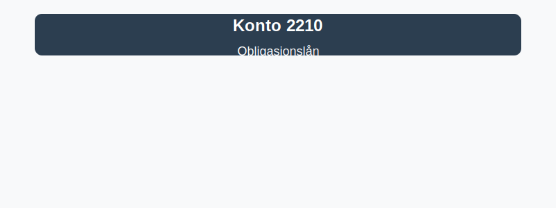

---
title: "2210-obligasjonslan"
meta_title: "2210-obligasjonslan"
meta_description: "**Konto 2210 - Obligasjonslån** er en konto i Norsk Standard Kontoplan (NS 4102) som brukes til å registrere **obligasjonslån**, dvs. langsiktige gjeldsinst..."
slug: 2210-obligasjonslan
type: blog
layout: pages/single
---

**Konto 2210 - Obligasjonslån** er en konto i Norsk Standard Kontoplan (NS 4102) som brukes til å registrere **obligasjonslån**, dvs. langsiktige gjeldsinstrumenter utstedt i obligasjonsmarkedet for å hente finansiering.



## Hva er obligasjonslån?

*Obligasjonslån* er langsiktige rentebærende gjeldspapirer hvor utsteder mottar kapital fra investorer og forplikter seg til å betale rente (kupong) og tilbakebetale nominell verdi ved forfall. Obligasjoner kan utstedes av stater, kommuner og selskaper.

## Typer obligasjonslån

Vanlige typer obligasjonslån inkluderer:

* **Statsobligasjonslån:** Utstedt av nasjonale myndigheter med svært lav kredittrisiko.
* **Kommunalobligasjonslån:** Utstedt av kommuner eller fylkeskommuner for lokale prosjekter.
* **Selskapsobligasjonslån:** Utstedt av private selskaper med varierende kredittrating.
* **Inflasjonsindekserte obligasjonslån:** Rente og/eller hovedstol justeres i henhold til inflasjon.
* **Konvertible obligasjonslån:** Kan konverteres til egenkapital på forhåndsbestemte vilkår.
* **Grønne obligasjonslån:** Øremerket finansiering av miljøvennlige prosjekter.

## Regnskapsføring av obligasjonslån

| Transaksjon                        | Debet                     | Kredit                      |
|------------------------------------|---------------------------|-----------------------------|
| Utstedelse av obligasjonslån       | Konto 1920 - Bankinnskudd | Konto 2210 - Obligasjonslån |
| Påløpte renter                     | Konto 8140 - Rentekostnad | Konto 2210 - Obligasjonslån |
| Innløsning av obligasjonslån ved forfall | Konto 2210 - Obligasjonslån | Konto 1920 - Bankinnskudd |

_*Resultat- og balanseposter kan variere etter selskapets kontoplan.*_

## Vurdering og balansepresentasjon

> Saldo på konto 2210 presenteres som **langsiktig gjeld** i balansen. Obligasjonene vurderes til amortisert kost, og påløpte renter periodiseres over løpetiden.

## Kontoplanoversikt

| Konto                                 | Kontonummer | Beskrivelse                                                  |
|---------------------------------------|-------------|--------------------------------------------------------------|
| Andre avsetninger for forpliktelser   | 2180        | Avsetninger for fremtidige forpliktelser                     |
| Konvertible lån                       | 2200        | Lån som kan konverteres til egenkapital                      |
| Gjeld til kredittinstitusjoner        | 2220        | Gjeld til banker og finansinstitusjoner for lån og kreditt   |
| **Obligasjonslån**                    | **2210**    | **Langsiktige obligasjonslån utstedt i obligasjonsmarkedet** |

## Eksempel på bokføring

```plaintext
Debet: Konto 1920 - Bankinnskudd                XXX XXX kr
Kredit: Konto 2210 - Obligasjonslån             XXX XXX kr
```

## Relaterte artikler

* [Konto 2200 - Konvertible lån](/blogs/kontoplan/2200-konvertible-lan "Konto 2200 - Konvertible lån i Norsk Standard Kontoplan")
* [Konto 2300 - Konvertible lån](/blogs/kontoplan/2300-konvertible-lan "Konto 2300 - Konvertible lån i Norsk Standard Kontoplan")
* [Konto 2180 - Andre avsetninger for forpliktelser](/blogs/kontoplan/2180-andre-avsetninger-for-forpliktelser "Konto 2180 - Andre avsetninger for forpliktelser i Norsk Standard Kontoplan")
* [Konto 2980 - Avsetninger og forpliktelser](/blogs/kontoplan/2980-avsetninger-og-forpliktelser "Konto 2980 - Avsetninger og forpliktelser i Norsk Standard Kontoplan")
* [Konto 2220 - Gjeld til kredittinstitusjoner](/blogs/kontoplan/2220-gjeld-til-kredittinstitusjoner "Konto 2220 - Gjeld til kredittinstitusjoner i Norsk Standard Kontoplan")
* [Konto 2240 - Pantelån](/blogs/kontoplan/2240-pantelan "Konto 2240 - Pantelån i Norsk Standard Kontoplan")
* [Konto 2270 - Andre valutalån](/blogs/kontoplan/2270-andre-valutalan "Konto 2270 - Andre valutalån i Norsk Standard Kontoplan")
* [Konto 8140 - Rentekostnad, ikke fradragsberettiget](/blogs/kontoplan/8140-rentekostnad-ikke-fradragsberettiget "Konto 8140 - Rentekostnad, ikke fradragsberettiget i Norsk Standard Kontoplan")
* [Hva er langsiktig gjeld?](/blogs/regnskap/langsiktig-gjeld "Hva er Langsiktig gjeld? Komplett guide til langsiktig gjeld i norsk regnskap")
