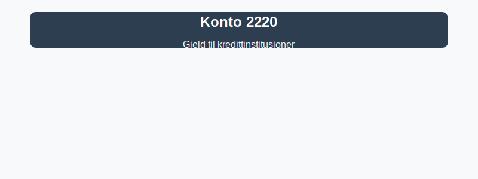

**Konto 2220 - Gjeld til kredittinstitusjoner** er en konto i Norsk Standard Kontoplan (NS 4102) som brukes til å registrere **gjeld til kredittinstitusjoner**, det vil si lån, kassekreditt og andre kredittavtaler inngått med banker og finansinstitusjoner.

## Hva er gjeld til kredittinstitusjoner?

*Gjeld til kredittinstitusjoner* omfatter alle former for **kortsiktig og langsiktig gjeld** knyttet til kredittlinjer, lån og finansielle avtaler fra banker og finansforetak. Dette kan inkludere:

* **Kassekreditt** opptil avtalt grense.
* **Serielån** og **annuitetslån** med ulike avdragsplaner.
* **Termingarantier** og finansielle kredittfasiliteter.
* **Revolverende lån**.

Gjeld til kredittinstitusjoner gir virksomheten tilgang til ekstern finansiering, men medfører også forpliktelser i form av renter og avdrag.

## NÃ¥r benyttes konto 2220?

Konto 2220 benyttes for å bokføre transaksjoner som oppstår når selskapet:

* Tar opp ny **kassekreditt** eller lån fra bank.
* Innbetaler avdrag og renter på eksisterende låneavtaler.
* Forfaller til betaling av langsiktige lån med avdragsbeløp som bokføres som kortsiktig gjeld.
* Etablerer nye kredittfasiliteter eller garantipakter.

## Regnskapsføring av gjeld til kredittinstitusjoner

| Transaksjon                                    | Debet                               | Kredit                                |
|------------------------------------------------|-------------------------------------|---------------------------------------|
| Opprettelse av kassekreditt                    | Konto 1920 - Bankinnskudd           | Konto 2220 - Gjeld til kredittinstitusjoner |
| Utbetaling av lån (serielån/annuitetslån)       | Konto 1920 - Bankinnskudd           | Konto 2220 - Gjeld til kredittinstitusjoner |
| Påløpte renter på lån                          | Konto 8150 - Rentekostnad           | Konto 2220 - Gjeld til kredittinstitusjoner |
| Avdrag på langsiktig lån                       | Konto 2220 - Gjeld til kredittinstitusjoner | Konto 1920 - Bankinnskudd           |

_*Resultat- og balanseposter kan variere ved avtaler med avdragsfrihet eller rentefrie perioder.*_

## Vurdering og balansepresentasjon

> Saldo på konto 2220 presenteres som **kortsiktig gjeld (omløpsforpliktelser)** eller **langsiktig gjeld** avhengig av forfallstidspunktet. Vurder gjelden til amortisert kost i balansen, inkludert eventuelle etableringsgebyrer.

## Intern lenking og relaterte kontoer

Andre kontoer i NS 4102 som ofte benyttes sammen med konto 2220:

* [Konto 2200 - Konvertible lån](/blogs/kontoplan/2200-konvertible-lan "Konto 2200 - Konvertible lån i Norsk Standard Kontoplan")
* [Konto 2300 - Konvertible lån](/blogs/kontoplan/2300-konvertible-lan "Konto 2300 - Konvertible lån i Norsk Standard Kontoplan")
* [Konto 2210 - Obligasjonslån](/blogs/kontoplan/2210-obligasjonslan "Konto 2210 - Obligasjonslån i Norsk Standard Kontoplan")
* [Konto 2240 - Pantelån](/blogs/kontoplan/2240-pantelan "Konto 2240 - Pantelån i Norsk Standard Kontoplan")
* [Konto 2270 - Andre valutalån](/blogs/kontoplan/2270-andre-valutalan "Konto 2270 - Andre valutalån i Norsk Standard Kontoplan")
* [Konto 2260 - Gjeld til selskap i samme konsern](/blogs/kontoplan/2260-gjeld-til-selskap-i-samme-konsern "Konto 2260 - Gjeld til selskap i samme konsern i Norsk Standard Kontoplan")
* [Konto 2180 - Andre avsetninger for forpliktelser](/blogs/kontoplan/2180-andre-avsetninger-for-forpliktelser "Konto 2180 - Andre avsetninger for forpliktelser i Norsk Standard Kontoplan")
* [Hva er gjeld?](/blogs/regnskap/hva-er-gjeld "Hva er Gjeld i Regnskap? Komplett Guide til Forpliktelser og Gjeldstyper")
* [Hva er en Kontoplan?](/blogs/regnskap/hva-er-kontoplan "Hva er en Kontoplan? Komplett Guide til Kontoplaner i Norsk Regnskap")
* [Konto 2380 - Kassekreditt](/blogs/kontoplan/2380-kassekreditt "Konto 2380 - Kassekreditt i Norsk Standard Kontoplan")

**Riktig bokføring** av gjeld til kredittinstitusjoner sikrer korrekte resultat- og balanseposter, og hjelper virksomheten med å holde oversikt over sine finansielle forpliktelser.

