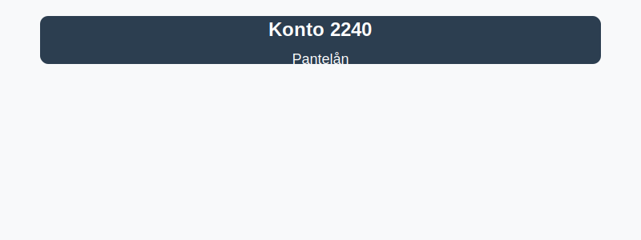

---
title: "2240-pantelan"
meta_title: "2240-pantelan"
meta_description: "**Konto 2240 - Pantelån** er en konto i Norsk Standard Kontoplan (NS 4102) som brukes til å registrere **pantelån**, det vil si lån sikret med pant i eiend..."
slug: 2240-pantelan
type: blog
layout: pages/single
---

**Konto 2240 - Pantelån** er en konto i Norsk Standard Kontoplan (NS 4102) som brukes til å registrere **pantelån**, det vil si lån sikret med pant i eiendeler som eiendom, maskiner eller andre verdigjenstander.

## Hva er pantelån?

*Pantelån* er lån som er sikret med **pant i eiendeler**, som for eksempel:
* **Eiendom**, som fast eiendom eller bygg.
* **Maskiner og teknisk utstyr**.
* **Transportmidler**, som biler og lastebiler.
* **Lagerbeholdning** eller **varebeholdning**.
* **Verdipapirer** og andre likvide eiendeler.

## NÃ¥r benyttes konto 2240?

Konto 2240 benyttes ved transaksjoner der selskapet:
* Tar opp et **pantelån** med sikkerhet i eiendeler.
* Betaler avdrag og renter på eksisterende pantelån.
* Omklassifiserer del av pantelån til kortsiktig gjeld ved forfall innen 12 måneder.
* Etablerer pantsettelser eller garantier knyttet til lån.

## Regnskapsføring av pantelån

| Transaksjon                                                | Debet                           | Kredit                      |
|------------------------------------------------------------|---------------------------------|-----------------------------|
| Opprettelse av pantelån                                    | Konto 1920 - Bankinnskudd       | Konto 2240 - Pantelån       |
| Påløpte renter på pantelån                                 | Konto 8150 - Rentekostnad       | Konto 2240 - Pantelån       |
| Avdrag på pantelån                                          | Konto 2240 - Pantelån           | Konto 1920 - Bankinnskudd   |
| Omklassifisering til kortsiktig gjeld ved forfall innen ett år | Konto 2240 - Pantelån           | Konto 2960 - Annen kortsiktig gjeld |

_*Resultat- og balanseposter kan variere ved avtaler med avdragsfrihet eller rentefrie perioder.*_

## Vurdering og balansepresentasjon

> Saldo på konto 2240 presenteres som **langsiktig gjeld** hvis forfallstidspunkt er mer enn ett år, ellers som **kortsiktig gjeld**. Vurder pantelånet til amortisert kost i balansen, inkludert etableringsgebyrer og kostnader ved pantsettelse.

## Intern lenking og relaterte kontoer

Andre kontoer i NS 4102 som ofte benyttes sammen med konto 2240:

* [Konto 2200 - Konvertible lån](/blogs/kontoplan/2200-konvertible-lan "Konto 2200 - Konvertible lån i Norsk Standard Kontoplan")
* [Konto 2300 - Konvertible lån](/blogs/kontoplan/2300-konvertible-lan "Konto 2300 - Konvertible lån i Norsk Standard Kontoplan")
* [Konto 2210 - Obligasjonslån](/blogs/kontoplan/2210-obligasjonslan "Konto 2210 - Obligasjonslån i Norsk Standard Kontoplan")
* [Konto 2220 - Gjeld til kredittinstitusjoner](/blogs/kontoplan/2220-gjeld-til-kredittinstitusjoner "Konto 2220 - Gjeld til kredittinstitusjoner i Norsk Standard Kontoplan")
* [Konto 2260 - Gjeld til selskap i samme konsern](/blogs/kontoplan/2260-gjeld-til-selskap-i-samme-konsern "Konto 2260 - Gjeld til selskap i samme konsern i Norsk Standard Kontoplan")
* [Konto 2270 - Andre valutalån](/blogs/kontoplan/2270-andre-valutalan "Konto 2270 - Andre valutalån i Norsk Standard Kontoplan")
* [Langsiktig gjeld](/blogs/regnskap/langsiktig-gjeld "Hva er Langsiktig gjeld? Komplett guide til langsiktige forpliktelser i norsk regnskap")
* [Hva er en kontoplan?](/blogs/regnskap/hva-er-kontoplan "Hva er en Kontoplan? Komplett Guide til Kontoplaner i Norsk Regnskap")

**Riktig bokføring** av pantelån sikrer korrekte resultat- og balanseposter, og hjelper virksomheten med å holde oversikt over sine sikre forpliktelser.
