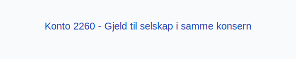

---
title: "Hva er Konto 2260 - Gjeld til selskap i samme konsern?"
meta_title: "2260-gjeld-til-selskap-i-samme-konsern"
meta_description: '**Konto 2260 - Gjeld til selskap i samme konsern** er en konto i Norsk Standard Kontoplan (NS 4102) som brukes til å registrere **kortsiktig gjeld** til andre...'
slug: 2260-gjeld-til-selskap-i-samme-konsern
type: blog
layout: pages/single
---

**Konto 2260 - Gjeld til selskap i samme konsern** er en konto i Norsk Standard Kontoplan (NS 4102) som brukes til å registrere **kortsiktig gjeld** til andre selskaper i samme konsern.

## Hva er gjeld til selskap i samme konsern?

**Gjeld til selskap i samme konsern** oppstår når ett konsernselskap har forpliktelser om tilbakebetaling eller oppgjør med et annet konsernselskap utover ordinære [leverandørgjeld](/blogs/kontoplan/2400-leverandorgjeld "Konto 2400 - Leverandørgjeld"). Dette kan inkludere for eksempel konserninterne lån, forskuddsbetalinger eller andre mellomværender.

## NÃ¥r benyttes konto 2260?

Konto 2260 benyttes ved transaksjoner som genererer kortsiktig konserngjeld, for eksempel:

* **Internlån** med forfall innen ett år.
* **Forskuddsbetalinger** fra andre konsernselskaper.
* **Sammenstilling av mellomværender** som skal gjøres opp innen kort tid.
* **Omklassifisering** av langsiktig gjeld til kortsiktig gjeld ved forfall innen året.

## Regnskapsføring av intercompany gjeld

| Transaksjon                                                      | Debet                                  | Kredit                                            |
|------------------------------------------------------------------|----------------------------------------|---------------------------------------------------|
| Opprettelse av konserninternt lån (forfall innen 12 måneder)     | Konto 1920 - Bankinnskudd              | Konto 2260 - Gjeld til selskap i samme konsern    |
| Mottatt forskuddsbetaling fra konsernselskap                     | Konto 2260 - Gjeld til selskap i samme konsern | Konto 1920 - Bankinnskudd                  |
| Tilbakebetaling av konserninternt lån                            | Konto 2260 - Gjeld til selskap i samme konsern | Konto 1920 - Bankinnskudd                  |

_* Resultat- og balanseposter kan variere ved rentefrie perioder eller avdragsordninger._*

## Praktiske hensyn

* **Konsolidering:** Sørg for eliminering av interne gjelds- og fordringsposter i konsernregnskapet.
* **Valuta:** Ved internasjonale mellomværender, følg [valutakursprinsippet](/blogs/regnskap/hva-er-valutakurs "Hva er Valutakurs? Prinsipper for valutahåndtering i regnskap").
* **Internprising:** Dokumenter prisfastsettelse i henhold til [armslengdeprinsippet](/blogs/regnskap/hva-er-internprising "Hva er Internprising? Retningslinjer for konserninternt salg").

## Intern lenking og relaterte kontoer

Andre kontoer i NS 4102 som ofte benyttes sammen med konto 2260:

* [Konto 2200 - Konvertible lån](/blogs/kontoplan/2200-konvertible-lan "Konto 2200 - Konvertible lån i Norsk Standard Kontoplan")
* [Konto 2300 - Konvertible lån](/blogs/kontoplan/2300-konvertible-lan "Konto 2300 - Konvertible lån i Norsk Standard Kontoplan")
* [Konto 2210 - Obligasjonslån](/blogs/kontoplan/2210-obligasjonslan "Konto 2210 - Obligasjonslån i Norsk Standard Kontoplan")
* [Konto 2220 - Gjeld til kredittinstitusjoner](/blogs/kontoplan/2220-gjeld-til-kredittinstitusjoner "Konto 2220 - Gjeld til kredittinstitusjoner i Norsk Standard Kontoplan")
* [Konto 2240 - Pantelån](/blogs/kontoplan/2240-pantelan "Konto 2240 - Pantelån i Norsk Standard Kontoplan")
* [Konto 2270 - Andre valutalån](/blogs/kontoplan/2270-andre-valutalan "Konto 2270 - Andre valutalån i Norsk Standard Kontoplan")
* [Konto 1550 - Kundefordringer på selskap samme konsern](/blogs/kontoplan/1550-kundefordringer-pa-selskap-samme-konsern "Konto 1550 - Kundefordringer på selskap samme konsern")
* [Konto 1560 - Andre fordringer på selskap samme konsern](/blogs/kontoplan/1560-andre-fordringer-pa-selskap-samme-konsern "Konto 1560 - Andre fordringer på selskap samme konsern")
* [Konto 2460 - Leverandørgjeld til selskap i samme konsern](/blogs/kontoplan/2460-leverandorgjeld-til-selskap-i-samme-konsern "Konto 2460 - Leverandørgjeld til selskap i samme konsern")
* [Konto 2920 - Gjeld til selskap i samme konsern](/blogs/kontoplan/2920-gjeld-til-selskap-i-samme-konsern "Konto 2920 - Gjeld til selskap i samme konsern: Langsiktig gjeld")
* [Konto 8130 - Rentekostnad foretak i samme konsern](/blogs/kontoplan/8130-rentekostnad-foretak-i-samme-konsern "Konto 8130 - Rentekostnad foretak i samme konsern")
* [Konto 8140 - Rentekostnad, ikke fradragsberettiget](/blogs/kontoplan/8140-rentekostnad-ikke-fradragsberettiget "Konto 8140 - Rentekostnad, ikke fradragsberettiget i Norsk Standard Kontoplan")
* [Hva er Konsern?](/blogs/regnskap/hva-er-konsern "Hva er Konsern? Komplett Guide til Konsernstrukturer og Konsernregnskap")
* [Hva er en Kontoplan?](/blogs/regnskap/hva-er-kontoplan "Hva er en Kontoplan? Komplett Guide til Kontoplaner i Norsk Regnskap")
* [Hva er Mellomregningskonto?](/blogs/regnskap/mellomregningskonto "Hva er Mellomregningskonto? Guide til intercompany clearing og avstemming")

