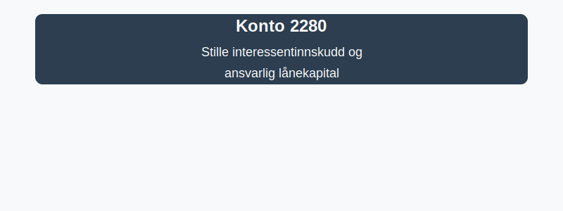

---
title: "Konto 2280 - Stille interessentinnskudd og ansvarlig lånekapital"
seoTitle: "2280-stille-interessentinnskudd-og-ansvarlig-lanekapital"
description: '**Konto 2280 - Stille interessentinnskudd og ansvarlig lånekapital** er en konto i Norsk Standard Kontoplan (NS 4102) som brukes til å registrere **stille in...'
---

**Konto 2280 - Stille interessentinnskudd og ansvarlig lånekapital** er en konto i Norsk Standard Kontoplan (NS 4102) som brukes til å registrere **stille interessentinnskudd** og **ansvarlig lånekapital**, det vil si kapitalinnskudd fra investorer eller interessenter med begrenset innsyn og avkastningsrett, men hvor innskyterne kan påta seg ansvar for selskapets forpliktelser etter avtalte vilkår.

## Hva er stille interessentinnskudd og ansvarlig lånekapital?

*stille interessentinnskudd og ansvarlig lånekapital* refererer til finansielle bidrag fra interessenter eller investorer som:

* gjøres **som kapitalinnskudd** uten at interessenten innføres som eier i selskapet (stille deltaker)
* kan gi **begrenset eller ubestemt avkastning**, ofte avtalt som en andel av overskuddet
* innebærer **begrenset ansvar** for selskapets tap, avhengig av avtalevilkår
* klassifiseres som **egenkapitalinstrumenter** eller hybridinstrumenter mellom egenkapital og gjeld

## Når benyttes konto 2280?

Konto 2280 benyttes ved transaksjoner som:

* mottak av **stille interessentinnskudd** i selskapet
* utbetaling av avkastning eller overskuddsandel til stille deltakere
* kreditering eller debitering ved deltakernes begrensede tap ved underskudd
* registrering av ansvarlig lånekapital etter avtale med interessenter

## Regnskapsføring av stille interessentinnskudd og ansvarlig lånekapital

| Transaksjon                                            | Debet                                                  | Kredit                                                  |
|--------------------------------------------------------|--------------------------------------------------------|---------------------------------------------------------|
| Mottak av stille interessentinnskudd                   | Konto 1920 - Bankinnskudd                              | Konto 2280 - Stille interessentinnskudd og ansvarlig lånekapital   |
| Avkastning eller overskuddsandel til stille deltaker   | Konto 2280 - Stille interessentinnskudd og ansvarlig lånekapital   | Konto 8150 - Rentekostnad eller annen resultatkonto        |
| Tapbeløp for stille deltaker (begrenset ansvar)        | Konto 2280 - Stille interessentinnskudd og ansvarlig lånekapital   | Konto 7790 - Kursgevinst eller annen egenkapitalkonto      |
| Tilbakebetaling av ansvarlig lånekapital               | Konto 2280 - Stille interessentinnskudd og ansvarlig lånekapital   | Konto 1920 - Bankinnskudd                                  |

_*Tabellen kan tilpasses etter avtaler om rentebetingelser, deltakelsesprosent og tidfesting av avkastning.*_

## Vurdering og balansepresentasjon

> Saldo på konto 2280 presenteres som **egenkapital** (eventuelt under egenkapitalens egenkapitalkonti) eller som **hybridkapital** ved spesifikk presentasjon av ansvarlig lånekapital. Vurder innskuddet til **amortisert kost** med vurdering av eventuelle tap og påløpte avkastningsforpliktelser.

## Intern lenking og relaterte kontoer

Andre kontoer i NS 4102 som ofte benyttes sammen med konto 2280:

* [Konto 2000 - Aksjekapital](/blogs/kontoplan/2000-aksjekapital "Konto 2000 - Aksjekapital i Norsk Standard Kontoplan")
* [Konto 1780 - Krav på innbetaling av selskapskapital](/blogs/kontoplan/1780-krav-pa-innbetaling-av-selskapskapital "Konto 1780 - Krav på innbetaling av selskapskapital i Norsk Standard Kontoplan")
* [Konto 2010 - Egne aksjer](/blogs/kontoplan/2010-egne-aksjer "Konto 2010 - Egne aksjer i Norsk Standard Kontoplan")
* [Konto 2020 - Overkursfond](/blogs/kontoplan/2020-overkursfond "Konto 2020 - Overkursfond i Norsk Standard Kontoplan")
* [Hva er egenkapital?](/blogs/regnskap/hva-er-egenkapital "Hva er Egenkapital? Komplett Guide til Egenkapital i Regnskap")
* [Hva er en Kontoplan?](/blogs/regnskap/hva-er-kontoplan "Hva er en Kontoplan? Komplett Guide til Kontoplaner i Norsk Regnskap")

