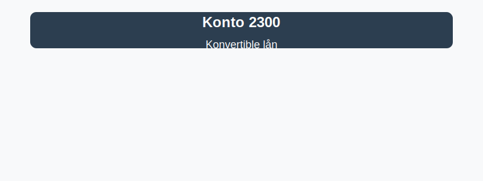

---
title: "2300-konvertible-lan"
meta_title: "2300-konvertible-lan"
meta_description: "**Konto 2300 - Konvertible lån** er en konto i Norsk Standard Kontoplan (NS 4102) som brukes til å registrere **konvertible lån**, dvs. lån som gir långiv..."
slug: 2300-konvertible-lan
type: blog
layout: pages/single
---

**Konto 2300 - Konvertible lån** er en konto i Norsk Standard Kontoplan (NS 4102) som brukes til å registrere **konvertible lån**, dvs. lån som gir långiver rett til å konvertere gjelden til egenkapital under gitte vilkår.

## Hva er konvertible lån?

*Konvertible lån* er et **hybridfinansieringsinstrument** som kombinerer egenskaper fra både gjeld og egenkapital. Långiveren har rett, men ikke plikt, til å bytte gjelden mot aksjer i selskapet på et forhåndsbestemt tidspunkt og til en avtalt pris.

Vanlige kjennetegn ved konvertible lån:

* **Konverteringskurs:** Bestemmer antall aksjer per lånebeløp.
* **Konverteringsperiode:** Angir tidsrommet lånet kan konverteres.
* **Rentevilkår:** Fast eller flytende rente som påløper frem til konvertering eller forfall.
* **Prioritet:** Stående gjeld med fortrinnsrett før egenkapital ved likvidasjon.

## NÃ¥r benyttes konto 2300?

Konto 2300 brukes når selskapet mottar eller utsteder konvertible lån for å kombinere finansiering og eieropsjoner:

* Ved emisjoner der investorer ønsker både renteavkastning og mulighet for aksjekonvertering.
* For å finansiere prosjekter eller vekst samtidig som investor får eieropsjon.
* Når selskapet ønsker fleksibilitet i kapitalstruktur og redusert [finanskostnad](/blogs/kontoplan/8170-annen-finanskostnad "Konto 8170 - Annen finanskostnad").
* I venture- og oppstartsfasen der egenkapitalvurderinger kan være krevende.

## Regnskapsføring av konvertible lån

| Transaksjon                                | Debet                     | Kredit                           |
|--------------------------------------------|---------------------------|----------------------------------|
| Utstedelse av konvertibelt lån             | Konto 1920 - Bankinnskudd | Konto 2300 - Konvertible lån     |
| Påløpte renter                             | Konto 8140 - Rentekostnad | Konto 2300 - Konvertible lån     |
| Konvertering av lån til egenkapital        | Konto 2000 - Aksjekapital | Konto 2300 - Konvertible lån     |

_*Resultat- og balanseposter kan variere etter selskapets kontoplan.*_

## Vurdering og balansepresentasjon

> Saldo på konto 2300 presenteres som **langsiktig gjeld** i balansen. Vurder lånet til amortisert kost frem til konvertering eller forfall.

## Intern lenking og relaterte kontoer

Andre kontoer i NS 4102 som ofte benyttes sammen med konto 2300:

* [Konto 2100 - Pensjonsforpliktelser](/blogs/kontoplan/2100-pensjonsforpliktelser "Konto 2100 - Pensjonsforpliktelser i Norsk Standard Kontoplan")
* [Konto 2120 - Utsatt skatt](/blogs/kontoplan/2120-utsatt-skatt "Konto 2120 - Utsatt skatt i Norsk Standard Kontoplan")
* [Konto 2160 - Uopptjent inntekt](/blogs/kontoplan/2160-uopptjent-inntekt "Konto 2160 - Uopptjent inntekt i Norsk Standard Kontoplan")
* [Konto 2180 - Andre avsetninger for forpliktelser](/blogs/kontoplan/2180-andre-avsetninger-for-forpliktelser "Konto 2180 - Andre avsetninger for forpliktelser: Guide til avsetninger for forpliktelser i Norsk kontoplan")
* [Konto 2200 - Konvertible lån](/blogs/kontoplan/2200-konvertible-lan "Konto 2200 - Konvertible lån i Norsk Standard Kontoplan")
* [Konto 2210 - Obligasjonslån](/blogs/kontoplan/2210-obligasjonslan "Konto 2210 - Obligasjonslån i Norsk Standard Kontoplan")
* [Konto 2220 - Gjeld til kredittinstitusjoner](/blogs/kontoplan/2220-gjeld-til-kredittinstitusjoner "Konto 2220 - Gjeld til kredittinstitusjoner i Norsk Standard Kontoplan")
* [Konto 2240 - Pantelån](/blogs/kontoplan/2240-pantelan "Konto 2240 - Pantelån i Norsk Standard Kontoplan")
* [Konto 2270 - Andre valutalån](/blogs/kontoplan/2270-andre-valutalan "Konto 2270 - Andre valutalån i Norsk Standard Kontoplan")
* [Konto 8140 - Rentekostnad, ikke fradragsberettiget](/blogs/kontoplan/8140-rentekostnad-ikke-fradragsberettiget "Konto 8140 - Rentekostnad, ikke fradragsberettiget i Norsk Standard Kontoplan")

**Andre relevante artikler:**

* [Hva er gjeld?](/blogs/regnskap/hva-er-gjeld "Hva er Gjeld i Regnskap? Komplett Guide til Forpliktelser og Gjeldstyper")
* [Hva er en Kontoplan?](/blogs/regnskap/hva-er-kontoplan "Hva er en Kontoplan? Komplett Guide til Kontoplaner i Norsk Regnskap")
