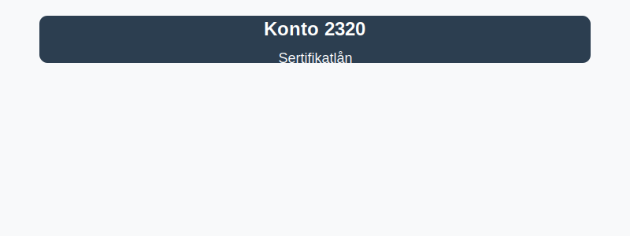

**Konto 2320 - Sertifikatlån** er en konto i Norsk Standard Kontoplan (NS 4102) som brukes til å registrere **sertifikatlån**, dvs. kortsiktige rentebærende gjeldsinstrumenter utstedt som sertifikater.

## Hva er sertifikatlån?

*Sertifikatlån* er **kortsiktige gjeldsinstrumenter** hvor låntaker utsteder sertifikater med fast eller flytende rente og løpetid vanligvis under 12 måneder. Sertifikatlån omsettes ofte i pengemarkedet og anvendes for finansiering av likviditetsbehov.

Typiske kjennetegn ved sertifikatlån:

* **Løpetid:** Vanligvis mellom 1 måned og 12 måneder.
* **Rentevilkår:** Fast eller flytende rente som avtales ved utstedelse.
* **Verdipapirform:** Utstedt som sertifikater og omsettbart i markedet.

## Regnskapsføring av sertifikatlån

| Transaksjon                        | Debet                        | Kredit                          |
|------------------------------------|------------------------------|---------------------------------|
| Utstedelse av sertifikatlån        | Konto 1920 - Bankinnskudd    | Konto 2320 - Sertifikatlån      |
| Påløpte renter                     | Konto 8140 - Rentekostnad    | Konto 2320 - Sertifikatlån      |

_*Resultat- og balanseposter kan variere etter selskapets kontoplan.*_

## Vurdering og balansepresentasjon

Saldo på konto 2320 presenteres som **kortsiktig gjeld** i balansen. Vurder sertifikatlån til anskaffelseskost eller virkelig verdi avhengig av virksomhetens regnskapsprinsipper.

## Relaterte kontoer

Andre kontoer i NS 4102 som ofte benyttes sammen med konto 2320:

* [Konto 1860 - Andre sertifikater](/blogs/kontoplan/1860-andre-sertifikater "Konto 1860 - Andre sertifikater i Norsk Standard Kontoplan")
* [Konto 1830 - Markedsbaserte obligasjoner](/blogs/kontoplan/1830-markedsbaserte-obligasjoner "Konto 1830 - Markedsbaserte obligasjoner i Norsk Standard Kontoplan")
* [Konto 1840 - Andre obligasjoner](/blogs/kontoplan/1840-andre-obligasjoner "Konto 1840 - Andre obligasjoner i Norsk Standard Kontoplan")
* [Konto 1850 - Markedsbaserte obligasjoner](/blogs/kontoplan/1850-markedsbaserte-obligasjoner "Konto 1850 - Markedsbaserte obligasjoner i Norsk Standard Kontoplan")
* [Konto 2200 - Konvertible lån](/blogs/kontoplan/2200-konvertible-lan "Konto 2200 - Konvertible lån i Norsk Standard Kontoplan")
* [Konto 2210 - Obligasjonslån](/blogs/kontoplan/2210-obligasjonslan "Konto 2210 - Obligasjonslån i Norsk Standard Kontoplan")
* [Konto 8140 - Rentekostnad, ikke fradragsberettiget](/blogs/kontoplan/8140-rentekostnad-ikke-fradragsberettiget "Konto 8140 - Rentekostnad, ikke fradragsberettiget i Norsk Standard Kontoplan")

