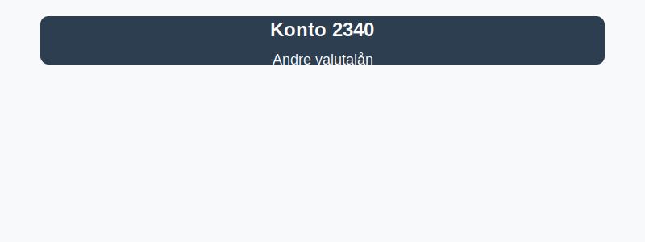

**Konto 2340 - Andre valutalån** er en konto i Norsk Standard Kontoplan (NS 4102) som brukes til å registrere **andre valutalån**, det vil si *kortsiktige* lån denominert i utenlandsk valuta som ikke dekkes av andre kontoer.

## Hva er andre valutalån?

*andre valutalån* omfatter ulike former for kortsiktige lån i **utenlandsk valuta**, for eksempel:

* **Banklån i utenlandsk valuta** (EUR, USD, GBP osv.)
* **Valutaswap-lån** og andre derivatbaserte finansieringsavtaler
* **Intercompany valutalån** mellom konsernselskaper
* **Utenlandsk kreditt** som ikke dekkes av konto 2220 eller 2260

## Når benyttes konto 2340?

Konto 2340 benyttes ved transaksjoner som:

* Tar opp **kortsiktige valutalån** i utenlandsk valuta.
* Betaler avdrag og renter på valutalån innen ett år.
* Beregner og bokfører **valutagevinster** og **valutatap** ved balansedag.
* Omklassifiserer lån til **langsiktig gjeld** (konto 2270) ved forfall om mer enn ett år.
* Vurderer og sikrer **valutarisiko** ved bruk av sikringsinstrumenter.

## Regnskapsføring av andre valutalån

| Transaksjon                                                     | Debet                         | Kredit                            |
|-----------------------------------------------------------------|-------------------------------|-----------------------------------|
| Opprettelse av kortsiktig valutalån                             | Konto 1920 - Bankinnskudd     | Konto 2340 - Andre valutalån      |
| Påløpte renter på valutalån                                     | Konto 8150 - Rentekostnad     | Konto 2340 - Andre valutalån      |
| Valutagevinst ved balansedag                                    | Konto 2340 - Andre valutalån  | Konto 7790 - Kursgevinst          |
| Valutatap ved balansedag                                        | Konto 7790 - Kursgevinst      | Konto 2340 - Andre valutalån      |
| Avdrag på kortsiktig valutalån                                  | Konto 2340 - Andre valutalån  | Konto 1920 - Bankinnskudd         |
| Omklassifisering til langsiktig gjeld ved forfall om mer enn ett år | Konto 2270 - Andre valutalån | Konto 2340 - Andre valutalån      |

_*Resultat- og balanseposter kan variere ved avtaler med avdragsfrihet eller rentefrie perioder.*_

## Vurdering og balansepresentasjon

> Saldo på konto 2340 presenteres som **kortsiktig gjeld**. Vurder valutalånet til **amortisert kost**, inkludert valutajusteringer og kostnader ved valutafordringer.

## Intern lenking og relaterte kontoer

Andre kontoer i NS 4102 som ofte benyttes sammen med konto 2340:

* [Konto 2270 - Andre valutalån](/blogs/kontoplan/2270-andre-valutalan "Konto 2270 - Andre valutalån i Norsk Standard Kontoplan")
* [Konto 2200 - Konvertible lån](/blogs/kontoplan/2200-konvertible-lan "Konto 2200 - Konvertible lån i Norsk Standard Kontoplan")
* [Konto 2300 - Konvertible lån](/blogs/kontoplan/2300-konvertible-lan "Konto 2300 - Konvertible lån i Norsk Standard Kontoplan")
* [Konto 2210 - Obligasjonslån](/blogs/kontoplan/2210-obligasjonslan "Konto 2210 - Obligasjonslån i Norsk Standard Kontoplan")
* [Konto 2220 - Gjeld til kredittinstitusjoner](/blogs/kontoplan/2220-gjeld-til-kredittinstitusjoner "Konto 2220 - Gjeld til kredittinstitusjoner i Norsk Standard Kontoplan")
* [Konto 2360 - Byggelån](/blogs/kontoplan/2360-byggelan "Konto 2360 - Byggelån i Norsk Standard Kontoplan")
* [Hva er gjeld?](/blogs/regnskap/hva-er-gjeld "Hva er Gjeld i Regnskap? Komplett Guide til Forpliktelser og Gjeldstyper")
* [Hva er en Kontoplan?](/blogs/regnskap/hva-er-kontoplan "Hva er en Kontoplan? Komplett Guide til Kontoplaner i Norsk Regnskap")
* [Konto 8160 - Valutatap (Disagio)](/blogs/kontoplan/8160-valutatap-disagio "Konto 8160 - Valutatap (Disagio)")

**Korrekt bokføring** av kortsiktige valutalån sikrer nøyaktig regnskapsføring av valutarelaterte lån og hjelper virksomheten med å styre **valutarisiko** i balansen.
