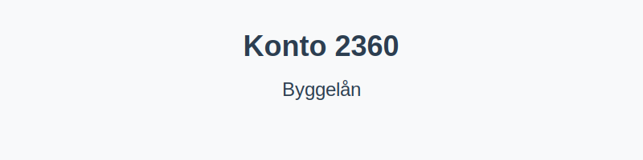

---
title: "Hva er Konto 2360 - Byggelån?"
seoTitle: "Konto 2360 | Byggelån | Kontoplan"
description: "Konto 2360 brukes til å registrere byggelån knyttet til finansiering av byggeprosjekter. Les om hvordan kontoen brukes i byggeperioden, bokføring av renter og utbetalinger, samt overføring til langsiktig lån ved ferdigstillelse."
summary: "Konto 2360: byggelån. Bruk i byggeperioden, bokføring og omklassifisering ved ferdigstillelse."
---

**Konto 2360 - Byggelån** er en konto i Norsk Standard Kontoplan (NS 4102) som brukes til å registrere **lån til byggeprosjekter**, både kortsiktige og langsiktige finansieringsbehov under oppføring eller rehabilitering.



## Hva er byggelån?

*Byggelån* er et lån som gis for å finansiere bygge- eller oppussingsprosjekter før ferdigstillelse. Lånet utbetales vanligvis trinnvis i takt med prosjektets fremdrift, og avdragsfrihet kan avtales i byggeperioden.

## Når benyttes konto 2360?

Konto 2360 benyttes ved:

* Opprettelse eller utvidelse av låneramme til bygging, rehabilitering eller ombygging av eiendom
* Utbetalinger trinnvis i byggeperioden etter fremdriftsplan
* Overføring av overskytende byggelån til langsiktig gjeld ved ferdigstillelse

## Regnskapsføring av byggelån

| Transaksjon                                         | Debet                         | Kredit                         |
|-----------------------------------------------------|-------------------------------|--------------------------------|
| Opprettelse av byggelån                              | Konto 2360 - Byggelån         | Konto 1920 - Bankinnskudd      |
| Påløpte renter i byggeperioden                      | Konto 8150 - Rentekostnad     | Konto 2360 - Byggelån          |
| Utbetaling etter fremdrift                           | Konto 2360 - Byggelån         | Konto 1920 - Bankinnskudd      |
| Overføring til langsiktig lån ved ferdigstillelse    | Konto 2240 - Pantelån         | Konto 2360 - Byggelån          |

_*Kontooppstilling kan variere etter selskapets kontoplan og låneavtaler.*_

## Klassifisering i kontoplanen

| Kontotype                | Kontonummer | Beskrivelse                                         |
|--------------------------|-------------|-----------------------------------------------------|
| Kortsiktig byggelån      | 2360        | Finansiering under oppføring, betales innen ett år   |
| Langsiktig pantelån      | 2240        | Pantelån etter ferdigstillelse                      |

## Eksempel på bokføring

Ved utbetaling av byggelån i byggeperioden:

```plaintext
Debet: Konto 2360 - Byggelån                   2–¯500–¯000 kr
Kredit: Konto 1920 - Bankinnskudd               2–¯500–¯000 kr
```

## Intern lenking og relaterte kontoer

Andre kontoer i NS 4102 som ofte benyttes sammen med konto 2360:

* [Konto 2200 - Konvertible lån](/blogs/kontoplan/2200-konvertible-lan "Konto 2200 - Konvertible lån i Norsk Standard Kontoplan")
* [Konto 2300 - Konvertible lån](/blogs/kontoplan/2300-konvertible-lan "Konto 2300 - Konvertible lån i Norsk Standard Kontoplan")
* [Konto 2210 - Obligasjonslån](/blogs/kontoplan/2210-obligasjonslan "Konto 2210 - Obligasjonslån i Norsk Standard Kontoplan")
* [Konto 2220 - Gjeld til kredittinstitusjoner](/blogs/kontoplan/2220-gjeld-til-kredittinstitusjoner "Konto 2220 - Gjeld til kredittinstitusjoner i Norsk Standard Kontoplan")
* [Konto 2240 - Pantelån](/blogs/kontoplan/2240-pantelan "Konto 2240 - Pantelån i Norsk Standard Kontoplan")
* [Konto 2260 - Gjeld til selskap i samme konsern](/blogs/kontoplan/2260-gjeld-til-selskap-i-samme-konsern "Konto 2260 - Gjeld til selskap i samme konsern i Norsk Standard Kontoplan")
* [Konto 2270 - Andre valutalån](/blogs/kontoplan/2270-andre-valutalan "Konto 2270 - Andre valutalån i Norsk Standard Kontoplan")
* [Konto 2320 - Sertifikatlån](/blogs/kontoplan/2320-sertifikatlan "Konto 2320 - Sertifikatlån i Norsk Standard Kontoplan")
* [Konto 2340 - Andre valutalån](/blogs/kontoplan/2340-andre-valutalan "Konto 2340 - Andre valutalån i Norsk Standard Kontoplan")
* [Hva er gjeld?](/blogs/regnskap/hva-er-gjeld "Hva er Gjeld i Regnskap? Komplett Guide til Forpliktelser og Gjeldstyper")
* [Hva er en Kontoplan?](/blogs/regnskap/hva-er-kontoplan "Hva er en Kontoplan? Komplett Guide til Kontoplaner i Norsk Regnskap")
* [Konto 2380 - Kassekreditt](/blogs/kontoplan/2380-kassekreditt "Konto 2380 - Kassekreditt i Norsk Standard Kontoplan")


