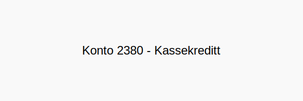

---
title: "Hva er Konto 2380 - Kassekreditt?"
seoTitle: "Konto 2380 | Kassekreditt | Kontoplan"
description: "Konto 2380 brukes til å registrere kassekreditt, en kortsiktig kredittramme i bank knyttet til selskapets konto. Les om når kontoen brukes, bokføring av renter og gebyrer og klassifisering i balansen."
summary: "Konto 2380: kassekreditt. Når den brukes, typiske føringer og klassifisering."
---

**Konto 2380 - Kassekreditt** er en konto i Norsk Standard Kontoplan (NS 4102) som brukes til å registrere **kassekreditt**, en kortsiktig kredittramme i bank.



## Hva er kassekreditt?

*Kassekreditt* er en fleksibel **kortsiktig låneramme** knyttet til selskapets bankkonto, der virksomheten kan overtrekke inntil en avtalt grense mot renter.

## Når benyttes konto 2380?

Konto 2380 benyttes ved:

* Opprettelse eller utvidelse av kassekredittavtale i bank
* Overtrekk av bankkonto utover innestående beløp
* Betaling av renter og [gebyrer knyttet til kassekreditt](/blogs/kontoplan/7770-bank-og-kortgebyrer "Konto 7770 - Bank og kortgebyrer")

## Regnskapsføring av kassekreditt

| Transaksjon                                   | Debet                         | Kredit                             |
|-----------------------------------------------|-------------------------------|------------------------------------|
| Overtrekk av kassekreditt                     | Konto 1920 - Bankinnskudd     | Konto 2380 - Kassekreditt          |
| Betalte renter og gebyrer                     | Konto 8150 - Rentekostnad     | Konto 2380 - Kassekreditt          |

_*Konvensjoner kan variere mellom selskaper avhengig av kontoplan og avtalevilkår.*_

## Klassifisering i kontoplanen

| Kontotype                  | Kontonummer | Beskrivelse                                      |
|----------------------------|-------------|--------------------------------------------------|
| Kortsiktig kredittfasilitet| 2380        | Kassekredittlinje, kortsiktig gjeld med forfall  |

## Eksempel på bokføring

Ved overtrekk av kassekreditt:

```plaintext
Debet: Konto 1920 - Bankinnskudd               150–¯000 kr
Kredit: Konto 2380 - Kassekreditt               150–¯000 kr
```

## Intern lenking og relaterte kontoer

Andre kontoer i NS 4102 som ofte benyttes sammen med konto 2380:

* [Konto 2220 - Gjeld til kredittinstitusjoner](/blogs/kontoplan/2220-gjeld-til-kredittinstitusjoner "Konto 2220 - Gjeld til kredittinstitusjoner i Norsk Standard Kontoplan")
* [Konto 7770 - Bank og kortgebyrer](/blogs/kontoplan/7770-bank-og-kortgebyrer "Konto 7770 - Bank og kortgebyrer i Norsk Standard Kontoplan")
* [Konto 1920 - Bankinnskudd](/blogs/kontoplan/1920-bankinnskudd "Konto 1920 - Bankinnskudd i Norsk Standard Kontoplan")
* [Hva er gjeld?](/blogs/regnskap/hva-er-gjeld "Hva er Gjeld i Regnskap? Komplett Guide til Forpliktelser og Gjeldstyper")
* [Hva er en Kontoplan?](/blogs/regnskap/hva-er-kontoplan "Hva er en Kontoplan? Komplett Guide til Kontoplaner i Norsk Regnskap")


