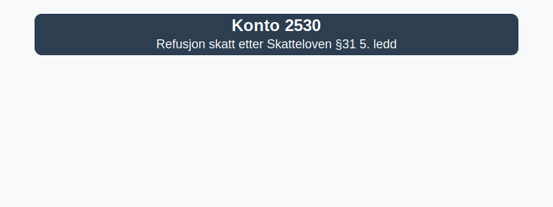

---
title: "Hva er Konto 2530 - Refusjon skatt etter Skatteloven §31 5. ledd?"
meta_title: "2530-refusjon-skatt-etter-skatteloven-31-5-ledd"
meta_description: '**Konto 2530 - Refusjon skatt etter Skatteloven §31 5. ledd** er en konto i Norsk Standard Kontoplan som brukes når virksomheten har betalt for mye skatt og h...'
slug: 2530-refusjon-skatt-etter-skatteloven-31-5-ledd
type: blog
layout: pages/single
---

**Konto 2530 - Refusjon skatt etter Skatteloven §31 5. ledd** er en konto i Norsk Standard Kontoplan som brukes når virksomheten har betalt for mye skatt og har krav på **skatterefusjon** fra skattemyndighetene i henhold til _Skatteloven §–¯31 femte ledd_.

## Hva er skatterefusjon etter Skatteloven §–¯31 femte ledd?

_Skatteloven §–¯31 femte ledd_ gir virksomheter rett til å kreve tilbakebetalt overbetalt forskuddsskatt. Dette skjer når det samlede beløpet innbetalt som forskuddsskatt overstiger den endelige skattekostnaden for perioden.

## Når benyttes Konto 2530?

Konto 2530 brukes typisk ved:

* Overbetaling av forskuddsskatt som følge av feilberegning eller endret skattegrunnlag.
* Endring i skattemelding som reduserer faktisk skattekostnad sammenlignet med forskuddsbetaling.
* Tilbakebetaling fra skattemyndighetene etter oppgjør av skatt.

## Regnskapsføring av skatterefusjon

| Situasjon                                             | Debet                                                            | Kredit                                                                                             |
|-------------------------------------------------------|------------------------------------------------------------------|----------------------------------------------------------------------------------------------------|
| Bokføring av krav på skatterefusjon                    | Konto 2530 - Refusjon skatt etter Skatteloven §31 5. ledd       | Konto 2500 - Betalbar skatt, ikke utlignet                                                         |
| Mottatt skatterefusjon (utbetaling fra Skatteetaten)   | Konto 1920 - Bankinnskudd                                        | Konto 2530 - Refusjon skatt etter Skatteloven §31 5. ledd                                           |

## Klassifisering i kontoplanen

| Kontotype                     | Kontonummer | Beskrivelse                                                 |
|-------------------------------|-------------|-------------------------------------------------------------|
| Betalbar skatt, ikke utlignet | 2500        | Betalbar skatt før utligning                                |
| Betalbar skatt, utlignet      | 2510        | Betalbar skatt utlignet mot forskudd                        |
| Refusjon skatt                | 2530        | Krav på skatterefusjon etter Skatteloven §–¯31 femte ledd     |
| Utsatt skatt                  | 2120        | Skatt som skal betales i fremtiden (Deferred Tax Liability) |
| Utsatt skattfordel            | 1070        | Fradrag for utsatt skatt (Deferred Tax Asset)               |

## Sammenheng med andre konti

Se også:

* [Konto 2500 - Betalbar skatt, ikke utlignet](/blogs/kontoplan/2500-betalbar-skatt-ikke-utlignet "Konto 2500 - Betalbar skatt, ikke utlignet")
* [Konto 2510 - Betalbar skatt, utlignet](/blogs/kontoplan/2510-betalbar-skatt-utlignet "Konto 2510 - Betalbar skatt, utlignet")
* [Konto 2530 - Refusjon skatt etter Skatteloven §31 5. ledd](/blogs/kontoplan/2530-refusjon-skatt-etter-skatteloven-31-5-ledd "Konto 2530 - Refusjon skatt etter Skatteloven §31 5. ledd")
* [Konto 2120 - Utsatt skatt](/blogs/kontoplan/2120-utsatt-skatt "Konto 2120 - Utsatt skatt")
* [Konto 1070 - Utsatt skattfordel](/blogs/kontoplan/1070-utsatt-skattfordel "Konto 1070 - Utsatt skattfordel")
* [Konto 2540 - Forhåndsskatt](/blogs/kontoplan/2540-forhaandskatt "Konto 2540 - Forhåndsskatt")
* [Konto 2600 - Skyldig forskuddstrekk](/blogs/kontoplan/2600-forskuddstrekk "Konto 2600 - Skyldig forskuddstrekk")
* [Konto 2610 - Påleggstrekk](/blogs/kontoplan/2610-paalleggstrekk "Konto 2610 - Påleggstrekk")
* [Betalbar skatt](/blogs/regnskap/betalbar-skatt "Betalbar skatt – Komplett guide til beregning og håndtering")
* [Hva er balanse?](/blogs/regnskap/hva-er-balanse "Hva er Balanse?")

## Praktiske tips

* Dokumenter alltid beregninger av forskuddsskatt for å sikre korrekt refusjonskrav.
* Følg opp tidsfrister for krav om skatterefusjon for å unngå bortfall av krav.
* Samordne med skatteteam og revisor for å registrere skatterefusjon i regnskapet.

## Oppsummering

Konto 2530 gir oversikt over krav på **skatterefusjon** etter Skatteloven §–¯31 femte ledd og sikrer at overskuddsbetalte skattebeløp presenteres korrekt som **omløpsmiddel** i balansen.

