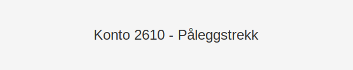

---
title: "Hva er Konto 2610 - Påleggstrekk?"
seoTitle: "2610-paalleggstrekk"
description: '**Konto 2610 - Påleggstrekk** er en konto i Norsk Standard Kontoplan som brukes til å registrere **påleggstrekk** som arbeidsgiver foretar i ansattes [lønn]...'
---

**Konto 2610 - Påleggstrekk** er en konto i Norsk Standard Kontoplan som brukes til å registrere **påleggstrekk** som arbeidsgiver foretar i ansattes [lønn](/blogs/kontoplan/2930-lonn "Konto 2930 - Lønn") som følge av krav fra namsmyndigheter, Skatteetaten eller andre kreditorer med rettskraftig vedtak.



## Hva er påleggstrekk?

> *Påleggstrekk* er en tvungen lønnstrekkordning der arbeidsgiver trekker et bestemt beløp fra ansattes [lønn](/blogs/kontoplan/2930-lonn "Konto 2930 - Lønn") etter krav fra namsmyndighetene eller andre offentlige instanser.

## Nøkkelfunksjoner

| Egenskap      | Beskrivelse                                            |
|---------------|--------------------------------------------------------|
| Kontonummer   | 2610                                                   |
| Konto         | Påleggstrekk                                           |
| Kontotype     | Kortsiktig gjeld                                       |
| Formål        | Registrere påleggstrekk trukket fra [lønn](/blogs/kontoplan/2930-lonn "Konto 2930 - Lønn")               |

## Når bruker man konto 2610?

* Når en ansatt har fått vedtak om helt eller delvis *påleggstrekk* fra namsmyndighetene
* Ved trekketilfeller fra Skatteetaten for dekning av restskatt eller merverdiavgiftskrav
* Når midler skal holdes tilbake fra [lønn](/blogs/kontoplan/2930-lonn "Konto 2930 - Lønn") for dekning av gjeld etter rettskraftig beslutning

## Forskjell mellom 2610 og relaterte kontoer

| Konto | Formål                    | Type gjeld       |
|-------|---------------------------|------------------|
| 2600  | Skyldig forskuddstrekk    | Kortsiktig gjeld |
| 2610  | Påleggstrekk              | Kortsiktig gjeld |
| 2620  | Bidragstrekk               | Kortsiktig gjeld |
| 1950  | Bankinnskudd for skattetrekk | Omløpsmiddel   |
| 2500  | Betalbar skatt, ikke utlignet | Kortsiktig gjeld |

## Regnskapsføring av påleggstrekk

### 1. Ved lønnskjøring og avsetning av påleggstrekk

```plaintext
Debet: [Konto 5000 - Lønn til ansatte](/blogs/kontoplan/5000-lonn-til-ansatte "Konto 5000 - Lønn til ansatte")               XXX NOK
Kredit: Konto 2610 - Påleggstrekk                   XXX NOK
```

### 2. Ved utbetaling til namsmannen eller kreditor

```plaintext
Debet: Konto 2610 - Påleggstrekk                   YYY NOK
Kredit: Konto 1950 - Bankinnskudd for skattetrekk   YYY NOK
```

## Avstemming av påleggstrekk

Avstem konto 2610 jevnlig mot lønnssystemets beregninger og utbetalingsbekreftelser fra namsmyndighetene for å sikre korrekt saldo.

## Praktiske tips

* Samarbeid tett med lønnsavdelingen for å få nøyaktige trekkdata
* Dokumenter vedtak og utbetalingsordrer for å sikre revisjonsspor
* Bruk automatiserte rutiner i lønnssystemet for å unngå manuelle feil
* Avstem konto månedlig for å oppdage uoverensstemmelser tidlig

## Intern lenking og relaterte kontoer

* [Konto 2930 - Lønn](/blogs/kontoplan/2930-lonn "Konto 2930 - Lønn")
* [Konto 2600 - Skyldig forskuddstrekk](/blogs/kontoplan/2600-forskuddstrekk "Konto 2600 - Skyldig forskuddstrekk")
* [Konto 1950 - Bankinnskudd for skattetrekk](/blogs/kontoplan/1950-bankinnskudd-for-skattetrekk "Konto 1950 - Bankinnskudd for skattetrekk")
* [Konto 2500 - Betalbar skatt, ikke utlignet](/blogs/kontoplan/2500-betalbar-skatt-ikke-utlignet "Konto 2500 - Betalbar skatt, ikke utlignet")
* [Konto 2620 - Bidragstrekk](/blogs/kontoplan/2620-bidragstrekk "Konto 2620 - Bidragstrekk")
* [Konto 2630 - Trygdetrekk](/blogs/kontoplan/2630-trygdetrekk "Konto 2630 - Trygdetrekk")
* [Konto 2770 - Skyldig arbeidsgiveravgift](/blogs/kontoplan/2770-skyldig-arbeidsgiveravgift "Konto 2770 - Skyldig arbeidsgiveravgift")
 * [Konto 2640 - Forsikringstrekk](/blogs/kontoplan/2640-forsikringstrekk "Konto 2640 - Forsikringstrekk")
 * [Konto 2650 - Trukket fagforeningskontingent](/blogs/kontoplan/2650-trukket-fagforeningskontingent "Konto 2650 - Trukket fagforeningskontingent")
 * [Hva er en Kontoplan?](/blogs/regnskap/hva-er-kontoplan "Hva er en Kontoplan? Komplett Guide til Kontoplaner i Norsk Regnskap")

**Konto 2610 - Påleggstrekk** gir oversikt over tvangsrettede lønnstrekk og sikrer korrekt periodisering og presentasjon som kortsiktig gjeld i balansen.


