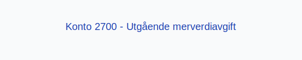

---
title: "Konto 2700 - Utgående merverdiavgift"
meta_title: "2700-utgaende-merverdiavgift"
meta_description: '**Konto 2700 - Utgående merverdiavgift** er en konto i **Norsk Standard Kontoplan** som brukes til å registrere **utgående merverdiavgift (MVA)** som en kort...'
slug: 2700-utgaende-merverdiavgift
type: blog
layout: pages/single
---

**Konto 2700 - Utgående merverdiavgift** er en konto i **Norsk Standard Kontoplan** som brukes til å registrere **utgående merverdiavgift (MVA)** som en kortsiktig forpliktelse til skattemyndighetene inntil betaling.

## Hva er utgående merverdiavgift?

*Utgående merverdiavgift* er den **merverdiavgiften** virksomheter legger til ved salg av varer og tjenester. Denne påløpte avgiften er en forpliktelse til staten frem til det **periodiske oppgjøret**.

For en oversikt over andre MVA-kontoer, se [Hva er MVA?](/blogs/regnskap/hva-er-moms-mva "Hva er MVA? MVA-regnskapsføring og merverdiavgift").

## Når skal konto 2700 benyttes?

* Ved **periodisk oppgjør** av utgående merverdiavgift etter avstemming i konto [Konto 1640 - Oppgjørskonto merverdiavgift](/blogs/kontoplan/1640-oppgjorskonto-merverdiavgift "Konto 1640 - Oppgjørskonto merverdiavgift").
* Når netto MVA skal overføres til betaling.
* I forbindelse med innbetaling av merverdiavgift til skattemyndighetene.

## Regnskapsføring

| Transaksjon                                | Debet                                     | Kredit                                    |
|--------------------------------------------|-------------------------------------------|-------------------------------------------|
| Overføring av netto utgående MVA til konto | Konto 1640 - Oppgjørskonto merverdiavgift | Konto 2700 - Utgående merverdiavgift      |
| Betaling av utgående MVA til staten        | Konto 2700 - Utgående merverdiavgift      | Konto 1920 - Bankinnskudd                 |

## Eksempel

En virksomhet har avstemt MVA ved periodeavslutning med følgende saldi:

| Beskrivelse                      | Beløp (NOK) |
|----------------------------------|-------------|
| Utgående merverdiavgift          | 20–¯000      |
| Inngående merverdiavgift         | 8–¯000       |

Netto MVA overføres og betales til staten:

| Transaksjon                          | Debet                                    | Kredit                                   |
|--------------------------------------|------------------------------------------|------------------------------------------|
| Netto MVA overført til oppgjørskonto | Konto 1640 - Oppgjørskonto merverdiavgift | Konto 2700 - Utgående merverdiavgift     |
| Betaling av MVA                      | Konto 2700 - Utgående merverdiavgift     | Konto 1920 - Bankinnskudd                |

## Fordeler ved korrekt bruk av konto 2700

* **Presis likviditetsstyring** ved å holde oversikt over skyldig MVA.
* **Riktig avstemming** mellom oppgjørskonto og betaling.
* Bidrar til overholdelse av **lovpålagte krav** for MVA-rapportering.

## Relaterte artikler

* [Konto 1600 - Utgående merverdiavgift](/blogs/kontoplan/1600-utgaende-merverdiavgift "Konto 1600 - Utgående merverdiavgift")
* [Konto 1640 - Oppgjørskonto merverdiavgift](/blogs/kontoplan/1640-oppgjorskonto-merverdiavgift "Konto 1640 - Oppgjørskonto merverdiavgift")
* [Konto 1610 - Inngående merverdiavgift](/blogs/kontoplan/1610-inngaaende-merverdiavgift "Konto 1610 - Inngående merverdiavgift")
* [Konto 2710 - Inngående merverdiavgift](/blogs/kontoplan/2710-inngaaende-merverdiavgift "Konto 2710 - Inngående merverdiavgift")
* [Konto 2740 - Oppgjørskonto merverdiavgift](/blogs/kontoplan/2740-oppgjorskonto-merverdiavgift "Konto 2740 - Oppgjørskonto merverdiavgift")
* [Hva er MVA?](/blogs/regnskap/hva-er-moms-mva "Hva er MVA? MVA-regnskapsføring og merverdiavgift")
* [Konto 2701 - Utgående merverdiavgift høy sats](/blogs/kontoplan/2701-utgaende-merverdiavgift-hoy-sats "Konto 2701 - Utgående merverdiavgift høy sats")
* [Konto 2702 - Utgående merverdiavgift kjøp tjenester fra utlandet](/blogs/kontoplan/2702-utgaende-merverdiavgift-kjop-tjen-fra-utlandet "Konto 2702 - Utgående merverdiavgift kjøp tjenester fra utlandet")
* [Konto 2703 - Utgående merverdiavgift middels sats](/blogs/kontoplan/2703-utgaende-merverdiavgift-middels-sats "Konto 2703 - Utgående merverdiavgift middels sats")
* [Konto 2704 - Utgående merverdiavgift lav sats](/blogs/kontoplan/2704-utgaende-merverdiavgift-lav-sats "Konto 2704 - Utgående merverdiavgift lav sats")
* [Konto 3300 - Spesiell off. avg. tilv./solgte varer avgiftspl.](/blogs/kontoplan/3300-spesiell-off-avg-tilv-solgte-varer-avgiftspl "Konto 3300 - Spesiell off. avg. tilv./solgte varer avgiftspl.")
* [Hva er en Kontoplan?](/blogs/regnskap/hva-er-kontoplan "Hva er en Kontoplan? Komplett Guide til Kontoplaner i Norsk Regnskap")

