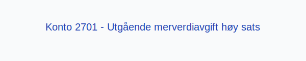

---
title: "2701-utgaende-merverdiavgift-hoy-sats"
meta_title: "2701-utgaende-merverdiavgift-hoy-sats"
meta_description: '**Konto 2701 - Utgående merverdiavgift høy sats** er en konto i **Norsk Standard Kontoplan** som brukes ved periodisk **oppgjør av utgående merverdiavgift m...'
slug: 2701-utgaende-merverdiavgift-hoy-sats
type: blog
layout: pages/single
---

**Konto 2701 - Utgående merverdiavgift høy sats** er en konto i **Norsk Standard Kontoplan** som brukes ved periodisk **oppgjør av utgående merverdiavgift med høy sats** (25 %) for å skille dette fra andre MVA-satser før overføring til betalingskonto.

## Hva er konto 2701?

*Konto 2701 - Utgående merverdiavgift høy sats* benyttes for å overføre beløp fra salgskontoene med høy sats (25 %) til oppgjørskontoen før betaling. Dette gir bedre oversikt i regnskapet ved periodisk avstemming.

For selve transaksjonsføringen av salg med høy sats, se [Konto 1601 - Utgående merverdiavgift høy sats](/blogs/kontoplan/1601-utgaende-merverdiavgift-hoy-sats "Konto 1601 - Utgående merverdiavgift høy sats").

## NÃ¥r skal konto 2701 benyttes?

* Ved periodisk oppgjør av **25 % MVA** for varer og tjenester med høy sats.
* I forbindelse med avstemming mot [Konto 2700 - Utgående merverdiavgift](/blogs/kontoplan/2700-utgaende-merverdiavgift "Konto 2700 - Utgående merverdiavgift").
* Når netto høy sats MVA skal innbetales til skattemyndighetene.

## Regnskapsføring av oppgjør høy sats MVA

| Transaksjon                                              | Debet                                                     | Kredit                                      |
|----------------------------------------------------------|-----------------------------------------------------------|----------------------------------------------|
| Overføring av høy sats MVA fra salgskonto                | Konto 1601 - Utgående merverdiavgift høy sats             | Konto 2701 - Utgående merverdiavgift høy sats |
| Betaling av høy sats MVA til skattemyndighetene          | Konto 2701 - Utgående merverdiavgift høy sats             | Konto 1920 - Bankinnskudd                    |

## Eksempel og beregning

| Salgsbeløp uten MVA | MVA (25 %) | Salgsbeløp inkl. MVA |
|---------------------|------------|----------------------|
| 8 000 NOK           | 2 000 NOK  | 10 000 NOK           |
| 20 000 NOK          | 5 000 NOK  | 25 000 NOK           |

## Fordeler med egen oppgjørskonto for høy sats

* **Presis avstemming** av høy sats MVA mot betalingskonto.
* **Klarere regnskapsbilde** ved å separere oppgjørsstrømmer.
* Bidrar til forenklet **rapportering** og bedre likviditetstyring.

## Relaterte artikler

* [Konto 1601 - Utgående merverdiavgift høy sats](/blogs/kontoplan/1601-utgaende-merverdiavgift-hoy-sats "Konto 1601 - Utgående merverdiavgift høy sats")
* [Konto 2700 - Utgående merverdiavgift](/blogs/kontoplan/2700-utgaende-merverdiavgift "Konto 2700 - Utgående merverdiavgift")
* [Konto 2702 - Utgående merverdiavgift kjøp tjenester fra utlandet](/blogs/kontoplan/2702-utgaende-merverdiavgift-kjop-tjen-fra-utlandet "Konto 2702 - Utgående merverdiavgift kjøp tjenester fra utlandet")
* [Konto 2703 - Utgående merverdiavgift middels sats](/blogs/kontoplan/2703-utgaende-merverdiavgift-middels-sats "Konto 2703 - Utgående merverdiavgift middels sats")
* [Konto 2704 - Utgående merverdiavgift lav sats](/blogs/kontoplan/2704-utgaende-merverdiavgift-lav-sats "Konto 2704 - Utgående merverdiavgift lav sats")
* [Hva er MVA?](/blogs/regnskap/hva-er-moms-mva "Hva er MVA? MVA-regnskapsføring og merverdiavgift")
