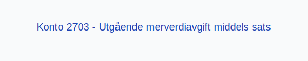

**Konto 2703 - Utgående merverdiavgift middels sats** er en konto i **Norsk Standard Kontoplan** som brukes ved periodisk **oppgjør av utgående merverdiavgift med middels sats** (15 %) for å skille dette fra andre MVA-satser før overføring til betalingskonto.

## Hva er konto 2703?

*Konto 2703 - Utgående merverdiavgift middels sats* benyttes for å overføre beløp fra salgskontoene med middels sats (15 %) til oppgjørskontoen før betaling. Dette gir bedre oversikt i regnskapet ved periodisk avstemming.

## NÃ¥r skal konto 2703 benyttes?

* Ved periodisk oppgjør av **15 % MVA** for varer og tjenester med middels sats.
* I forbindelse med avstemming mot [Konto 2700 - Utgående merverdiavgift](/blogs/kontoplan/2700-utgaende-merverdiavgift "Konto 2700 - Utgående merverdiavgift").
* NÃ¥r netto middels sats MVA skal innbetales til skattemyndighetene.

## Regnskapsføring av oppgjør middels sats MVA

| Transaksjon                                              | Debet                                                     | Kredit                                      |
|----------------------------------------------------------|-----------------------------------------------------------|----------------------------------------------|
| Overføring av middels sats MVA fra salgskonto            | Konto 1603 - Utgående merverdiavgift middels sats         | Konto 2703 - Utgående merverdiavgift middels sats |
| Betaling av middels sats MVA til skattemyndighetene      | Konto 2703 - Utgående merverdiavgift middels sats         | Konto 1920 - Bankinnskudd                    |

## Eksempel og beregning

| Salgsbeløp uten MVA | MVA (15 %)   | Salgsbeløp inkl. MVA |
|---------------------|--------------|----------------------|
| 8 000 NOK           | 1 200 NOK    | 9 200 NOK            |
| 20 000 NOK          | 3 000 NOK    | 23 000 NOK           |

## Fordeler med egen oppgjørskonto for middels sats

* **Presis avstemming** av middels sats MVA mot betalingskonto.
* **Klarere regnskapsbilde** ved å separere oppgjørsstrømmer.
* Bidrar til forenklet **rapportering** og bedre likviditetstyring.

## Relaterte artikler

* [Konto 1603 - Utgående merverdiavgift middels sats](/blogs/kontoplan/1603-utgaende-merverdiavgift-middels-sats "Konto 1603 - Utgående merverdiavgift middels sats")
* [Konto 2700 - Utgående merverdiavgift](/blogs/kontoplan/2700-utgaende-merverdiavgift "Konto 2700 - Utgående merverdiavgift")
* [Konto 2701 - Utgående merverdiavgift høy sats](/blogs/kontoplan/2701-utgaende-merverdiavgift-hoy-sats "Konto 2701 - Utgående merverdiavgift høy sats")
* [Konto 2702 - Utgående merverdiavgift kjøp tjenester fra utlandet](/blogs/kontoplan/2702-utgaende-merverdiavgift-kjop-tjen-fra-utlandet "Konto 2702 - Utgående merverdiavgift kjøp tjenester fra utlandet")
* [Konto 2704 - Utgående merverdiavgift lav sats](/blogs/kontoplan/2704-utgaende-merverdiavgift-lav-sats "Konto 2704 - Utgående merverdiavgift lav sats")
* [Hva er MVA?](/blogs/regnskap/hva-er-moms-mva "Hva er MVA? MVA-regnskapsføring og merverdiavgift")
* [Hva er en Kontoplan?](/blogs/regnskap/hva-er-kontoplan "Hva er en Kontoplan? Komplett Guide til Kontoplaner i Norsk Regnskap")
