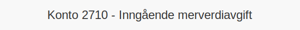

---
title: "2710-inngaaende-merverdiavgift"
meta_title: "2710-inngaaende-merverdiavgift"
meta_description: "**Konto 2710 - Inngående merverdiavgift** er en konto i Norsk Standard Kontoplan som brukes til å registrere **inngående merverdiavgift (MVA)** som et fradra..."
slug: 2710-inngaaende-merverdiavgift
type: blog
layout: pages/single
---

**Konto 2710 - Inngående merverdiavgift** er en konto i Norsk Standard Kontoplan som brukes til å registrere **inngående merverdiavgift (MVA)** som et fradrag i regnskapet for kjøp av varer og tjenester.

## Hva er inngående merverdiavgift?

*Inngående merverdiavgift* er den merverdiavgiften virksomheter betaler på kjøp av varer og tjenester som senere kan fradras fra skyldig utgående MVA.

## NÃ¥r skal konto 2710 benyttes?

* Ved kjøp av varer og tjenester som er avgiftspliktige
* I periodisk MVA-rapportering for å beregne fradragsberettiget inngående MVA
* Når virksomheten krever tilbakebetaling eller avregning av inngående MVA

## Regnskapsføring av inngående MVA

| Transaksjon                               | Debet                                     | Kredit                                 |
|-------------------------------------------|-------------------------------------------|----------------------------------------|
| Kjøp med MVA                              | Konto 2710 - Inngående merverdiavgift     | Konto 2400 - Leverandørgjeld           |
| Periodisk MVA-oppgjør (fradrag)           | Konto 2740 - Inngående merverdiavgift fradrag | Konto 2710 - Inngående merverdiavgift |

For en komplett gjennomgang av merverdiavgift, se [Hva er MVA?](/blogs/regnskap/hva-er-moms-mva "Hva er MVA? MVA-regnskapsføring og merverdiavgift").

## Eksempel på bokføring

En virksomhet kjøper varer for 8 000 NOK ekskl. MVA (25 %):

| Salgsbeløp uten MVA | MVA (25 %) | Totalt beløp inkl. MVA |
|---------------------|------------|-------------------------|
| 8 000 NOK           | 2 000 NOK  | 10 000 NOK              |

Bokføring:

| Konto                                | Debet      | Kredit     |
|--------------------------------------|------------|------------|
| 2710 Inngående merverdiavgift        | 2 000 NOK  |            |
| 2400 Leverandørgjeld                 | 10 000 NOK |            |
| 3000 Varekjøp                        | 8 000 NOK  |            |

## Regler og begrensninger

* **Fradragsrett** gjelder kun for kjøp relatert til avgiftspliktig virksomhet.
* Enkelte varer og tjenester (f.eks. representasjon, persontransport) kan ha **begrenset eller ingen fradragsrett**.
* Ved **andel fradrag** må fradragsberettiget MVA beregnes etter forholdet mellom avgiftspliktig og avgiftsfri omsetning.

## Fordeler ved korrekt inngående MVA-behandling

* **Bedre likviditetsstyring** ved å sikre rett fradrag og unngå overbetaling.
* **Redusert risiko** for feil i MVA-rapporteringen.
* Overholdelse av **skatte- og avgiftslovgivning**, og færre korrigeringer ved revisjon.

## Relaterte artikler

* [Konto 1600 - Utgående merverdiavgift](/blogs/kontoplan/1600-utgaende-merverdiavgift "Konto 1600 - Utgående merverdiavgift")
* [Konto 2700 - Utgående merverdiavgift](/blogs/kontoplan/2700-utgaende-merverdiavgift "Konto 2700 - Utgående merverdiavgift")
* [Konto 1610 - Inngående merverdiavgift](/blogs/kontoplan/1610-inngaaende-merverdiavgift "Konto 1610 - Inngående merverdiavgift")
* [Konto 1611 - Inngående merverdiavgift høy sats](/blogs/kontoplan/1611-inngaaende-merverdiavgift-hoy-sats "Konto 1611 - Inngående merverdiavgift høy sats")
* [Konto 2711 - Inngående merverdiavgift høy sats](/blogs/kontoplan/2711-inngaaende-merverdiavgift-hoy-sats "Konto 2711 - Inngående merverdiavgift høy sats")
* [Konto 2712 - Inngående merverdiavgift kjøp tjenester fra utlandet](/blogs/kontoplan/2712-inngaaende-merverdiavgift-kjop-tjen-fra-utlandet "Konto 2712 - Inngående merverdiavgift kjøp tjenester fra utlandet")
* [Konto 2713 - Inngående merverdiavgift middels sats](/blogs/kontoplan/2713-inngaaende-merverdiavgift-middels-sats "Konto 2713 - Inngående merverdiavgift middels sats")
* [Konto 2714 - Inngående merverdiavgift lav sats](/blogs/kontoplan/2714-inngaaende-merverdiavgift-lav-sats "Konto 2714 - Inngående merverdiavgift lav sats")
* [Konto 1640 - Oppgjørskonto merverdiavgift](/blogs/kontoplan/1640-oppgjorskonto-merverdiavgift "Konto 1640 - Oppgjørskonto merverdiavgift")
* [Konto 2740 - Oppgjørskonto merverdiavgift](/blogs/kontoplan/2740-oppgjorskonto-merverdiavgift "Konto 2740 - Oppgjørskonto merverdiavgift")
* [Hva er MVA?](/blogs/regnskap/hva-er-moms-mva "Hva er MVA? MVA-regnskapsføring og merverdiavgift")
* [Konto 7350 - Representasjon, fradragsberettiget](/blogs/kontoplan/7350-representasjon-fradragsberettiget "Konto 7350 - Representasjon, fradragsberettiget")
* [Konto 7360 - Representasjon, ikke fradragsberettiget](/blogs/kontoplan/7360-representasjon-ikke-fradragsberettiget "Konto 7360 - Representasjon, ikke fradragsberettiget")
* [Hva er en Kontoplan?](/blogs/regnskap/hva-er-kontoplan "Hva er en Kontoplan? Komplett Guide til Kontoplaner i Norsk Regnskap")
