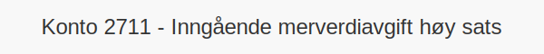

---
title: "2711-inngaaende-merverdiavgift-hoy-sats"
meta_title: "2711-inngaaende-merverdiavgift-hoy-sats"
meta_description: "**Konto 2711 - Inngående merverdiavgift høy sats** er en konto i **Norsk Standard Kontoplan** som brukes ved periodisk **oppgjør av inngående merverdiavgift..."
slug: 2711-inngaaende-merverdiavgift-hoy-sats
type: blog
layout: pages/single
---

**Konto 2711 - Inngående merverdiavgift høy sats** er en konto i **Norsk Standard Kontoplan** som brukes ved periodisk **oppgjør av inngående merverdiavgift med høy sats** (25 %) for å avstemme og registrere fradrag før betaling eller til gode i MVA-regnskapet.

## Hva er konto 2711?

*Konto 2711 - Inngående merverdiavgift høy sats* benyttes for å overføre beløp fra [Konto 1611 - Inngående merverdiavgift høy sats](/blogs/kontoplan/1611-inngaaende-merverdiavgift-hoy-sats "Konto 1611 - Inngående merverdiavgift høy sats") til oppgjørskontoen for inngående merverdiavgift før betaling eller til gode som en del av MVA-avstemming.

## NÃ¥r skal konto 2711 benyttes?

* Ved periodisk oppgjør av **25 % MVA** inngående for varer og tjenester med høy sats.
* I forbindelse med avstemming mot [Konto 2740 - Merverdiavgift til betaling/til gode](/blogs/kontoplan/2740-merverdiavgift-til-betaling-til-gode "Konto 2740 - Merverdiavgift til betaling/til gode").
* Når netto høy sats MVA skal betales eller føres til gode i regnskapet.

## Regnskapsføring av oppgjør høy sats inngående MVA

| Transaksjon                                         | Debet                                           | Kredit                                          |
|-----------------------------------------------------|-------------------------------------------------|-------------------------------------------------|
| Overføring av inngående høy sats MVA fra konto 1611  | Konto 1611 - Inngående merverdiavgift høy sats   | Konto 2711 - Inngående merverdiavgift høy sats   |
| Betaling eller til gode av høy sats MVA til staten  | Konto 2711 - Inngående merverdiavgift høy sats   | Konto 1920 - Bankinnskudd                        |

## Eksempel på beregning

| Kjøpsbeløp uten MVA | MVA (25 %) | Totalt inkl. MVA |
|---------------------|------------|------------------|
| 8 000 NOK           | 2 000 NOK  | 10 000 NOK       |
| 20 000 NOK          | 5 000 NOK  | 25 000 NOK       |

## Fordeler med egen oppgjørskonto for høy sats inngående MVA

* **Presis avstemming** av høy sats MVA mot betalings- eller til gode-konto.
* **Klarere regnskapsbilde** ved å separere oppgjørsstrømmer.
* Bidrar til forenklet **rapportering** og bedre likviditetsstyring.

## Relaterte artikler

* [Konto 1611 - Inngående merverdiavgift høy sats](/blogs/kontoplan/1611-inngaaende-merverdiavgift-hoy-sats "Konto 1611 - Inngående merverdiavgift høy sats")
* [Konto 2710 - Inngående merverdiavgift](/blogs/kontoplan/2710-inngaaende-merverdiavgift "Konto 2710 - Inngående merverdiavgift")
* [Konto 2712 - Inngående merverdiavgift kjøp tjenester fra utlandet](/blogs/kontoplan/2712-inngaaende-merverdiavgift-kjop-tjen-fra-utlandet "Konto 2712 - Inngående merverdiavgift kjøp tjenester fra utlandet")
* [Konto 2713 - Inngående merverdiavgift middels sats](/blogs/kontoplan/2713-inngaaende-merverdiavgift-middels-sats "Konto 2713 - Inngående merverdiavgift middels sats")
* [Konto 2714 - Inngående merverdiavgift lav sats](/blogs/kontoplan/2714-inngaaende-merverdiavgift-lav-sats "Konto 2714 - Inngående merverdiavgift lav sats")
* [Konto 2740 - Merverdiavgift til betaling/til gode](/blogs/kontoplan/2740-merverdiavgift-til-betaling-til-gode "Konto 2740 - Merverdiavgift til betaling/til gode")
* [Hva er MVA?](/blogs/regnskap/hva-er-moms-mva "Hva er MVA? MVA-regnskapsføring og merverdiavgift")
