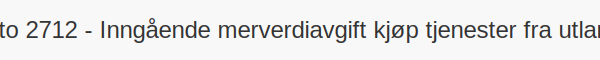

---
title: "Konto 2712 - Inngående merverdiavgift kjøp tjenester fra utlandet"
seoTitle: "2712-inngaaende-merverdiavgift-kjop-tjen-fra-utlandet"
description: '**Konto 2712 - Inngående merverdiavgift kjøp tjenester fra utlandet** er en konto i **Norsk Standard Kontoplan** som brukes til å presentere **inngående mer...'
---

**Konto 2712 - Inngående merverdiavgift kjøp tjenester fra utlandet** er en konto i **Norsk Standard Kontoplan** som brukes til å presentere **inngående merverdiavgift** ved kjøp av tjenester fra utlandet i resultatregnskapet. Kontoen skiller periodisk MVA-oppgjør for utenlandstjenester fra øvrige inntekts- og kostnadskontoer.

## Hva er konto 2712?

*Konto 2712 - Inngående merverdiavgift kjøp tjenester fra utlandet* benyttes når virksomheter kjøper tjenester fra utenlandske leverandører under **omvendt avgiftsplikt**, og inngående merverdiavgift skal føres i resultatregnskapet som en midlertidig kostnadspost før den går til fradrag.

For bokføring av selve transaksjonen, se [Konto 1612 - Inngående merverdiavgift kjøp tjenester fra utlandet](/blogs/kontoplan/1612-inngaaende-merverdiavgift-kjop-tjen-fra-utlandet "Konto 1612 - Inngående merverdiavgift kjøp tjenester fra utlandet").

## Når skal konto 2712 benyttes?

* Ved periodisk MVA-oppgjør for kjøp av tjenester fra utlandet med omvendt avgiftsplikt.
* I forbindelse med avstemming mot transaksjonskonto for inngående MVA på utenlandstjenester.
* Når inngående MVA ved utenlandstjenester skal presenteres i resultatregnskapet.

## Regnskapsføring av oppgjør

| Transaksjon                                                         | Debet                                                         | Kredit                                                                         |
|---------------------------------------------------------------------|---------------------------------------------------------------|--------------------------------------------------------------------------------|
| Overføring av inngående MVA fra transaksjonskonto                   | Konto 1612 - Inngående merverdiavgift kjøp tjenester fra utlandet | Konto 2712 - Inngående merverdiavgift kjøp tjenester fra utlandet              |
| Avslutning av konto 2712 til oppgjørskonto                          | Konto 2740 - Inngående merverdiavgift fradrag                 | Konto 2712 - Inngående merverdiavgift kjøp tjenester fra utlandet              |

## Eksempel på beregning

| Beløp uten MVA  | MVA (25–¯%) | MVA vist i resultatregnskapet |
|-----------------|------------|-------------------------------|
| 10–¯000 NOK      | 2–¯500 NOK  | 2–¯500 NOK                    |
| 6–¯000 NOK       | 1–¯500 NOK  | 1–¯500 NOK                    |

## Regler og begrensninger

* **Fradragsrett** gjelder kun for kjøp relatert til avgiftspliktig virksomhet.
* Enkelte tjenester (f.eks. representasjon, persontransport) kan ha **begrenset eller ingen fradragsrett**.
* Ved **andel fradrag** må inngående merverdiavgift beregnes etter forholdet mellom avgiftspliktig og avgiftsfri omsetning.

## Fordeler ved å bruke konto 2712

* **Klar separasjon** av MVA-oppgjør for utenlandstjenester fra øvrige kostnadsposter.
* **Forenklet avstemming** og rapportering i resultatregnskapet.
* Bedre oversikt som bidrar til **korrekt MVA-fradrag** og overholdelse av regelverk.

## Relaterte artikler

* [Konto 1612 - Inngående merverdiavgift kjøp tjenester fra utlandet](/blogs/kontoplan/1612-inngaaende-merverdiavgift-kjop-tjen-fra-utlandet "Konto 1612 - Inngående merverdiavgift kjøp tjenester fra utlandet")
* [Konto 2710 - Inngående merverdiavgift](/blogs/kontoplan/2710-inngaaende-merverdiavgift "Konto 2710 - Inngående merverdiavgift")
* [Konto 2711 - Inngående merverdiavgift høy sats](/blogs/kontoplan/2711-inngaaende-merverdiavgift-hoy-sats "Konto 2711 - Inngående merverdiavgift høy sats")
* [Konto 2713 - Inngående merverdiavgift middels sats](/blogs/kontoplan/2713-inngaaende-merverdiavgift-middels-sats "Konto 2713 - Inngående merverdiavgift middels sats")
* [Konto 2714 - Inngående merverdiavgift lav sats](/blogs/kontoplan/2714-inngaaende-merverdiavgift-lav-sats "Konto 2714 - Inngående merverdiavgift lav sats")
* [Konto 2740 - Merverdiavgift til betaling/til gode](/blogs/kontoplan/2740-merverdiavgift-til-betaling-til-gode "Konto 2740 - Merverdiavgift til betaling/til gode")
* [Konto 7350 - Representasjon, fradragsberettiget](/blogs/kontoplan/7350-representasjon-fradragsberettiget "Konto 7350 - Representasjon, fradragsberettiget")
* [Konto 7360 - Representasjon, ikke fradragsberettiget](/blogs/kontoplan/7360-representasjon-ikke-fradragsberettiget "Konto 7360 - Representasjon, ikke fradragsberettiget")
* [Hva er MVA?](/blogs/regnskap/hva-er-moms-mva "Hva er MVA? MVA-regnskapsføring og merverdiavgift")
* [Hva er en Kontoplan?](/blogs/regnskap/hva-er-kontoplan "Hva er en Kontoplan? Komplett Guide til Kontoplaner i Norsk Regnskap")

