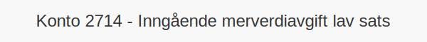

**Konto 2714 - Inngående merverdiavgift lav sats** er en konto i **Norsk Standard Kontoplan** som brukes ved periodisk **oppgjør av inngående merverdiavgift med lav sats** (12 %) for å avstemme og registrere fradrag før betaling eller til gode i MVA-regnskapet.

## Hva er konto 2714?

*Konto 2714 - Inngående merverdiavgift lav sats* benyttes for å overføre beløp fra [Konto 1614 - Inngående merverdiavgift lav sats](/blogs/kontoplan/1614-inngaaende-merverdiavgift-lav-sats "Konto 1614 - Inngående merverdiavgift lav sats") til oppgjørskontoen for inngående merverdiavgift før betaling eller til gode som en del av MVA-avstemming.

## NÃ¥r skal konto 2714 benyttes?

* Ved periodisk oppgjør av **12 % MVA** inngående for varer og tjenester med lav sats.
* I forbindelse med avstemming mot [Konto 2740 - Merverdiavgift til betaling/til gode](/blogs/kontoplan/2740-merverdiavgift-til-betaling-til-gode "Konto 2740 - Merverdiavgift til betaling/til gode").
* Når netto lav sats MVA skal betales eller føres til gode i regnskapet.

## Regnskapsføring av oppgjør lav sats inngående MVA

| Transaksjon                                                     | Debet                                                     | Kredit                                       |
|-----------------------------------------------------------------|-----------------------------------------------------------|-----------------------------------------------|
| Overføring av inngående lav sats MVA fra konto 1614             | Konto 1614 - Inngående merverdiavgift lav sats            | Konto 2714 - Inngående merverdiavgift lav sats |
| Betaling eller til gode av lav sats MVA til skattemyndighetene | Konto 2714 - Inngående merverdiavgift lav sats            | Konto 1920 - Bankinnskudd                     |

## Eksempel på beregning

| Kjøpsbeløp uten MVA | MVA (12 %) | Totalt inkl. MVA |
|---------------------|------------|------------------|
| 8 000 NOK           | 960 NOK    | 8 960 NOK        |
| 20 000 NOK          | 2 400 NOK  | 22 400 NOK       |

## Fordeler med egen oppgjørskonto for lav sats inngående MVA

* **Presis avstemming** av lav sats MVA mot betalings- eller til gode-konto.
* **Klarere regnskapsbilde** ved å separere oppgjørsstrømmer for lav sats.
* Bidrar til forenklet **rapportering** og bedre likviditetsstyring.

## Relaterte artikler

* [Konto 1614 - Inngående merverdiavgift lav sats](/blogs/kontoplan/1614-inngaaende-merverdiavgift-lav-sats "Konto 1614 - Inngående merverdiavgift lav sats")
* [Konto 2710 - Inngående merverdiavgift](/blogs/kontoplan/2710-inngaaende-merverdiavgift "Konto 2710 - Inngående merverdiavgift")
* [Konto 2711 - Inngående merverdiavgift høy sats](/blogs/kontoplan/2711-inngaaende-merverdiavgift-hoy-sats "Konto 2711 - Inngående merverdiavgift høy sats")
* [Konto 2712 - Inngående merverdiavgift kjøp tjenester fra utlandet](/blogs/kontoplan/2712-inngaaende-merverdiavgift-kjop-tjen-fra-utlandet "Konto 2712 - Inngående merverdiavgift kjøp tjenester fra utlandet")
* [Konto 2713 - Inngående merverdiavgift middels sats](/blogs/kontoplan/2713-inngaaende-merverdiavgift-middels-sats "Konto 2713 - Inngående merverdiavgift middels sats")
* [Konto 2714 - Inngående merverdiavgift lav sats](/blogs/kontoplan/2714-inngaaende-merverdiavgift-lav-sats "Konto 2714 - Inngående merverdiavgift lav sats")
* [Konto 2740 - Merverdiavgift til betaling/til gode](/blogs/kontoplan/2740-merverdiavgift-til-betaling-til-gode "Konto 2740 - Merverdiavgift til betaling/til gode")
* [Hva er MVA?](/blogs/regnskap/hva-er-moms-mva "Hva er MVA? MVA-regnskapsføring og merverdiavgift")
* [Hva er en Kontoplan?](/blogs/regnskap/hva-er-kontoplan "Hva er en Kontoplan? Komplett Guide til Kontoplaner i Norsk Regnskap")

