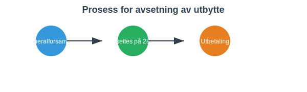

---
title: "Konto 2800 - Avsatt utbytte"
seoTitle: "Konto 2800 | Avsatt utbytte | Kontoplan"
description: "Konto 2800 brukes til å registrere avsatt utbytte vedtatt av generalforsamlingen som kortsiktig gjeld frem til utbetaling. Les om regler, prosess, bokføring og eksempler."
summary: "Konto 2800: avsatt utbytte. Når den brukes og hvordan bokføre."
---

**Konto 2800 - Avsatt utbytte** er en konto i Norsk Standard Kontoplan (NS 4102) som brukes til å registrere **avsetning av utbytte** vedtatt av generalforsamlingen som kortsiktig gjeld frem til utbetaling til aksjonærene.


## Hva er avsatt utbytte?

*Avsatt utbytte* er den delen av årets overskudd som generalforsamlingen har besluttet skal deles ut til aksjonærene, men som ennå ikke er utbetalt. Når vedtaket fattes, skal beløpet balanseres som en kortsiktig gjeldspost under konto 2800.

## Når benyttes konto 2800?

* Kontoen settes opp etter vedtak i generalforsamlingen om utbytte
* Periodisering ved årsavslutning for å vise forpliktelsen til aksjonærene
* Synliggjøring av kortsiktig gjeld for utbytte frem til utbetaling

## Prosess for avsetning av utbytte



## Regnskapsføring av avsatt utbytte

Ved resultatdisponering bokføres avsetningen som følger:
```
Debet: Konto 8010 - Overført resultat
Kredit: Konto 2800 - Avsatt utbytte
```

Når utbyttet betales ut til aksjonærene, reverseres posten:
```
Debet: Konto 2800 - Avsatt utbytte
Kredit: Konto 1920 - Bankinnskudd
```


## Relaterte artikler

* [Konto 2050 - Annen egenkapital](/blogs/kontoplan/2050-annen-egenkapital "Konto 2050 - Annen egenkapital: Annen egenkapital i Norsk Standard Kontoplan")
* [Konto 2080 - Udekket tap](/blogs/kontoplan/2080-udekket-tap "Konto 2080 - Udekket tap: Udekket tap i Norsk Standard Kontoplan")
* [Konto 8800 - Årsresultat](/blogs/kontoplan/8800-arsresultat "Konto 8800 - Årsresultat")
* [Hva er utbytte?](/blogs/regnskap/hva-er-utbytte "Hva er Utbytte? Regnskapsføring og Skattemessige Konsekvenser")
* [Hva er en Kontoplan?](/blogs/regnskap/hva-er-kontoplan "Hva er en Kontoplan? Komplett Guide til Kontoplaner i Norsk Regnskap")
* [Konto 8920 - Avsatt utbytte/renter grunnfondsbevis](/blogs/kontoplan/8920-avsatt-utbytte-renter-grunnfondsbevis "Konto 8920 - Avsatt utbytte/renter grunnfondsbevis: Avsetning av utbytte og renter på grunnfondsbevis som kortsiktig gjeld")


