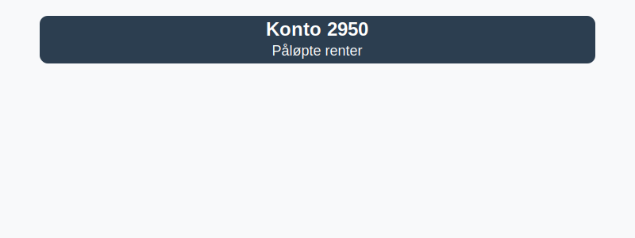

---
title: "Konto 2950 - Påløpte renter"
meta_title: "2950-palopte-renter"
meta_description: '**Konto 2950 - Påløpte renter** er en konto i Norsk Standard Kontoplan som brukes til å registrere **påløpte renteutgifter**.'
slug: 2950-palopte-renter
type: blog
layout: pages/single
---

**Konto 2950 - Påløpte renter** er en konto i Norsk Standard Kontoplan som brukes til å registrere **påløpte renteutgifter**.

## Hva er påløpte renter?

*Påløpte renter* er rentekostnader som er påløpt i løpet av en regnskapsperiode, men som ennå ikke er betalt ved balansedagen. Konto 2950 fungerer som en **kortsiktig gjeldskonto** for disse kostnadene inntil faktura eller betaling skjer.

Typiske situasjoner for bruk av konto 2950:

* **Renteutgifter på lån og kreditter** som påløper ved periodens slutt
* **Avtaler med rentebetaling i etterkant** der faktura mottas etter påløpt periode
* **Serier av rentebetalinger** som krever periodisering for korrekt regnskapsføring

## Regnskapsføring

| Transaksjon                           | Debet                                    | Kredit                                     |
|---------------------------------------|------------------------------------------|--------------------------------------------|
| Kostnadsføring av påløpt renteperiode | Relevante rentekostnadskonto (f.eks. Konto 8240 - Rentekostnader) | Konto 2950 - Påløpte renter |
| Påløpte renter uten mottatt faktura   | Konto 2950 - Påløpte renter              | Konto 2400 - Leverandørgjeld               |
| Betaling av påløpt rente              | Konto 2400 - Leverandørgjeld             | Konto 1920 - Bankinnskudd                  |
| Periodisering ved årsavslutning       | Konto 2950 - Påløpte renter              | Konto 4160 - Endring i påløpte kostnader   |

## Vurdering og balansepresentasjon

Ved årsavslutning presenteres saldo på konto 2950 som **kortsiktig gjeld**, vurdert til påløpt kostnad. Påløpte renter som gjelder perioder etter balansedagen må vurderes for eventuelle justeringer eller avskrivninger.

## Praktisk eksempel

Her er et eksempel på bokføring av påløpte renter:

| Dato       | Beskrivelse                             | Debet                         | Kredit                        |
|------------|-----------------------------------------|-------------------------------|-------------------------------|
| 31.12.2023 | Periodisert renteutgift for desember    | Konto 8240 - Rentekostnader   | Konto 2950 - Påløpte renter   |
| 15.01.2024 | Mottatt faktura for rente               | Konto 2950 - Påløpte renter   | Konto 2400 - Leverandørgjeld  |
| 22.01.2024 | Betaling av faktura                     | Konto 2400 - Leverandørgjeld  | Konto 1920 - Bankinnskudd     |

## Intern lenking og relaterte kontoer

Andre kontoer i NS 4102 som ofte benyttes sammen med konto 2950:

* [Konto 1710 - Forskuddsbetalte renter](/blogs/kontoplan/1710-forskuddsbetalte-renter "Konto 1710 - Forskuddsbetalte renter: Regnskapsføring av forskuddsbetalte renteutgifter")
* [Konto 1760 - Påløpte renter](/blogs/kontoplan/1760-palopte-renter "Konto 1760 - Påløpte renter: Regnskapsføring av påløpte renteutgifter")
* [Konto 1750 - Påløpte leier](/blogs/kontoplan/1750-palopte-leier "Konto 1750 - Påløpte leier: Regnskapsføring av påløpte leiekostnader")
* [Hva er en Kontoplan?](/blogs/regnskap/hva-er-kontoplan "Hva er en Kontoplan? Komplett Guide til Kontoplaner i Norsk Regnskap")
* [Hva er Periodisering i Regnskap?](/blogs/regnskap/hva-er-periodisering "Hva er Periodisering i Regnskap? Guide til periodisering av kostnader og inntekter")

* [Konto 7780 - Renter og gebyrer inkasso](/blogs/kontoplan/7780-renter-og-gebyrer-inkasso "Konto 7780 - Renter og gebyrer inkasso: Regnskapsføring av renter og gebyrer ved inkasso")
* [Konto 8130 - Rentekostnad foretak i samme konsern](/blogs/kontoplan/8130-rentekostnad-foretak-i-samme-konsern "Konto 8130 - Rentekostnad foretak i samme konsern")
* [Konto 8140 - Rentekostnad, ikke fradragsberettiget](/blogs/kontoplan/8140-rentekostnad-ikke-fradragsberettiget "Konto 8140 - Rentekostnad, ikke fradragsberettiget i Norsk Standard Kontoplan")

**Riktig bruk** av konto 2950 sikrer nøyaktig periodisering og oversikt over påløpte rentekostnader.

