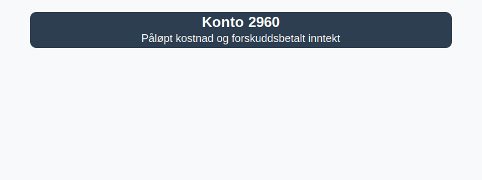

---
title: "Konto 2960 - Påløpt kostnad og forskuddsbetalt inntekt"
seoTitle: "Konto 2960 | Påløpt kostnad og forskuddsbetalt inntekt | Kontoplan"
description: "Konto 2960 brukes til periodisering av påløpte kostnader og forskuddsbetalte inntekter. Forklarer bruksområder, balanseføring, bokføring og eksempler i Norsk Standard Kontoplan."
summary: "Konto 2960: periodisering av påløpte kostnader og forskuddsbetalte inntekter. Når og hvordan bokføre."
---

**Konto 2960 - Påløpt kostnad og forskuddsbetalt inntekt** er en konto i Norsk Standard Kontoplan som brukes til å registrere **påløpte kostnader** for varer eller tjenester som er påløpt uten betaling og **forskuddsbetalt inntekt** mottatt for varer eller tjenester som ennå ikke er levert.

## Hva er Påløpt kostnad og forskuddsbetalt inntekt?

*Påløpte kostnader* oppstår når selskapet har mottatt varer eller tjenester, men faktura eller betaling ikke er registrert ved regnskapsperiodens slutt.
*Forskuddsbetalt inntekt* oppstår når selskapet mottar betaling for varer eller tjenester som ennå ikke er levert ved regnskapsperiodens slutt.

Vanlige eksempler:

* **Strøm- og energikostnader** for forbruk som er påløpt ved månedsslutt uten faktura
* [Konto 5000 - Lønn til ansatte](/blogs/kontoplan/5000-lonn-til-ansatte "Konto 5000 - Lønn til ansatte") som er opptjent av ansatte, men ikke utbetalt ved periodeavslutning
* **Abonnementsinntekter** mottatt på forhånd for tjenester levert i neste periode
* **Medlemsavgifter** forskuddsbetalt for perioder som starter etter balansedagen

## Regnskapsføring

| Transaksjon                                          | Debet                                                                      | Kredit                                                          |
|------------------------------------------------------|----------------------------------------------------------------------------|-----------------------------------------------------------------|
| Periodisering av påløpt kostnad for varer/tjenester  | Relevant kostnadskonto (6xxx)                                              | Konto 2960 - Påløpt kostnad og forskuddsbetalt inntekt          |
| Mottatt forskuddsbetaling fra kunde                  | Konto 1920 - Bankinnskudd                                                  | Konto 2960 - Påløpt kostnad og forskuddsbetalt inntekt          |
| Bokføring av kostnad ved mottatt faktura             | Konto 2960 - Påløpt kostnad og forskuddsbetalt inntekt                      | Konto 2400 - Leverandørgjeld                                     |
| Inntektsføring ved levering av varer/tjenester        | Konto 2960 - Påløpt kostnad og forskuddsbetalt inntekt                      | Relevant inntektskonto (3000)                                   |

## Vurdering og balansepresentasjon

Saldo på konto 2960 presenteres i balansen som **kortsiktig gjeld** når netto beløp er kredit (> forskuddsbetalt inntekt) og som **kortsiktig eiendel** når nettobeløpet er debet (> påløpt kostnad).

## Intern lenking og relaterte kontoer

Andre kontoer i NS 4102 som ofte benyttes sammen med konto 2960:

* [Konto 1750 - Påløpte leier](/blogs/kontoplan/1750-palopte-leier "Konto 1750 - Påløpte leier: Regnskapsføring av påløpte leiekostnader")
* [Konto 1760 - Påløpte renter](/blogs/kontoplan/1760-palopte-renter "Konto 1760 - Påløpte renter: Regnskapsføring av påløpte renteutgifter")
* [Konto 2160 - Uopptjent inntekt](/blogs/kontoplan/2160-uopptjent-inntekt "Konto 2160 - Uopptjent inntekt: Regnskapsføring av forskuddsinntekter")
* [Konto 2970 - Uopptjent inntekt](/blogs/kontoplan/2970-uopptjent-inntekt "Konto 2970 - Uopptjent inntekt: Regnskapsføring av uopptjent inntekt")
* [Hva er Periodisering i Regnskap?](/blogs/regnskap/hva-er-periodisering "Hva er Periodisering i Regnskap? Komplett Guide til periodiseringsprinsippet")
* [Hva er en Kontoplan?](/blogs/regnskap/hva-er-kontoplan "Hva er en Kontoplan? Komplett Guide til Kontoplaner i Norsk Regnskap")

