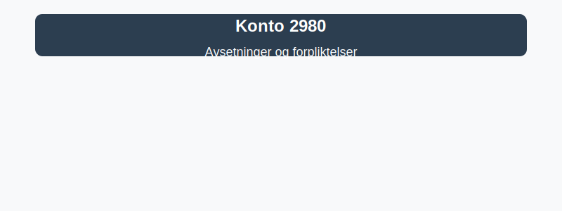

---
title: "Konto 2980 - Avsetninger og forpliktelser"
meta_title: "2980-avsetninger-og-forpliktelser"
meta_description: '**Konto 2980 - Avsetninger og forpliktelser** er en konto i Norsk Standard Kontoplan som brukes til å oppsummere **avsetninger og forpliktelser**, inkludert ul...'
slug: 2980-avsetninger-og-forpliktelser
type: blog
layout: pages/single
---

**Konto 2980 - Avsetninger og forpliktelser** er en konto i Norsk Standard Kontoplan som brukes til å oppsummere **avsetninger og forpliktelser**, inkludert ulike typer avsetninger for fremtidige kostnader og uspesifiserte forpliktelser. Kontoen gir en oversikt over generelle forpliktelser som ikke har en mer spesifikk konto i kontoplanen.

## Hva er avsetninger og forpliktelser?

*Avsetninger* er regnskapsmessige reserver for estimert fremtidig kostnad, mens *forpliktelser* er selskapets **eksterne krav** og forpliktelser som forventes å gi utgående ressurser. Konto 2980 samler flere typer avsetninger og forpliktelser som:

* **Avsetning for tap på fordringer** via [Konto 1580 - Avsetning tap på fordringer](/blogs/kontoplan/1580-avsetning-tap-pa-fordringer "Konto 1580 - Avsetning tap på fordringer")
* **Andre avsetninger for forpliktelser** via [Konto 2180 - Andre avsetninger for forpliktelser](/blogs/kontoplan/2180-andre-avsetninger-for-forpliktelser "Konto 2180 - Andre avsetninger for forpliktelser i Norsk Standard Kontoplan")
* **Pensjonsforpliktelser** via [Konto 2100 - Pensjonsforpliktelser](/blogs/kontoplan/2100-pensjonsforpliktelser "Konto 2100 - Pensjonsforpliktelser i Norsk Standard Kontoplan")
* **Uopptjent inntekt** via [Konto 2160 - Uopptjent inntekt](/blogs/kontoplan/2160-uopptjent-inntekt "Konto 2160 - Uopptjent inntekt i Norsk Standard Kontoplan")
* Andre forpliktelser som presenteres i [kontoplanen](/blogs/regnskap/hva-er-kontoplan "Hva er en Kontoplan? Komplett Guide til Kontoplaner i Norsk Regnskap")

## Regnskapsføring av avsetninger og forpliktelser

| Transaksjon                                           | Debet                                      | Kredit                                                           |
|-------------------------------------------------------|--------------------------------------------|------------------------------------------------------------------|
| Periodisk avsetning for tap på fordringer            | Konto 7800 - Tap på fordringer             | Konto 1580 - Avsetning tap på fordringer                         |
| Periodisk avsetning for garantiforpliktelser         | Konto 7550 - Garantikostnad                | Konto 2180 - Andre avsetninger for forpliktelser                 |
| Periodisk avsetning for pensjonsforpliktelser        | Konto 6800 - Pensjonskostnader             | Konto 2100 - Pensjonsforpliktelser                               |
| Bokføring av faktisk kostnad knyttet til forpliktelse | Konto 2980 - Avsetninger og forpliktelser  | Konto 1920 - Bankinnskudd                                        |

_*Bruk relevante resultatkontoer for kostnadsføring av de ulike avsetningene.*_

## Vurdering og balansepresentasjon

> Saldo på konto 2980 presenteres som **kortsiktig gjeld** eller **langsiktig gjeld** etter forpliktelsens forventede forfallstidspunkt. Vurder posten til anskaffelseskost i balansen og vær oppmerksom på periodiseringsprinsippet.

## Intern lenking og relaterte kontoer

* [Konto 1580 - Avsetning tap på fordringer](/blogs/kontoplan/1580-avsetning-tap-pa-fordringer "Konto 1580 - Avsetning tap på fordringer i Norsk Standard Kontoplan")
* [Konto 2180 - Andre avsetninger for forpliktelser](/blogs/kontoplan/2180-andre-avsetninger-for-forpliktelser "Konto 2180 - Andre avsetninger for forpliktelser i Norsk Standard Kontoplan")
* [Konto 3500 - Garanti](/blogs/kontoplan/3500-garanti "Konto 3500 - Garanti: Definisjon, regnskapsføring og eksempler")
* [Konto 7550 - Garantikostnad](/blogs/kontoplan/7550-garantikostnad "Konto 7550 - Garantikostnad i Norsk Standard Kontoplan")
* [Konto 2100 - Pensjonsforpliktelser](/blogs/kontoplan/2100-pensjonsforpliktelser "Konto 2100 - Pensjonsforpliktelser i Norsk Standard Kontoplan")
* [Konto 2160 - Uopptjent inntekt](/blogs/kontoplan/2160-uopptjent-inntekt "Konto 2160 - Uopptjent inntekt i Norsk Standard Kontoplan")
* [Hva er Avsetning?](/blogs/regnskap/avsetning "Hva er Avsetning i Regnskap? Komplett Guide til Avsetninger og Estimater")
* [Hva er en Kontoplan?](/blogs/regnskap/hva-er-kontoplan "Hva er en Kontoplan? Komplett Guide til Kontoplaner i Norsk Regnskap")
* [Hva er gjeld?](/blogs/regnskap/hva-er-gjeld "Hva er Gjeld i Regnskap? Komplett Guide til Forpliktelser og Gjeldstyper")

