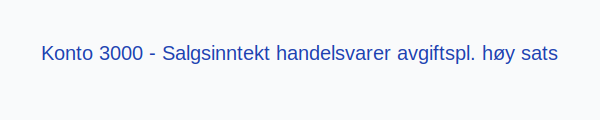
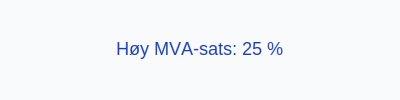

**Konto 3000 - Salgsinntekt handelsvarer avgiftspl. høy sats** er en konto i Norsk Standard Kontoplan som brukes til å registrere **salgsinntekter** fra **handelsvarer** som er **avgiftspliktige med høy MVA-sats**.

## Hva er Salgsinntekt handelsvarer avgiftspliktig høy sats?

*Salgsinntekt handelsvarer avgiftspliktig høy sats* omfatter omsetning av varer som er en del av selskapets **hovedvirksomhet**, der varene selges med **25 % MVA**.

| Konto | Beskrivelse                                            | MVA-sats |
|-------|--------------------------------------------------------|----------|
| 3000  | Salgsinntekt handelsvarer avgiftspl. høy sats          | 25 %     |

## Regnskapsføring

Regnskapsføring av salgsinntekter skal følge **inntektsføringsprinsippet** og skille mellom netto salgsinntekt og merverdiavgift.

| Transaksjon                                 | Debet                                            | Kredit                                               |
|---------------------------------------------|--------------------------------------------------|------------------------------------------------------|
| Salg av handelsvarer ekskl. MVA             | Konto 1500 - Kundefordringer (inkl. MVA)          | Konto 3000 - Salgsinntekt handelsvarer avgiftspl. høy sats |
| Utgående merverdiavgift høy sats            | Konto 2701 - Utgående merverdiavgift høy sats     | Konto 1500 - Kundefordringer (inkl. MVA)             |
| Mottatt betaling fra kunde                  | Konto 1920 - Bankinnskudd                         | Konto 1500 - Kundefordringer                         |

## Vurdering og rapportering

Salgsinntekter rapporteres netto, det vil si eksklusive MVA, og skal føres i resultatregnskapet under driftsinntekter. Korrekt periodisering og rapportering av omsetning er avgjørende for **nøyaktig regnskapsanalyse**.

## Intern lenking og relaterte kontoer

* [Konto 7300 - Salgskostnad](/blogs/kontoplan/7300-salgskostnad "Konto 7300 - Salgskostnad")
* [Konto 2701 - Utgående merverdiavgift høy sats](/blogs/kontoplan/2701-utgaende-merverdiavgift-hoy-sats "Konto 2701 - Utgående merverdiavgift høy sats")
* [Konto 3000 - Salgsinntekt handelsvarer avgiftspl. høy sats](/blogs/kontoplan/3000-salgsinntekt-handelsvarer-avgiftspl-hoy-sats "Konto 3000 - Salgsinntekt handelsvarer avgiftspl. høy sats")
* [Konto 3010 - Salgsinntekt egentilvirkede varer avgiftspl. høy sats](/blogs/kontoplan/3010-salgsinntekt-egentilvirkede-varer-avgiftspl-hoy-sats "Konto 3010 - Salgsinntekt egentilvirkede varer avgiftspl. høy sats")
* [Konto 3020 - Salgsinntekt tjenester avgiftspl. høy sats](/blogs/kontoplan/3020-salgsinntekt-tjenester-avgiftspl-hoy-sats "Konto 3020 - Salgsinntekt tjenester avgiftspl. høy sats")
* [Konto 3030 - Salgsinntekt handelsvarer avgiftspl. middels sats](/blogs/kontoplan/3030-salgsinntekt-handelsvarer-avgiftspl-middels-sats "Konto 3030 - Salgsinntekt handelsvarer avgiftspl. middels sats")
* [Konto 3100 - Salgsinntekt handelsvarer avgiftsfri](/blogs/kontoplan/3100-salgsinntekt-handelsvarer-avgiftsfri "Konto 3100 - Salgsinntekt handelsvarer avgiftsfri")
* [Konto 3080 - Rabatter og annen salgsinntektsred., avgiftspl.](/blogs/kontoplan/3080-rabatter-og-annen-salgsinntektsred-avgiftspl "Konto 3080 - Rabatter og annen salgsinntektsred., avgiftspl.")
* [Hva er Driftsinntekter?](/blogs/regnskap/hva-er-driftsinntekter "Hva er Driftsinntekter? Komplett Guide til Driftsinntekter i Regnskap")
* [Hva er Omsetning?](/blogs/regnskap/hva-er-omsetning "Hva er Omsetning? Komplett Guide til Omsetning i Regnskap og Skatt")
* [Konto 3040 - Salgsinntekt egentilvirkede varer avgiftspl. middels sats](/blogs/kontoplan/3040-salgsinntekt-egentilvirkede-varer-avgiftspl-middels-sats "Konto 3040 - Salgsinntekt egentilvirkede varer avgiftspl. middels sats")
* [Hva er en Kontoplan?](/blogs/regnskap/hva-er-kontoplan "Hva er en Kontoplan? Komplett Guide til Kontoplaner i Norsk Regnskap")

