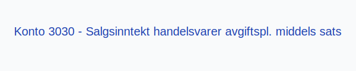
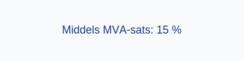

---
title: "3030-salgsinntekt-handelsvarer-avgiftspl-middels-sats"
meta_title: "3030-salgsinntekt-handelsvarer-avgiftspl-middels-sats"
meta_description: "**Konto 3030 - Salgsinntekt handelsvarer avgiftspl. middels sats** er en konto i Norsk Standard Kontoplan som brukes til å registrere **salgsinntekter** fra **..."
slug: 3030-salgsinntekt-handelsvarer-avgiftspl-middels-sats
type: blog
layout: pages/single
---

**Konto 3030 - Salgsinntekt handelsvarer avgiftspl. middels sats** er en konto i Norsk Standard Kontoplan som brukes til å registrere **salgsinntekter** fra **handelsvarer** som er **avgiftspliktige med middels MVA-sats**.

## Hva er Salgsinntekt handelsvarer avgiftspliktig middels sats?

*Salgsinntekt handelsvarer avgiftspliktig middels sats* omfatter omsetning av varer som er en del av selskapets **hovedvirksomhet**, der varene selges med **15 % MVA**.

| Konto | Beskrivelse                                            | MVA-sats |
|-------|--------------------------------------------------------|----------|
| 3030  | Salgsinntekt handelsvarer avgiftspl. middels sats       | 15 %     |

## Regnskapsføring

Regnskapsføring av salgsinntekter skal følge **inntektsføringsprinsippet** og skille mellom netto salgsinntekt og merverdiavgift.

| Transaksjon                                  | Debet                                            | Kredit                                                 |
|----------------------------------------------|--------------------------------------------------|-------------------------------------------------------|
| Salg av handelsvarer ekskl. MVA              | Konto 1500 - Kundefordringer (inkl. MVA)         | Konto 3030 - Salgsinntekt handelsvarer avgiftspl. middels sats |
| Utgående merverdiavgift middels sats         | Konto 2703 - Utgående merverdiavgift middels sats| Konto 1500 - Kundefordringer (inkl. MVA)               |
| Mottatt betaling fra kunde                   | Konto 1920 - Bankinnskudd                        | Konto 1500 - Kundefordringer                           |

## Vurdering og rapportering

Salgsinntekter rapporteres netto, det vil si eksklusive MVA, og skal føres i resultatregnskapet under driftsinntekter. Korrekt periodisering og rapportering av omsetning er avgjørende for **nøyaktig regnskapsanalyse**.

## Intern lenking og relaterte kontoer

* [Konto 2703 - Utgående merverdiavgift middels sats](/blogs/kontoplan/2703-utgaende-merverdiavgift-middels-sats "Konto 2703 - Utgående merverdiavgift middels sats")
* [Konto 3000 - Salgsinntekt handelsvarer avgiftspl. høy sats](/blogs/kontoplan/3000-salgsinntekt-handelsvarer-avgiftspl-hoy-sats "Konto 3000 - Salgsinntekt handelsvarer avgiftspl. høy sats")
* [Konto 3010 - Salgsinntekt egentilvirkede varer avgiftspl. høy sats](/blogs/kontoplan/3010-salgsinntekt-egentilvirkede-varer-avgiftspl-hoy-sats "Konto 3010 - Salgsinntekt egentilvirkede varer avgiftspl. høy sats")
* [Konto 3020 - Salgsinntekt tjenester avgiftspl. høy sats](/blogs/kontoplan/3020-salgsinntekt-tjenester-avgiftspl-hoy-sats "Konto 3020 - Salgsinntekt tjenester avgiftspl. høy sats")
* [Konto 3030 - Salgsinntekt handelsvarer avgiftspl. middels sats](/blogs/kontoplan/3030-salgsinntekt-handelsvarer-avgiftspl-middels-sats "Konto 3030 - Salgsinntekt handelsvarer avgiftspl. middels sats")
* [Konto 3040 - Salgsinntekt egentilvirkede varer avgiftspl. middels sats](/blogs/kontoplan/3040-salgsinntekt-egentilvirkede-varer-avgiftspl-middels-sats "Konto 3040 - Salgsinntekt egentilvirkede varer avgiftspl. middels sats")
* [Konto 3050 - Salgsinntekt tjenester avgiftspl. lav sats](/blogs/kontoplan/3050-salgsinntekt-tjenester-avgiftspl-lav-sats "Konto 3050 - Salgsinntekt tjenester avgiftspl. lav sats")
* [Konto 3100 - Salgsinntekt handelsvarer avgiftsfri](/blogs/kontoplan/3100-salgsinntekt-handelsvarer-avgiftsfri "Konto 3100 - Salgsinntekt handelsvarer avgiftsfri")
* [Konto 3080 - Rabatter og annen salgsinntektsred., avgiftspl.](/blogs/kontoplan/3080-rabatter-og-annen-salgsinntektsred-avgiftspl "Konto 3080 - Rabatter og annen salgsinntektsred., avgiftspl.")
* [Hva er Driftsinntekter?](/blogs/regnskap/hva-er-driftsinntekter "Hva er Driftsinntekter? Komplett Guide til Driftsinntekter i Regnskap")
* [Hva er Omsetning?](/blogs/regnskap/hva-er-omsetning "Hva er Omsetning? Komplett Guide til Omsetning i Regnskap og Skatt")
* [Hva er en Kontoplan?](/blogs/regnskap/hva-er-kontoplan "Hva er en Kontoplan? Komplett Guide til Kontoplaner i Norsk Regnskap")
