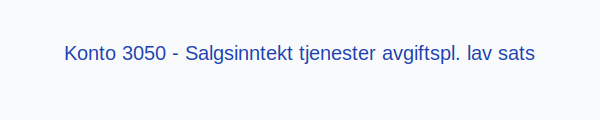
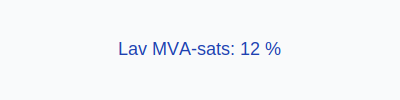

---
title: "Konto 3050 - Salgsinntekt tjenester avgiftspl. lav sats"
meta_title: "3050-salgsinntekt-tjenester-avgiftspl-lav-sats"
meta_description: '**Konto 3050 - Salgsinntekt tjenester avgiftspl. lav sats** er en konto i Norsk Standard Kontoplan som brukes til å registrere **salgsinntekter** fra **tjenest...'
slug: 3050-salgsinntekt-tjenester-avgiftspl-lav-sats
type: blog
layout: pages/single
---

**Konto 3050 - Salgsinntekt tjenester avgiftspl. lav sats** er en konto i Norsk Standard Kontoplan som brukes til å registrere **salgsinntekter** fra **tjenester** som er **avgiftspliktige med lav MVA-sats**.

## Hva er Salgsinntekt tjenester avgiftspliktig lav sats?

*Salgsinntekt tjenester avgiftspliktig lav sats* omfatter omsetning av tjenester levert av selskapet, der tjenestene selges med **12 % MVA**.

| Konto | Beskrivelse                                  | MVA-sats |
|-------|----------------------------------------------|----------|
| 3050  | Salgsinntekt tjenester avgiftspl. lav sats   | 12 %     |

## Regnskapsføring

Regnskapsføring av salgsinntekter skal følge **inntektsføringsprinsippet** og skille mellom netto salgsinntekt og merverdiavgift.

| Transaksjon                              | Debet                                            | Kredit                                                 |
|------------------------------------------|--------------------------------------------------|-------------------------------------------------------|
| Salg av tjenester ekskl. MVA             | Konto 1500 - Kundefordringer (inkl. MVA)         | Konto 3050 - Salgsinntekt tjenester avgiftspl. lav sats |
| Utgående merverdiavgift lav sats         | Konto 2704 - Utgående merverdiavgift lav sats    | Konto 1500 - Kundefordringer (inkl. MVA)               |
| Mottatt betaling fra kunde               | Konto 1920 - Bankinnskudd                        | Konto 1500 - Kundefordringer                           |

## Vurdering og rapportering

Salgsinntekter rapporteres netto, det vil si eksklusive MVA, og skal føres i resultatregnskapet under driftsinntekter. Korrekt periodisering og rapportering av omsetning er avgjørende for **nøyaktig regnskapsanalyse**.

## Intern lenking og relaterte kontoer

* [Konto 2704 - Utgående merverdiavgift lav sats](/blogs/kontoplan/2704-utgaende-merverdiavgift-lav-sats "Konto 2704 - Utgående merverdiavgift lav sats")
* [Konto 3000 - Salgsinntekt handelsvarer avgiftspl. høy sats](/blogs/kontoplan/3000-salgsinntekt-handelsvarer-avgiftspl-hoy-sats "Konto 3000 - Salgsinntekt handelsvarer avgiftspl. høy sats")
* [Konto 3010 - Salgsinntekt egentilvirkede varer avgiftspl. høy sats](/blogs/kontoplan/3010-salgsinntekt-egentilvirkede-varer-avgiftspl-hoy-sats "Konto 3010 - Salgsinntekt egentilvirkede varer avgiftspl. høy sats")
* [Konto 3020 - Salgsinntekt tjenester avgiftspl. høy sats](/blogs/kontoplan/3020-salgsinntekt-tjenester-avgiftspl-hoy-sats "Konto 3020 - Salgsinntekt tjenester avgiftspl. høy sats")
* [Konto 3030 - Salgsinntekt handelsvarer avgiftspl. middels sats](/blogs/kontoplan/3030-salgsinntekt-handelsvarer-avgiftspl-middels-sats "Konto 3030 - Salgsinntekt handelsvarer avgiftspl. middels sats")
* [Konto 3040 - Salgsinntekt egentilvirkede varer avgiftspl. middels sats](/blogs/kontoplan/3040-salgsinntekt-egentilvirkede-varer-avgiftspl-middels-sats "Konto 3040 - Salgsinntekt egentilvirkede varer avgiftspl. middels sats")
* [Konto 3050 - Salgsinntekt tjenester avgiftspl. lav sats](/blogs/kontoplan/3050-salgsinntekt-tjenester-avgiftspl-lav-sats "Konto 3050 - Salgsinntekt tjenester avgiftspl. lav sats")
* [Konto 3510 - Service](/blogs/kontoplan/3510-service "Konto 3510 - Service")
* [Konto 3120 - Salgsinntekt tjenester avgiftsfri](/blogs/kontoplan/3120-salgsinntekt-tjenester-avgiftsfri "Konto 3120 - Salgsinntekt tjenester avgiftsfri")
* [Konto 3220 - Salgsinntekt tjenester utenfor avg.omr](/blogs/kontoplan/3220-salgsinntekt-tjenester-utenfor-avg-omr "Konto 3220 - Salgsinntekt tjenester utenfor avg.omr")
* [Konto 3080 - Rabatter og annen salgsinntektsred., avgiftspl.](/blogs/kontoplan/3080-rabatter-og-annen-salgsinntektsred-avgiftspl "Konto 3080 - Rabatter og annen salgsinntektsred., avgiftspl.")
* [Hva er Driftsinntekter?](/blogs/regnskap/hva-er-driftsinntekter "Hva er Driftsinntekter? Komplett Guide til Driftsinntekter i Regnskap")
* [Hva er Omsetning?](/blogs/regnskap/hva-er-omsetning "Hva er Omsetning? Komplett Guide til Omsetning i Regnskap og Skatt")
* [Hva er en Kontoplan?](/blogs/regnskap/hva-er-kontoplan "Hva er en Kontoplan? Komplett Guide til Kontoplaner i Norsk Regnskap")

