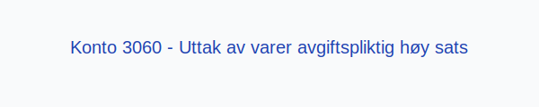
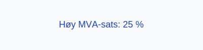

---
title: "Konto 3060 - Uttak av varer avgiftspliktig høy sats"
seoTitle: "Konto 3060 | Uttak av varer høy sats | Kontoplan"
description: "Konto 3060 brukes til å registrere uttak av varer fra lager som er avgiftspliktig med 25 % MVA. Inneholder bruksområder, bokføring, periodisering og rapportering."
summary: "Konto 3060: uttak av varer med høy MVA-sats. Når og hvordan bokføre."
---

**Konto 3060 - Uttak av varer avgiftspliktig høy sats** er en konto i Norsk Standard Kontoplan som brukes til å registrere **uttak av varer** fra varelageret til bruk i virksomheten, der uttaket er **avgiftspliktig med høy MVA-sats**.

## Hva er Uttak av varer avgiftspliktig høy sats?

*Uttak av varer avgiftspliktig høy sats* omfatter uttak av varer fra lager til bruk internt i selskapet, hvor varene anses som omsetning med **25 % MVA**.

| Konto | Beskrivelse                                             | MVA-sats |
|-------|---------------------------------------------------------|----------|
| 3060  | Uttak av varer avgiftspliktig høy sats                 | 25 %     |

## Regnskapsføring

Regnskapsføring av vareuttak skal følge **tilknytningsprinsippet** og skille mellom kostpris og merverdiavgift.

| Transaksjon                                   | Debet                                              | Kredit                             |
|-----------------------------------------------|----------------------------------------------------|------------------------------------|
| Uttak av varer ekskl. MVA                     | Konto 3060 - Uttak av varer avgiftspliktig høy sats | Konto 1400 - Råvarer og innkjøpte halvfabrikater |
| Utgående merverdiavgift høy sats              | Konto 2701 - Utgående merverdiavgift høy sats       | Konto 3060 - Uttak av varer avgiftspliktig høy sats |
| Bokføring av kostpris (vareforbruk)           | Konto 4300 - Vareforbruk (kostnad)                  | Konto 3060 - Uttak av varer avgiftspliktig høy sats |

## Vurdering og rapportering

Vareuttak rapporteres netto, det vil si ekskludert MVA, og kostnad føres i resultatregnskapet under driftskostnader. Korrekt periodisering er viktig for **nøyaktig regnskapsanalyse**.

## Intern lenking og relaterte kontoer

* [Konto 1400 - Råvarer og innkjøpte halvfabrikater](/blogs/kontoplan/1400-raavarer-og-innkjopte-halvfabrikater "Konto 1400 - Råvarer og innkjøpte halvfabrikater")
* [Konto 1420 - Varer under utvikling](/blogs/kontoplan/1420-varer-under-utvikling "Konto 1420 - Varer under utvikling")
* [Konto 1440 - Ferdige egentilvirkede varer](/blogs/kontoplan/1440-ferdige-egentilvirkede-varer "Konto 1440 - Ferdige egentilvirkede varer")
* [Konto 1460 - Innkjøpte varer for videresalg](/blogs/kontoplan/1460-innkjopte-varer-for-videresalg "Konto 1460 - Innkjøpte varer for videresalg")
* [Konto 4300 - Innkjøp varer for videresalg høy sats](/blogs/kontoplan/4300-innkjop-varer-for-videresalg-hoy-sats "Konto 4300 - Innkjøp varer for videresalg høy sats")
* [Konto 3060 - Uttak av varer avgiftspliktig høy sats](/blogs/kontoplan/3060-uttak-av-varer-avgiftspliktig-hoy-sats "Konto 3060 - Uttak av varer avgiftspliktig høy sats")
* [Konto 3063 - Uttak av varer avgiftspliktig middels sats](/blogs/kontoplan/3063-uttak-av-varer-avgiftspliktig-middels-sats "Konto 3063 - Uttak av varer avgiftspliktig middels sats")
* [Konto 3160 - Uttak av varer avgiftsfritt](/blogs/kontoplan/3160-uttak-av-varer-avgiftsfritt "Konto 3160 - Uttak av varer avgiftsfritt")
* [Konto 3260 - Uttak av varer utenfor avgiftsområdet](/blogs/kontoplan/3260-uttak-av-varer-utenfor-avg-omr "Konto 3260 - Uttak av varer utenfor avgiftsområdet")
* [Konto 3070 - Uttak av tjenester avgiftspliktig høy sats](/blogs/kontoplan/3070-uttak-av-tjenester-avgiftspliktig-hoy-sats "Konto 3070 - Uttak av tjenester avgiftspliktig høy sats")
* [Konto 3074 - Uttak av tjenester avgiftspliktig lav sats](/blogs/kontoplan/3074-uttak-av-tjenester-avgiftspliktig-lav-sats "Konto 3074 - Uttak av tjenester avgiftspliktig lav sats")
* [Hva er Varelager?](/blogs/regnskap/hva-er-varelager "Hva er Varelager? Komplett Guide til Lagerføring og Verdivurdering")
* [Hva er en Kontoplan?](/blogs/regnskap/hva-er-kontoplan "Hva er en Kontoplan? Komplett Guide til Kontoplaner i Norsk Regnskap")

