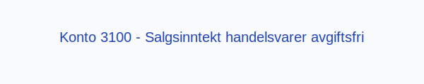

---
title: "Konto 3100 - Salgsinntekt handelsvarer avgiftsfri"
meta_title: "3100-salgsinntekt-handelsvarer-avgiftsfri"
meta_description: '**Konto 3100 - Salgsinntekt handelsvarer avgiftsfri** er en konto i Norsk Standard Kontoplan som brukes til å registrere **salgsinntekter** fra **handelsvarer*...'
slug: 3100-salgsinntekt-handelsvarer-avgiftsfri
type: blog
layout: pages/single
---

**Konto 3100 - Salgsinntekt handelsvarer avgiftsfri** er en konto i Norsk Standard Kontoplan som brukes til å registrere **salgsinntekter** fra **handelsvarer** som er **avgiftsfrie (0 % MVA)**.

## Hva er Salgsinntekt handelsvarer avgiftsfri?

*Salgsinntekt handelsvarer avgiftsfri* omfatter omsetning av varer som er en del av selskapets **hovedvirksomhet**, der varene selges uten merverdiavgift.

| Konto | Beskrivelse                                | MVA-sats |
|-------|--------------------------------------------|----------|
| 3100  | Salgsinntekt handelsvarer avgiftsfri       | 0 %      |

## Regnskapsføring

Regnskapsføring av avgiftsfrie salgsinntekter skal følge **inntektsføringsprinsippet** og skille mellom netto salgsinntekt og eventuelle kostnader.

| Transaksjon                            | Debet                                        | Kredit                                             |
|----------------------------------------|----------------------------------------------|----------------------------------------------------|
| Salg av handelsvarer                   | Konto 1500 - Kundefordringer                 | Konto 3100 - Salgsinntekt handelsvarer avgiftsfri  |
| Mottatt betaling fra kunde             | Konto 1920 - Bankinnskudd                    | Konto 1500 - Kundefordringer                       |

## Vurdering og rapportering

Avgiftsfrie salgsinntekter rapporteres netto og føres i resultatregnskapet under driftsinntekter. Korrekt periodisering og rapportering av omsetning er avgjørende for **nøyaktig regnskapsanalyse**.

## Intern lenking og relaterte kontoer

* [Konto 2701 - Utgående merverdiavgift høy sats](/blogs/kontoplan/2701-utgaende-merverdiavgift-hoy-sats "Konto 2701 - Utgående merverdiavgift høy sats")
* [Konto 3000 - Salgsinntekt handelsvarer avgiftspl. høy sats](/blogs/kontoplan/3000-salgsinntekt-handelsvarer-avgiftspl-hoy-sats "Konto 3000 - Salgsinntekt handelsvarer avgiftspl. høy sats")
* [Konto 3030 - Salgsinntekt handelsvarer avgiftspl. middels sats](/blogs/kontoplan/3030-salgsinntekt-handelsvarer-avgiftspl-middels-sats "Konto 3030 - Salgsinntekt handelsvarer avgiftspl. middels sats")
* [Konto 3100 - Salgsinntekt handelsvarer avgiftsfri](/blogs/kontoplan/3100-salgsinntekt-handelsvarer-avgiftsfri "Konto 3100 - Salgsinntekt handelsvarer avgiftsfri")
* [Konto 3110 - Salgsinntekt egentilvirkede varer avgiftsfri](/blogs/kontoplan/3110-salgsinntekt-egentilvirkede-varer-avgiftsfri "Konto 3110 - Salgsinntekt egentilvirkede varer avgiftsfri")
* [Konto 3180 - Rabatter og annen salgsinntektsreduksjon avgiftsfri](/blogs/kontoplan/3180-rabatter-og-annen-salgsinntektsreduksjon-avgiftsfri "Konto 3180 - Rabatter og annen salgsinntektsreduksjon avgiftsfri")
* [Konto 3190 - Refunderbare utlegg for kjøpers regning avgiftsfri](/blogs/kontoplan/3190-refunderbare-utlegg-for-kjopers-regning-avgiftsfri "Konto 3190 - Refunderbare utlegg for kjøpers regning avgiftsfri")
* [Konto 3200 - Salgsinntekt handelsvarer utenfor avg.omr](/blogs/kontoplan/3200-salgsinntekt-handelsvarer-utenfor-avg-omr "Konto 3200 - Salgsinntekt handelsvarer utenfor avg.omr")
* [Konto 3210 - Salgsinntekt egentilvirkede varer utenfor avg.omr](/blogs/kontoplan/3210-salgsinntekt-egentilvirkede-varer-utenfor-avg-omr "Konto 3210 - Salgsinntekt egentilvirkede varer utenfor avg.omr")
* [Konto 3080 - Rabatter og annen salgsinntektsred., avgiftspl.](/blogs/kontoplan/3080-rabatter-og-annen-salgsinntektsred-avgiftspl "Konto 3080 - Rabatter og annen salgsinntektsred., avgiftspl.")
* [Hva er Driftsinntekter?](/blogs/regnskap/hva-er-driftsinntekter "Hva er Driftsinntekter? Komplett Guide til Driftsinntekter i Regnskap")
* [Hva er Omsetning?](/blogs/regnskap/hva-er-omsetning "Hva er Omsetning? Komplett Guide til Omsetning i Regnskap og Skatt")
* [Hva er en Kontoplan?](/blogs/regnskap/hva-er-kontoplan "Hva er en Kontoplan? Komplett Guide til Kontoplaner i Norsk Regnskap")

