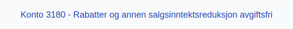

---
title: "3180-rabatter-og-annen-salgsinntektsreduksjon-avgiftsfri"
meta_title: "3180-rabatter-og-annen-salgsinntektsreduksjon-avgiftsfri"
meta_description: '**Konto 3180 - Rabatter og annen salgsinntektsreduksjon avgiftsfri** er en konto i Norsk Standard Kontoplan som brukes til å registrere **rabatter** og annen *...'
slug: 3180-rabatter-og-annen-salgsinntektsreduksjon-avgiftsfri
type: blog
layout: pages/single
---

**Konto 3180 - Rabatter og annen salgsinntektsreduksjon avgiftsfri** er en konto i Norsk Standard Kontoplan som brukes til å registrere **rabatter** og annen **salgsinntektsreduksjon** for varer eller tjenester som er **avgiftsfrie (0 % MVA)**.

## Hva er Rabatter og annen salgsinntektsreduksjon avgiftsfri?

*Rabatter og annen salgsinntektsreduksjon avgiftsfri* omfatter alle rabatter, bonuser og prisavslag som gis til kunder på varer eller tjenester som er avgiftsfrie, og reduserer netto omsetning.

| Konto | Beskrivelse                                             | MVA-sats |
|-------|---------------------------------------------------------|----------|
| 3180  | Rabatter og annen salgsinntektsreduksjon avgiftsfri     | 0 %      |

## Regnskapsføring

*Registrering av rabatter skal følge **tilknytningsprinsippet**, og salgsinntektsreduksjon føres netto uten MVA.*

| Transaksjon                | Debet                                                | Kredit                      |
|----------------------------|------------------------------------------------------|-----------------------------|
| Rabatter ekskl. MVA        | Konto 3180 - Rabatter og annen salgsinntektsreduksjon avgiftsfri | Konto 1500 - Kundefordringer |
| Mottatt betaling fra kunde | Konto 1920 - Bankinnskudd                            | Konto 1500 - Kundefordringer |

## Vurdering og rapportering

Rabatter og prisavslag reduserer netto omsetning og skal vises tydelig i resultatregnskapet for **nøyaktig regnskapsanalyse**.

## Intern lenking og relaterte kontoer

* [Konto 3000 - Salgsinntekt handelsvarer avgiftspl. høy sats](/blogs/kontoplan/3000-salgsinntekt-handelsvarer-avgiftspl-hoy-sats "Konto 3000 - Salgsinntekt handelsvarer avgiftspl. høy sats")
* [Konto 3010 - Salgsinntekt egentilvirkede varer avgiftspl. høy sats](/blogs/kontoplan/3010-salgsinntekt-egentilvirkede-varer-avgiftspl-hoy-sats "Konto 3010 - Salgsinntekt egentilvirkede varer avgiftspl. høy sats")
* [Konto 3020 - Salgsinntekt tjenester avgiftspl. høy sats](/blogs/kontoplan/3020-salgsinntekt-tjenester-avgiftspl-hoy-sats "Konto 3020 - Salgsinntekt tjenester avgiftspl. høy sats")
* [Konto 3030 - Salgsinntekt handelsvarer avgiftspl. middels sats](/blogs/kontoplan/3030-salgsinntekt-handelsvarer-avgiftspl-middels-sats "Konto 3030 - Salgsinntekt handelsvarer avgiftspl. middels sats")
* [Konto 3040 - Salgsinntekt egentilvirkede varer avgiftspl. middels sats](/blogs/kontoplan/3040-salgsinntekt-egentilvirkede-varer-avgiftspl-middels-sats "Konto 3040 - Salgsinntekt egentilvirkede varer avgiftspl. middels sats")
* [Konto 3050 - Salgsinntekt tjenester avgiftspl. lav sats](/blogs/kontoplan/3050-salgsinntekt-tjenester-avgiftspl-lav-sats "Konto 3050 - Salgsinntekt tjenester avgiftspl. lav sats")
* [Konto 3120 - Salgsinntekt tjenester avgiftsfri](/blogs/kontoplan/3120-salgsinntekt-tjenester-avgiftsfri "Konto 3120 - Salgsinntekt tjenester avgiftsfri")
* [Konto 3100 - Salgsinntekt handelsvarer avgiftsfri](/blogs/kontoplan/3100-salgsinntekt-handelsvarer-avgiftsfri "Konto 3100 - Salgsinntekt handelsvarer avgiftsfri")
* [Konto 3110 - Salgsinntekt egentilvirkede varer avgiftsfri](/blogs/kontoplan/3110-salgsinntekt-egentilvirkede-varer-avgiftsfri "Konto 3110 - Salgsinntekt egentilvirkede varer avgiftsfri")
* [Konto 3180 - Rabatter og annen salgsinntektsreduksjon avgiftsfri](/blogs/kontoplan/3180-rabatter-og-annen-salgsinntektsreduksjon-avgiftsfri "Konto 3180 - Rabatter og annen salgsinntektsreduksjon avgiftsfri")
* [Konto 3190 - Refunderbare utlegg for kjøpers regning avgiftsfri](/blogs/kontoplan/3190-refunderbare-utlegg-for-kjopers-regning-avgiftsfri "Konto 3190 - Refunderbare utlegg for kjøpers regning avgiftsfri")
* [Konto 3280 - Rabatter og annen salgsinntektsreduksjon utenfor avg.omr](/blogs/kontoplan/3280-rabatter-og-annen-salgsinntektsreduksjon-utenfor-avg-omr "Konto 3280 - Rabatter og annen salgsinntektsreduksjon utenfor avg.omr")
* [Konto 3200 - Salgsinntekt handelsvarer utenfor avg.omr](/blogs/kontoplan/3200-salgsinntekt-handelsvarer-utenfor-avg-omr "Konto 3200 - Salgsinntekt handelsvarer utenfor avg.omr")
* [Konto 3080 - Rabatter og annen salgsinntektsred., avgiftspl.](/blogs/kontoplan/3080-rabatter-og-annen-salgsinntektsred-avgiftspl "Konto 3080 - Rabatter og annen salgsinntektsred., avgiftspl.")
* [Hva er Driftsinntekter?](/blogs/regnskap/hva-er-driftsinntekter "Hva er Driftsinntekter? Komplett Guide til Driftsinntekter i Regnskap")
* [Hva er Omsetning?](/blogs/regnskap/hva-er-omsetning "Hva er Omsetning? Komplett Guide til Omsetning i Regnskap og Skatt")
* [Konto 4070 - Innkjøpsprisreduksjon](/blogs/kontoplan/4070-innkjopsprisreduksjon "Konto 4070 - Innkjøpsprisreduksjon")
* [Konto 4270 - Innkjøpsprisreduksjon, avgiftspliktig](/blogs/kontoplan/4270-innkjopsprisreduksjon-avgiftspliktig "Konto 4270 - Innkjøpsprisreduksjon, avgiftspliktig")
* [Hva er en Kontoplan?](/blogs/regnskap/hva-er-kontoplan "Hva er en Kontoplan? Komplett Guide til Kontoplaner i Norsk Regnskap")
