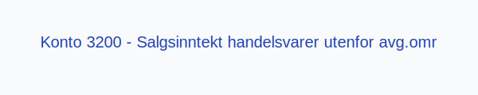

---
title: "Konto 3200 - Salgsinntekt handelsvarer utenfor avg.omr"
meta_title: "3200-salgsinntekt-handelsvarer-utenfor-avg-omr"
meta_description: '**Konto 3200 - Salgsinntekt handelsvarer utenfor avg.omr** er en konto i Norsk Standard Kontoplan som brukes til å registrere **salgsinntekter** fra **handelsv...'
slug: 3200-salgsinntekt-handelsvarer-utenfor-avg-omr
type: blog
layout: pages/single
---

**Konto 3200 - Salgsinntekt handelsvarer utenfor avg.omr** er en konto i Norsk Standard Kontoplan som brukes til å registrere **salgsinntekter** fra **handelsvarer** som ligger **utenfor merverdiavgiftsområdet**.

## Hva er Salgsinntekt handelsvarer utenfor avg.omr?

*Salgsinntekt handelsvarer utenfor avg.omr* omfatter omsetning av varer som ikke er omfattet av merverdiavgiftsloven, for eksempel internasjonal transport, diplomatiske leveranser eller salg til tollfrie områder.

Eksempler på unntatt omsetning:
* Eksport av varer til land utenfor EØS.
* Leveranser til diplomatiske misjoner og internasjonale organisasjoner.
* Salg av varer under omsetningstillatelse til tollfrie områder.

| Konto | Beskrivelse                               | MVA-sats               |
|-------|-------------------------------------------|------------------------|
| 3200  | Salgsinntekt handelsvarer utenfor avg.omr | Utenfor avgiftsområdet |

## Regnskapsføring

Regnskapsføring av **salgsinntekter utenfor avgiftsområdet** følger inntektsføringsprinsippet med fokus på netto salg. Kontostrukturen bidrar til å skille mellom MVA-pliktig og ikke MVA-pliktig omsetning.

| Transaksjon                   | Debet                        | Kredit                                                |
|-------------------------------|------------------------------|-------------------------------------------------------|
| Salg av handelsvarer uten MVA | Konto 1500 - Kundefordringer | Konto 3200 - Salgsinntekt handelsvarer utenfor avg.omr |
| Mottatt betaling fra kunde    | Konto 1920 - Bankinnskudd    | Konto 1500 - Kundefordringer                          |

## Vurdering og rapportering

* Inntekter utenfor merverdiavgiftsområdet skal rapporteres separat for å sikre korrekt MVA-rapportering.
* Det er viktig med **nøyaktig periodisering** for å unngå feil i skattemessige og finansielle rapporter.
* Bruk av konto 3200 hjelper med å opprettholde klarhet mellom avgiftspliktig og avgiftsfri omsetning.

## Intern lenking og relaterte kontoer

* [Konto 1500 - Kundefordringer](/blogs/kontoplan/1500-kundefordringer "Konto 1500 - Kundefordringer")
* [Konto 1920 - Bankinnskudd](/blogs/kontoplan/1920-bankinnskudd "Konto 1920 - Bankinnskudd")
* [Konto 3100 - Salgsinntekt handelsvarer avgiftsfri](/blogs/kontoplan/3100-salgsinntekt-handelsvarer-avgiftsfri "Konto 3100 - Salgsinntekt handelsvarer avgiftsfri")
* [Konto 3210 - Salgsinntekt egentilvirkede varer utenfor avg.omr](/blogs/kontoplan/3210-salgsinntekt-egentilvirkede-varer-utenfor-avg-omr "Konto 3210 - Salgsinntekt egentilvirkede varer utenfor avg.omr")
* [Konto 3220 - Salgsinntekt tjenester utenfor avg.omr](/blogs/kontoplan/3220-salgsinntekt-tjenester-utenfor-avg-omr "Konto 3220 - Salgsinntekt tjenester utenfor avg.omr")
* [Konto 3260 - Uttak av varer utenfor avg.omr](/blogs/kontoplan/3260-uttak-av-varer-utenfor-avg-omr "Konto 3260 - Uttak av varer utenfor avg.omr")
* [Konto 3280 - Rabatter og annen salgsinntektsreduksjon utenfor avg.omr](/blogs/kontoplan/3280-rabatter-og-annen-salgsinntektsreduksjon-utenfor-avg-omr "Konto 3280 - Rabatter og annen salgsinntektsreduksjon utenfor avg.omr")
* [Hva er en Kontoplan?](/blogs/regnskap/hva-er-kontoplan "Hva er en Kontoplan? Komplett Guide til Kontoplaner i Norsk Regnskap")
* [Hva er Omsetning?](/blogs/regnskap/hva-er-omsetning "Hva er Omsetning? Komplett Guide til Omsetning i Regnskap og Skatt")

