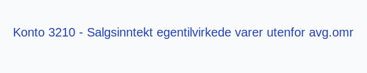
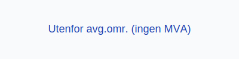

---
title: "Konto 3210 - Salgsinntekt egentilvirkede varer utenfor avg.omr"
meta_title: "3210-salgsinntekt-egentilvirkede-varer-utenfor-avg-omr"
meta_description: '**Konto 3210 - Salgsinntekt egentilvirkede varer utenfor avg.omr** er en konto i Norsk Standard Kontoplan som brukes til å registrere **salgsinntekter** fra **...'
slug: 3210-salgsinntekt-egentilvirkede-varer-utenfor-avg-omr
type: blog
layout: pages/single
---

**Konto 3210 - Salgsinntekt egentilvirkede varer utenfor avg.omr** er en konto i Norsk Standard Kontoplan som brukes til å registrere **salgsinntekter** fra **egentilvirkede varer** som ligger **utenfor merverdiavgiftsområdet**.

## Hva er Salgsinntekt egentilvirkede varer utenfor avg.omr?

*Salgsinntekt egentilvirkede varer utenfor avg.omr* omfatter omsetning av varer produsert internt i selskapet, der varene selges til kunder når omsetningen er unntatt fra merverdiavgift.

Eksempler på omsetning utenfor MVA-området:
* Eksport av varer til land utenfor EØS.
* Leveranser til diplomatiske misjoner eller internasjonale organisasjoner.
* Salg under omsetningstillatelse til tollfrie områder.

| Konto | Beskrivelse                                               | MVA-sats               |
|-------|-----------------------------------------------------------|------------------------|
| 3210  | Salgsinntekt egentilvirkede varer utenfor avg.omr         | Utenfor avgiftsområdet |

## Regnskapsføring

Regnskapsføring av **salgsinntekter utenfor avgiftsområdet** følger inntektsføringsprinsippet og skiller netto salgsinntekt fra eventuelle kostnader.

| Transaksjon                   | Debet                        | Kredit                                                |
|-------------------------------|------------------------------|-------------------------------------------------------|
| Salg av egentilvirkede varer  | Konto 1500 - Kundefordringer | Konto 3210 - Salgsinntekt egentilvirkede varer utenfor avg.omr |
| Mottatt betaling fra kunde    | Konto 1920 - Bankinnskudd    | Konto 1500 - Kundefordringer                          |

## Vurdering og rapportering

* Inntekter utenfor merverdiavgiftsområdet skal rapporteres separat for å sikre korrekt MVA-rapportering.
* Nøyaktig periodisering er viktig for å unngå avvik i skattemessige og finansielle rapporter.
* Konto 3210 bidrar til å holde **klare skiller** mellom avgiftspliktig, avgiftsfri og utenfor MVA-området.

## Intern lenking og relaterte kontoer

* [Konto 1500 - Kundefordringer](/blogs/kontoplan/1500-kundefordringer "Konto 1500 - Kundefordringer")
* [Konto 1920 - Bankinnskudd](/blogs/kontoplan/1920-bankinnskudd "Konto 1920 - Bankinnskudd")
* [Konto 3010 - Salgsinntekt egentilvirkede varer avgiftspl. høy sats](/blogs/kontoplan/3010-salgsinntekt-egentilvirkede-varer-avgiftspl-hoy-sats "Konto 3010 - Salgsinntekt egentilvirkede varer avgiftspl. høy sats")
* [Konto 3040 - Salgsinntekt egentilvirkede varer avgiftspl. middels sats](/blogs/kontoplan/3040-salgsinntekt-egentilvirkede-varer-avgiftspl-middels-sats "Konto 3040 - Salgsinntekt egentilvirkede varer avgiftspl. middels sats")
* [Konto 3110 - Salgsinntekt egentilvirkede varer avgiftsfri](/blogs/kontoplan/3110-salgsinntekt-egentilvirkede-varer-avgiftsfri "Konto 3110 - Salgsinntekt egentilvirkede varer avgiftsfri")
* [Konto 3200 - Salgsinntekt handelsvarer utenfor avg.omr](/blogs/kontoplan/3200-salgsinntekt-handelsvarer-utenfor-avg-omr "Konto 3200 - Salgsinntekt handelsvarer utenfor avg.omr")
* [Konto 3220 - Salgsinntekt tjenester utenfor avg.omr](/blogs/kontoplan/3220-salgsinntekt-tjenester-utenfor-avg-omr "Konto 3220 - Salgsinntekt tjenester utenfor avg.omr")
* [Konto 3260 - Uttak av varer utenfor avg.omr](/blogs/kontoplan/3260-uttak-av-varer-utenfor-avg-omr "Konto 3260 - Uttak av varer utenfor avg.omr")
* [Hva er en Kontoplan?](/blogs/regnskap/hva-er-kontoplan "Hva er en Kontoplan? Komplett Guide til Kontoplaner i Norsk Regnskap")
* [Hva er Omsetning?](/blogs/regnskap/hva-er-omsetning "Hva er Omsetning? Komplett Guide til Omsetning i Regnskap og Skatt")

