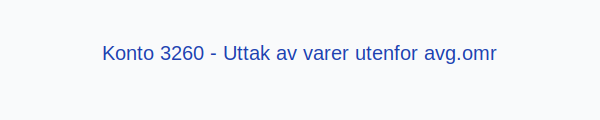
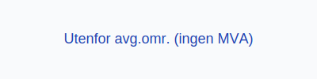

---
title: "Konto 3260 - Uttak av varer utenfor avg.omr"
seoTitle: "3260-uttak-av-varer-utenfor-avg-omr"
meta_description: '**Konto 3260 - Uttak av varer utenfor avg.omr** er en konto i Norsk Standard Kontoplan som brukes til å registrere **uttak av varer** fra varelageret til inter...'
slug: 3260-uttak-av-varer-utenfor-avg-omr
type: blog
layout: pages/single
---

**Konto 3260 - Uttak av varer utenfor avg.omr** er en konto i Norsk Standard Kontoplan som brukes til å registrere **uttak av varer** fra varelageret til intern bruk i virksomheten, der uttaket ligger **utenfor merverdiavgiftsområdet**.

## Hva er Uttak av varer utenfor avg.omr?

*Uttak av varer utenfor avg.omr* omfatter uttak av varer fra lager til internt bruk, hvor varene ikke er omfattet av merverdiavgiftsloven.

Eksempler på uttak utenfor merverdiavgiftsområdet:
* Overføring av varer til produksjonsanlegg eller filialer utenfor EØS.
* Utlevering av prøvevarer eller kampanjemateriell til land utenfor avgiftsområdet.
* Vareuttak til ansatte for bruk i virksomhetens utenlandske drift.

| Konto | Beskrivelse                             | MVA-sats               |
|-------|-----------------------------------------|------------------------|
| 3260  | Uttak av varer utenfor avgiftsområdet | Utenfor avgiftsområdet |

## Regnskapsføring

Regnskapsføring av **uttak av varer utenfor avgiftsområdet** følger **tilknytningsprinsippet** og skiller mellom kostpris og merverdiavgift.

| Transaksjon                        | Debet                                       | Kredit                                 |
|------------------------------------|---------------------------------------------|----------------------------------------|
| Uttak av varer uten MVA            | Konto 3260 - Uttak av varer utenfor avg.omr | Konto 1400 - Råvarer og innkjøpte halvfabrikater |
| Bokføring av kostpris (vareforbruk) | Konto 4300 - Vareforbruk (kostnad)          | Konto 3260 - Uttak av varer utenfor avg.omr |

## Vurdering og rapportering

* Uttak utenfor merverdiavgiftsområdet skal rapporteres separat for å sikre korrekt MVA-rapportering.
* Nøyaktig periodisering bidrar til **nøyaktig regnskapsanalyse** og riktig resultat.
* Konto 3260 bidrar til å holde tydelige skiller mellom avgiftspliktig, avgiftsfri og utenfor MVA-området.

## Intern lenking og relaterte kontoer

* [Konto 1400 - Råvarer og innkjøpte halvfabrikater](/blogs/kontoplan/1400-raavarer-og-innkjopte-halvfabrikater "Konto 1400 - Råvarer og innkjøpte halvfabrikater")
* [Konto 1420 - Varer under utvikling](/blogs/kontoplan/1420-varer-under-utvikling "Konto 1420 - Varer under utvikling")
* [Konto 1440 - Ferdige egentilvirkede varer](/blogs/kontoplan/1440-ferdige-egentilvirkede-varer "Konto 1440 - Ferdige egentilvirkede varer")
* [Konto 1460 - Innkjøpte varer for videresalg](/blogs/kontoplan/1460-innkjopte-varer-for-videresalg "Konto 1460 - Innkjøpte varer for videresalg")
* [Konto 3060 - Uttak av varer avgiftspliktig høy sats](/blogs/kontoplan/3060-uttak-av-varer-avgiftspliktig-hoy-sats "Konto 3060 - Uttak av varer avgiftspliktig høy sats")
* [Konto 3063 - Uttak av varer avgiftspliktig middels sats](/blogs/kontoplan/3063-uttak-av-varer-avgiftspliktig-middels-sats "Konto 3063 - Uttak av varer avgiftspliktig middels sats")
* [Konto 3160 - Uttak av varer avgiftsfritt](/blogs/kontoplan/3160-uttak-av-varer-avgiftsfritt "Konto 3160 - Uttak av varer avgiftsfritt")
* [Konto 3260 - Uttak av varer utenfor avgiftsområdet](/blogs/kontoplan/3260-uttak-av-varer-utenfor-avg-omr "Konto 3260 - Uttak av varer utenfor avgiftsområdet")
* [Hva er Varelager?](/blogs/regnskap/hva-er-varelager "Hva er Varelager? Komplett Guide til Lagerføring og Verdivurdering")
* [Hva er en Kontoplan?](/blogs/regnskap/hva-er-kontoplan "Hva er en Kontoplan? Komplett Guide til Kontoplaner i Norsk Regnskap")

