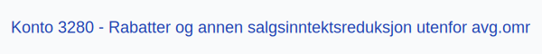

---
title: "3280-rabatter-og-annen-salgsinntektsreduksjon-utenfor-avg-omr"
meta_title: "3280-rabatter-og-annen-salgsinntektsreduksjon-utenfor-avg-omr"
meta_description: "**Konto 3280 - Rabatter og annen salgsinntektsreduksjon utenfor avg.omr** er en konto i Norsk Standard Kontoplan som brukes til å registrere **rabatter** og an..."
slug: 3280-rabatter-og-annen-salgsinntektsreduksjon-utenfor-avg-omr
type: blog
layout: pages/single
---

**Konto 3280 - Rabatter og annen salgsinntektsreduksjon utenfor avg.omr** er en konto i Norsk Standard Kontoplan som brukes til å registrere **rabatter** og annen **salgsinntektsreduksjon** på varer eller tjenester som ligger **utenfor merverdiavgiftsområdet**.

## Hva er Rabatter og annen salgsinntektsreduksjon utenfor avg.omr?

*Rabatter og annen salgsinntektsreduksjon utenfor avg.omr* omfatter alle rabatter, bonuser og prisavslag som gis til kunder på varer eller tjenester som ikke omfattes av merverdiavgiftsloven, og som reduserer netto omsetning.

| Konto | Beskrivelse                                            | MVA-sats               |
|-------|--------------------------------------------------------|------------------------|
| 3280  | Rabatter og annen salgsinntektsreduksjon utenfor avg.omr | Utenfor avgiftsområdet |

## Regnskapsføring

Regnskapsføring av **rabatter og salgsinntektsreduksjon utenfor avgiftsområdet** følger tilknytningsprinsippet med fokus på netto rabatt.

| Transaksjon                 | Debet                                                | Kredit                      |
|-----------------------------|------------------------------------------------------|-----------------------------|
| Rabatter uten MVA           | Konto 3280 - Rabatter og annen salgsinntektsreduksjon utenfor avg.omr | Konto 1500 - Kundefordringer |
| Mottatt betaling fra kunde  | Konto 1920 - Bankinnskudd                            | Konto 1500 - Kundefordringer |

## Vurdering og rapportering

* Rabatter og prisavslag utenfor merverdiavgiftsområdet skal rapporteres separat for å sikre korrekt finansiell rapportering.
* Det er viktig med **nøyaktig periodisering** for å unngå feil i skattemessige og økonomiske rapporter.

## Intern lenking og relaterte kontoer

* [Konto 1500 - Kundefordringer](/blogs/kontoplan/1500-kundefordringer "Konto 1500 - Kundefordringer")
* [Konto 1920 - Bankinnskudd](/blogs/kontoplan/1920-bankinnskudd "Konto 1920 - Bankinnskudd")
* [Konto 3080 - Rabatter og annen salgsinntektsred., avgiftspl.](/blogs/kontoplan/3080-rabatter-og-annen-salgsinntektsred-avgiftspl "Konto 3080 - Rabatter og annen salgsinntektsred., avgiftspl.")
* [Konto 3180 - Rabatter og annen salgsinntektsreduksjon avgiftsfri](/blogs/kontoplan/3180-rabatter-og-annen-salgsinntektsreduksjon-avgiftsfri "Konto 3180 - Rabatter og annen salgsinntektsreduksjon avgiftsfri")
* [Konto 3260 - Uttak av varer utenfor avg.omr](/blogs/kontoplan/3260-uttak-av-varer-utenfor-avg-omr "Konto 3260 - Uttak av varer utenfor avg.omr")
* [Konto 4070 - Innkjøpsprisreduksjon](/blogs/kontoplan/4070-innkjopsprisreduksjon "Konto 4070 - Innkjøpsprisreduksjon")
* [Konto 4270 - Innkjøpsprisreduksjon, avgiftspliktig](/blogs/kontoplan/4270-innkjopsprisreduksjon-avgiftspliktig "Konto 4270 - Innkjøpsprisreduksjon, avgiftspliktig")
* [Hva er en Kontoplan?](/blogs/regnskap/hva-er-kontoplan "Hva er en Kontoplan? Komplett Guide til Kontoplaner i Norsk Regnskap")
* [Hva er Omsetning?](/blogs/regnskap/hva-er-omsetning "Hva er Omsetning? Komplett Guide til Omsetning i Regnskap og Skatt")
