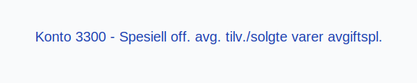

---
title: "Konto 3300 - Spesiell off. avg. tilv./solgte varer avgiftspl."
seoTitle: "Konto 3300 | Spesiell offentlig avgift | Kontoplan"
description: "Konto 3300 brukes til å registrere spesiell offentlig avgift ved tilvirkning eller salg av varer som er avgiftspliktige. Les om bruk av kontoen, bokføring og rapportering."
summary: "Konto 3300: spesiell offentlig avgift ved tilvirkning og salg."
---

**Konto 3300 - Spesiell off. avg. tilv./solgte varer avgiftspl.** er en konto i **Norsk Standard Kontoplan** som brukes til å registrere **spesiell offentlig avgift** ved tilvirkning eller salg av varer som er **avgiftspliktige**.

## Hva er Spesiell off. avg. tilv./solgte varer avgiftspl.?

*Spesiell off. avg. tilv./solgte varer avgiftspl.* er en **offentlig avgift** som pålegges produksjon (tilvirkning) eller omsetning (salg) av varer som også er underlagt **merverdiavgift**. Avgiften faktureres separat og skal skilles fra selve salgsinntekten.

| Konto | Beskrivelse                                                                                            |
|-------|--------------------------------------------------------------------------------------------------------|
| 3300  | Spesiell off. avg. tilvirkning/solgte varer avgiftspliktig                                                |

## Regnskapsføring

| Transaksjon                          | Debet                                   | Kredit                                              |
|--------------------------------------|-----------------------------------------|-----------------------------------------------------|
| Fakturert spesiell offentlig avgift  | Konto 3300 - Spesiell off. avg. tilv./solgte varer avgiftspl. | Konto 1500 - Kundefordringer (inkl. MVA)          |
| Betaling av avgift                   | Konto 1920 - Bankinnskudd               | Konto 3300 - Spesiell off. avg. tilv./solgte varer avgiftspl. |

## Vurdering og rapportering

Spesiell offentlig avgift bør presenteres **separat** i regnskap og rapportering for å sikre **oversikt** over salgsrelaterte avgiftsforpliktelser og korrekt periodisering.

## Intern lenking og relaterte kontoer

* [Konto 2700 - Utgående merverdiavgift](/blogs/kontoplan/2700-utgaende-merverdiavgift "Konto 2700 - Utgående merverdiavgift")
* [Konto 3000 - Salgsinntekt handelsvarer avgiftspl. høy sats](/blogs/kontoplan/3000-salgsinntekt-handelsvarer-avgiftspl-hoy-sats "Konto 3000 - Salgsinntekt handelsvarer avgiftspl. høy sats")
* [Hva er MVA?](/blogs/regnskap/hva-er-moms-mva "Hva er MVA? MVA-regnskapsføring og merverdiavgift")
* [Hva er en Kontoplan?](/blogs/regnskap/hva-er-kontoplan "Hva er en Kontoplan? Komplett Guide til Kontoplaner i Norsk Regnskap")

