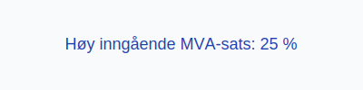

---
title: "4000-innkjop-av-raavarer-og-halvfabrikata-hoy-sats"
meta_title: "4000-innkjop-av-raavarer-og-halvfabrikata-hoy-sats"
meta_description: '**Konto 4000 - Innkjøp av råvarer og halvfabrikata høy sats** er en konto i Norsk Standard Kontoplan som brukes til å registrere **kjøp av råvarer og innk...'
slug: 4000-innkjop-av-raavarer-og-halvfabrikata-hoy-sats
type: blog
layout: pages/single
---

**Konto 4000 - Innkjøp av råvarer og halvfabrikata høy sats** er en konto i Norsk Standard Kontoplan som brukes til å registrere **kjøp av råvarer og innkjøpte halvfabrikater** som er **avgiftspliktige med høy MVA-sats (25 %)**.

## Hva er Innkjøp av råvarer og halvfabrikata høy sats?

*Innkjøp av råvarer og halvfabrikata høy sats* omfatter anskaffelse av materialer som selskapet bruker i produksjonen eller videresalg, der leveransene er underlagt **25 % MVA**.

| Konto | Beskrivelse                                              | MVA-sats |
|-------|----------------------------------------------------------|----------|
| 4000  | Innkjøp av råvarer og halvfabrikata høy sats             | 25 %     |

## Regnskapsføring

Regnskapsføring av råvarekjøp med høy MVA-sats skal skille mellom varekostnad og inngående merverdiavgift:

| Transaksjon                          | Debet                                                      | Kredit                            |
|--------------------------------------|------------------------------------------------------------|-----------------------------------|
| Kjøp av råvarer og halvfabrikata     | Konto 4000 - Innkjøp av råvarer og halvfabrikata høy sats    | Konto 2400 - Leverandørgjeld      |
| Inngående merverdiavgift høy sats    | Konto 1611 - Inngående merverdiavgift høy sats             | Konto 2400 - Leverandørgjeld      |
| Betaling til leverandør              | Konto 2400 - Leverandørgjeld                                | Konto 1920 - Bankinnskudd         |

## Vurdering og lagerbehandling

Kjøpene føres som varekostnad når varene forbrukes i produksjon eller videreselges. For lageroppgjør og vurdering av varelager, se [Konto 1400 - Råvarer og innkjøpte halvfabrikater](/blogs/kontoplan/1400-raavarer-og-innkjopte-halvfabrikater "Konto 1400 - Råvarer og innkjøpte halvfabrikater").

## Intern lenking og relaterte kontoer

Andre kontoer i NS 4102 som ofte benyttes sammen med konto 4000:

* [Konto 1400 - Råvarer og innkjøpte halvfabrikater](/blogs/kontoplan/1400-raavarer-og-innkjopte-halvfabrikater "Konto 1400 - Råvarer og innkjøpte halvfabrikater")
* [Konto 1420 - Varer under utvikling](/blogs/kontoplan/1420-varer-under-utvikling "Konto 1420 - Varer under utvikling")
* [Konto 1440 - Ferdige egentilvirkede varer](/blogs/kontoplan/1440-ferdige-egentilvirkede-varer "Konto 1440 - Ferdige egentilvirkede varer")
* [Konto 1460 - Innkjøpte varer for videresalg](/blogs/kontoplan/1460-innkjopte-varer-for-videresalg "Konto 1460 - Innkjøpte varer for videresalg")
* [Konto 4030 - Innkjøp av råvarer og halvfabrikata middels sats](/blogs/kontoplan/4030-innkjop-av-raavarer-og-halvfabrikata-middels-sats "Konto 4030 - Innkjøp av råvarer og halvfabrikata middels sats")
* [Konto 4060 - Frakt, toll og spedisjon](/blogs/kontoplan/4060-frakt-toll-og-spedisjon "Konto 4060 - Frakt, toll og spedisjon")
* [Hva er Varelager?](/blogs/regnskap/hva-er-varelager "Hva er Varelager? Komplett Guide til Lagerføring og Verdivurdering")
* [Konto 4070 - Innkjøpsprisreduksjon](/blogs/kontoplan/4070-innkjopsprisreduksjon "Konto 4070 - Innkjøpsprisreduksjon")
* [Konto 4270 - Innkjøpsprisreduksjon, avgiftspliktig](/blogs/kontoplan/4270-innkjopsprisreduksjon-avgiftspliktig "Konto 4270 - Innkjøpsprisreduksjon, avgiftspliktig")
* [Hva er en Kontoplan?](/blogs/regnskap/hva-er-kontoplan "Hva er en Kontoplan? Komplett Guide til Kontoplaner i Norsk Regnskap")

**Korrekt bokføring** av kjøp og MVA sikrer nøyaktig regnskapsføring og legger grunnlaget for riktig varelager og skattemeldinger.
