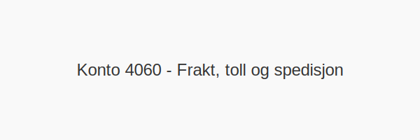

**Konto 4060 - Frakt, toll og spedisjon** er en konto i Norsk Standard Kontoplan som brukes til å registrere **frakt, toll og spedisjon** knyttet til anskaffelser og leveranser.

## Hva er Frakt, toll og spedisjon?

*Frakt, toll og spedisjon* omfatter **transportkostnader**, **importavgifter** og **håndteringsgebyrer** ved kjøp og salg av varer.

| Konto | Beskrivelse                         |
|-------|-------------------------------------|
| 4060  | Frakt, toll og spedisjon            |

## Regnskapsføring

> Regnskapsføring av frakt-, toll- og spedisjonskostnader skal skille mellom kostnadsføring og betaling.

| Transaksjon                          | Debet                                        | Kredit                         |
|--------------------------------------|----------------------------------------------|--------------------------------|
| Frakt-, toll- og spedisjonskostnader | Konto 4060 - Frakt, toll og spedisjon        | Konto 2400 - Leverandørgjeld   |
| Betaling til transportør/leverandør  | Konto 2400 - Leverandørgjeld                 | Konto 1920 - Bankinnskudd      |

## Intern lenking og relaterte kontoer

Andre kontoer i NS 4102 som ofte benyttes sammen med konto 4060:

* [Konto 2400 - Leverandørgjeld](/blogs/kontoplan/2400-leverandorgjeld "Konto 2400 - Leverandørgjeld")
* [Konto 1920 - Bankinnskudd](/blogs/kontoplan/1920-bankinnskudd "Konto 1920 - Bankinnskudd")
* [Konto 4000 - Innkjøp av råvarer og halvfabrikata høy sats](/blogs/kontoplan/4000-innkjop-av-raavarer-og-halvfabrikata-hoy-sats "Konto 4000 - Innkjøp av råvarer og halvfabrikata høy sats")
* [Konto 4030 - Innkjøp av råvarer og halvfabrikata middels sats](/blogs/kontoplan/4030-innkjop-av-raavarer-og-halvfabrikata-middels-sats "Konto 4030 - Innkjøp av råvarer og halvfabrikata middels sats")
* [Konto 4260 - Frakt, toll og spedisjon](/blogs/kontoplan/4260-frakt-toll-og-spedisjon "Konto 4260 - Frakt, toll og spedisjon")
* [Konto 6100 - Frakt, transportkostnad og forsikring](/blogs/kontoplan/6100-frakt-transportkostnad-og-forsikring "Konto 6100 - Frakt, transportkostnad og forsikring")
* [Konto 6110 - Toll og spedisjonskostnad](/blogs/kontoplan/6110-toll-og-spedisjonskostnad "Konto 6110 - Toll og spedisjonskostnad")
* [Hva er en Kontoplan?](/blogs/regnskap/hva-er-kontoplan "Hva er en Kontoplan? Komplett Guide til Kontoplaner i Norsk Regnskap")

**Korrekt bokføring** av frakt-, toll- og spedisjonskostnader sikrer nøyaktig regnskap og riktig rapportering.

