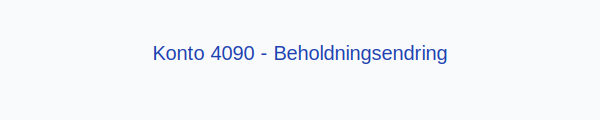

---
title: "Konto 4090 - Beholdningsendring"
meta_title: "4090-beholdningsendring"
meta_description: '**Konto 4090 - Beholdningsendring** er en konto i Norsk Standard Kontoplan som brukes til å registrere **endringer i varelagerets beholdning** i resultatregnsk...'
slug: 4090-beholdningsendring
type: blog
layout: pages/single
---

**Konto 4090 - Beholdningsendring** er en konto i Norsk Standard Kontoplan som brukes til å registrere **endringer i varelagerets beholdning** i resultatregnskapet.

## Hva er beholdningsendring?

*Beholdningsendring* (også kalt lagerendring) refererer til differansen mellom varelagerets verdi ved periodens begynnelse og slutten. Denne kontoen fanger opp både **økning** og **reduksjon** i lagerbeholdningen.

Typiske scenarier:

* **Økning i varelager** (produksjon over salg) gir positiv beholdningsendring.
* **Reduksjon i varelager** (salg over produksjon) gir negativ beholdningsendring.

## Regnskapsføring

| Transaksjon         | Debet                                                                                       | Kredit                                |
|---------------------|---------------------------------------------------------------------------------------------|---------------------------------------|
| Økning i varelager  | [Konto 1400 - Råvarer og innkjøpte halvfabrikater](/blogs/kontoplan/1400-raavarer-og-innkjopte-halvfabrikater "Konto 1400 - Råvarer og innkjøpte halvfabrikater"), [Konto 1420 - Varer under utvikling](/blogs/kontoplan/1420-varer-under-utvikling "Konto 1420 - Varer under utvikling"), [Konto 1440 - Ferdige egentilvirkede varer](/blogs/kontoplan/1440-ferdige-egentilvirkede-varer "Konto 1440 - Ferdige egentilvirkede varer"), [Konto 1460 - Innkjøpte varer for videresalg](/blogs/kontoplan/1460-innkjopte-varer-for-videresalg "Konto 1460 - Innkjøpte varer for videresalg") | Konto 4090 - Beholdningsendring         |
| Reduksjon i varelager | Konto 4090 - Beholdningsendring                                                          | [Konto 1400 - Råvarer og innkjøpte halvfabrikater](/blogs/kontoplan/1400-raavarer-og-innkjopte-halvfabrikater "Konto 1400 - Råvarer og innkjøpte halvfabrikater"), [Konto 1420 - Varer under utvikling](/blogs/kontoplan/1420-varer-under-utvikling "Konto 1420 - Varer under utvikling"), [Konto 1440 - Ferdige egentilvirkede varer](/blogs/kontoplan/1440-ferdige-egentilvirkede-varer "Konto 1440 - Ferdige egentilvirkede varer"), [Konto 1460 - Innkjøpte varer for videresalg](/blogs/kontoplan/1460-innkjopte-varer-for-videresalg "Konto 1460 - Innkjøpte varer for videresalg") |

## Vurdering og implikasjoner

Beholdningsendringer påvirker direkte resultatregnskapet og gir innsikt i produksjons- og salgsvolum. En positiv beholdningsendring øker driftsresultatet, mens en negativ beholdningsendring reduserer det.

For mer om varelager og vurderingsmetoder, se [Hva er Varelager?](/blogs/regnskap/hva-er-varelager "Hva er Varelager? Komplett Guide til Lagerføring og Verdivurdering").

## Intern lenking og relaterte kontoer

* [Konto 1400 - Råvarer og innkjøpte halvfabrikater](/blogs/kontoplan/1400-raavarer-og-innkjopte-halvfabrikater "Konto 1400 - Råvarer og innkjøpte halvfabrikater")
* [Konto 1420 - Varer under utvikling](/blogs/kontoplan/1420-varer-under-utvikling "Konto 1420 - Varer under utvikling")
* [Konto 1440 - Ferdige egentilvirkede varer](/blogs/kontoplan/1440-ferdige-egentilvirkede-varer "Konto 1440 - Ferdige egentilvirkede varer")
* [Konto 1460 - Innkjøpte varer for videresalg](/blogs/kontoplan/1460-innkjopte-varer-for-videresalg "Konto 1460 - Innkjøpte varer for videresalg")
* [Hva er Varelager?](/blogs/regnskap/hva-er-varelager "Hva er Varelager? Komplett Guide til Lagerføring og Verdivurdering")
* [Hva er en Kontoplan?](/blogs/regnskap/hva-er-kontoplan "Hva er en Kontoplan? Komplett Guide til Kontoplaner i Norsk Regnskap")
* [Konto 4390 - Beholdningsendring](/blogs/kontoplan/4390-beholdningsendring "Konto 4390 - Beholdningsendring")
* [Konto 4590 - Beholdningsendring](/blogs/kontoplan/4590-beholdningsendring "Konto 4590 - Beholdningsendring")
* [Konto 4990 - Beholdningsendring](/blogs/kontoplan/4990-beholdningsendring "Konto 4990 - Beholdningsendring")
* [Konto 7900 - Beholdningsendring anlegg under utførelse](/blogs/kontoplan/7900-beholdningsendring-anlegg-under-utforelse "Konto 7900 - Beholdningsendring anlegg under utførelse")
* [Konto 7910 - Ukurante varer](/blogs/kontoplan/7910-ukurante-varer "Konto 7910 - Ukurante varer")

**Korrekt håndtering** av beholdningsendringer sikrer et nøyaktig resultatregnskap og bedre innsikt i produksjon og salg.

