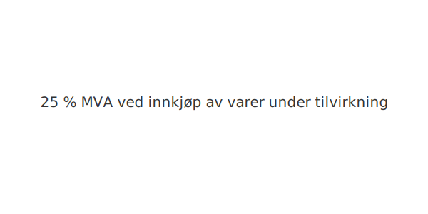

**Konto 4100 - Innkjøp varer under tilvirkning høy sats** er en konto i Norsk Standard Kontoplan som brukes til å registrere **kjøp av varer under tilvirkning** som er **avgiftspliktige med høy MVA-sats (25 %)**.

## Hva er Innkjøp varer under tilvirkning høy sats?

*Innkjøp varer under tilvirkning høy sats* omfatter anskaffelser av varer eller produkter som er under tilvirkning og der leveransen er underlagt **25 % MVA**.

| Konto | Beskrivelse                              | MVA-sats |
|-------|------------------------------------------|----------|
| 4100  | Innkjøp varer under tilvirkning høy sats | 25 %     |

## Regnskapsføring

| Transaksjon                               | Debet                                                | Kredit                           |
|-------------------------------------------|------------------------------------------------------|----------------------------------|
| Kjøp av varer under tilvirkning           | Konto 4100 - Innkjøp varer under tilvirkning høy sats | Konto 2400 - Leverandørgjeld     |
| Inngående merverdiavgift høy sats          | Konto 1611 - Inngående merverdiavgift høy sats       | Konto 2400 - Leverandørgjeld     |
| Betaling til leverandør                    | Konto 2400 - Leverandørgjeld                          | Konto 1920 - Bankinnskudd        |

## Vurdering og lagerbehandling

Kjøpene bokføres som varekostnad når varene forbrukes i produksjon eller videreselges. For lageroppgjør og vurdering av varelager, se [Konto 1400 - Råvarer og innkjøpte halvfabrikater](/blogs/kontoplan/1400-raavarer-og-innkjopte-halvfabrikater "Konto 1400 - Råvarer og innkjøpte halvfabrikater").

## Intern lenking og relaterte kontoer

Andre kontoer i NS 4102 som ofte benyttes sammen med konto 4100:

* [Konto 1400 - Råvarer og innkjøpte halvfabrikater](/blogs/kontoplan/1400-raavarer-og-innkjopte-halvfabrikater "Konto 1400 - Råvarer og innkjøpte halvfabrikater")
* [Konto 1420 - Varer under utvikling](/blogs/kontoplan/1420-varer-under-utvikling "Konto 1420 - Varer under utvikling")
* [Konto 1440 - Ferdige egentilvirkede varer](/blogs/kontoplan/1440-ferdige-egentilvirkede-varer "Konto 1440 - Ferdige egentilvirkede varer")
* [Konto 1460 - Innkjøpte varer for videresalg](/blogs/kontoplan/1460-innkjopte-varer-for-videresalg "Konto 1460 - Innkjøpte varer for videresalg")
* [Konto 4300 - Innkjøp varer for videresalg høy sats](/blogs/kontoplan/4300-innkjop-varer-for-videresalg-hoy-sats "Konto 4300 - Innkjøp varer for videresalg høy sats")
* [Konto 4000 - Innkjøp av råvarer og halvfabrikata høy sats](/blogs/kontoplan/4000-innkjop-av-raavarer-og-halvfabrikata-hoy-sats "Konto 4000 - Innkjøp av råvarer og halvfabrikata høy sats")
* [Konto 4030 - Innkjøp av råvarer og halvfabrikata middels sats](/blogs/kontoplan/4030-innkjop-av-raavarer-og-halvfabrikata-middels-sats "Konto 4030 - Innkjøp av råvarer og halvfabrikata middels sats")
* [Konto 4130 - Innkjøp varer under tilvirkning middels sats](/blogs/kontoplan/4130-innkjop-varer-under-tilvirkning-middels-sats "Konto 4130 - Innkjøp varer under tilvirkning middels sats")

* [Konto 4200 - Innkjøp ferdig egentilvirkede varer høy sats](/blogs/kontoplan/4200-innkjop-ferdig-egentilvirkede-varer-hoy-sats "Konto 4200 - Innkjøp ferdig egentilvirkede varer høy sats")
* [Konto 4230 - Innkjøp ferdig egentilvirkede varer middels sats](/blogs/kontoplan/4230-innkjop-ferdig-egentilvirkede-varer-middels-sats "Konto 4230 - Innkjøp ferdig egentilvirkede varer middels sats")
* [Hva er Varelager?](/blogs/regnskap/hva-er-varelager "Hva er Varelager? Komplett Guide til Lagerføring og Verdivurdering")
* [Hva er en Kontoplan?](/blogs/regnskap/hva-er-kontoplan "Hva er en Kontoplan? Komplett Guide til Kontoplaner i Norsk Regnskap")

**Korrekt bokføring** av kjøp og MVA sikrer nøyaktig regnskapsføring og legger grunnlaget for riktig varelager og skattemeldinger.

