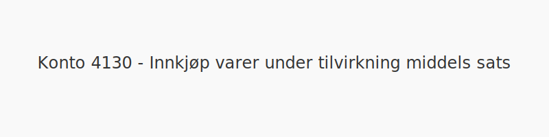
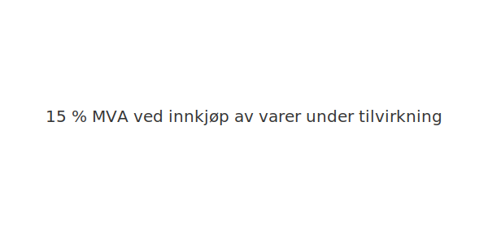

---
title: "Konto 4130 - Innkjøp varer under tilvirkning middels sats"
seoTitle: "4130-innkjop-varer-under-tilvirkning-middels-sats"
meta_description: '**Konto 4130 - Innkjøp varer under tilvirkning middels sats** er en konto i Norsk Standard Kontoplan som brukes til å registrere **kjøp av varer under tilvir...'
slug: 4130-innkjop-varer-under-tilvirkning-middels-sats
type: blog
layout: pages/single
---

**Konto 4130 - Innkjøp varer under tilvirkning middels sats** er en konto i Norsk Standard Kontoplan som brukes til å registrere **kjøp av varer under tilvirkning** som er **avgiftspliktige med middels MVA-sats (15 %)**.

## Hva er Innkjøp varer under tilvirkning middels sats?

*Innkjøp varer under tilvirkning middels sats* omfatter anskaffelser av varer eller produkter som er under tilvirkning og der leveransen er underlagt **15 % MVA**.

| Konto | Beskrivelse                                   | MVA-sats |
|-------|-----------------------------------------------|----------|
| 4130  | Innkjøp varer under tilvirkning middels sats | 15 %     |

## Regnskapsføring

| Transaksjon                             | Debet                                               | Kredit                        |
|-----------------------------------------|-----------------------------------------------------|-------------------------------|
| Kjøp av varer under tilvirkning         | Konto 4130 - Innkjøp varer under tilvirkning middels sats | Konto 2400 - Leverandørgjeld  |
| Inngående merverdiavgift middels sats   | Konto 1613 - Inngående merverdiavgift middels sats        | Konto 2400 - Leverandørgjeld  |
| Betaling til leverandør                 | Konto 2400 - Leverandørgjeld                         | Konto 1920 - Bankinnskudd     |

## Eksempel på bokføring

Anta at en bedrift kjøper varer under tilvirkning for **NOK 10 000** med middels MVA-sats. Bokføringen blir:

| Beskrivelse                     | Debet                                               | Kredit                                       |
|---------------------------------|-----------------------------------------------------|-----------------------------------------------|
| Innkjøp varer under tilvirkning | Konto 4130 - Innkjøp varer under tilvirkning middels sats | **NOK 10 000**                               |
| Inngående merverdiavgift (15 %) | Konto 1613 - Inngående merverdiavgift middels sats        | **NOK 1 500**                                |
| Leverandørgjeld                 |                                                     | Konto 2400 - Leverandørgjeld (**NOK 11 500**) |

### Trinn for bokføring

* Registrer innkjøp på konto 4130.
* Registrer inngående MVA på konto 1613.
* Når betalingen skjer, før betalingen mot konto 2400 og bankkonto.

## Vurdering og lagerbehandling

Kjøpene bokføres som varekostnad når varene forbrukes i produksjon eller videreselges. For lageroppgjør og vurdering av varelager, se [Konto 1400 - Råvarer og innkjøpte halvfabrikater](/blogs/kontoplan/1400-raavarer-og-innkjopte-halvfabrikater "Konto 1400 - Råvarer og innkjøpte halvfabrikater").

## Intern lenking og relaterte kontoer

Andre kontoer i NS 4102 som ofte benyttes sammen med konto 4130:

* [Konto 1400 - Råvarer og innkjøpte halvfabrikater](/blogs/kontoplan/1400-raavarer-og-innkjopte-halvfabrikater "Konto 1400 - Råvarer og innkjøpte halvfabrikater")
* [Konto 1420 - Varer under utvikling](/blogs/kontoplan/1420-varer-under-utvikling "Konto 1420 - Varer under utvikling")
* [Konto 1440 - Ferdige egentilvirkede varer](/blogs/kontoplan/1440-ferdige-egentilvirkede-varer "Konto 1440 - Ferdige egentilvirkede varer")
* [Konto 1460 - Innkjøpte varer for videresalg](/blogs/kontoplan/1460-innkjopte-varer-for-videresalg "Konto 1460 - Innkjøpte varer for videresalg")
* [Konto 4000 - Innkjøp av råvarer og halvfabrikata høy sats](/blogs/kontoplan/4000-innkjop-av-raavarer-og-halvfabrikata-hoy-sats "Konto 4000 - Innkjøp av råvarer og halvfabrikata høy sats")
* [Konto 4030 - Innkjøp av råvarer og halvfabrikata middels sats](/blogs/kontoplan/4030-innkjop-av-raavarer-og-halvfabrikata-middels-sats "Konto 4030 - Innkjøp av råvarer og halvfabrikata middels sats")
* [Konto 4100 - Innkjøp varer under tilvirkning høy sats](/blogs/kontoplan/4100-innkjop-varer-under-tilvirkning-hoy-sats "Konto 4100 - Innkjøp varer under tilvirkning høy sats")

* [Konto 4200 - Innkjøp ferdig egentilvirkede varer høy sats](/blogs/kontoplan/4200-innkjop-ferdig-egentilvirkede-varer-hoy-sats "Konto 4200 - Innkjøp ferdig egentilvirkede varer høy sats")
* [Konto 4230 - Innkjøp ferdig egentilvirkede varer middels sats](/blogs/kontoplan/4230-innkjop-ferdig-egentilvirkede-varer-middels-sats "Konto 4230 - Innkjøp ferdig egentilvirkede varer middels sats")
* [Hva er Varelager?](/blogs/regnskap/hva-er-varelager "Hva er Varelager? Komplett Guide til Lagerføring og Verdivurdering")
* [Hva er en Kontoplan?](/blogs/regnskap/hva-er-kontoplan "Hva er en Kontoplan? Komplett Guide til Kontoplaner i Norsk Regnskap")

**Korrekt bokføring** av kjøp og MVA sikrer nøyaktig regnskapsføring og legger grunnlaget for riktig varelager og skattemeldinger.

