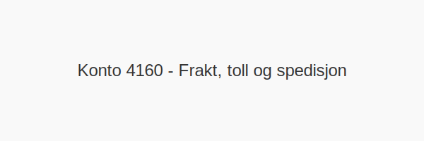

---
title: "Konto 4160 - Frakt, toll og spedisjon"
seoTitle: "Konto 4160 | Frakt, toll og spedisjon"
description: "Konto 4160 brukes til å registrere inntekter fra frakt, toll og spedisjon som faktureres kunden som del av salgsinntekten, med korrekt MVA-behandling."
summary: "Kort forklart: Konto 4160 brukes når frakt, toll og spedisjon faktureres kunden og skal inntektsføres."
---

**Konto 4160 - Frakt, toll og spedisjon** er en konto i Norsk Standard Kontoplan som brukes til å registrere **frakt, toll og spedisjon** som faktureres kunder som en del av salgsinntekten.

## Hva er Frakt, toll og spedisjon?

*Frakt, toll og spedisjon* omfatter **inntekter fra transport av varer**, **tollbehandling** og **spedisjonstjenester** som faktureres kunden.

| Konto | Beskrivelse                        |
|-------|------------------------------------|
| 4160  | Frakt, toll og spedisjon           |

## Når skal konto 4160 benyttes?

* Når virksomheten fakturerer kunden for **transport- og spedisjonskostnader** med merverdiavgift.
* Ved separat avregning av frakt, toll og spedisjon på faktura.

## Regnskapsføring

| Transaksjon                                         | Debet                         | Kredit                                            |
|-----------------------------------------------------|-------------------------------|---------------------------------------------------|
| Salgsfakturering av frakt, toll og spedisjon ekskl. MVA | Konto 1500 - Kundefordringer  | Konto 4160 - Frakt, toll og spedisjon             |
| Utgående merverdiavgift (25 %)                       | Konto 1500 - Kundefordringer  | Konto 2701 - Utgående merverdiavgift høy sats     |
| Innbetaling fra kunde                                | Konto 1920 - Bankinnskudd     | Konto 1500 - Kundefordringer                      |

## Eksempel

| Beløp ekskl. MVA | MVA (25 %) | Total inkl. MVA |
|------------------|------------|-----------------|
| 100 NOK          | 25 NOK     | 125 NOK         |

## Fordeler ved korrekt bruk

* **Korrekte MVA-beregninger** ved fraktfakturering
* **Bedre oversikt** over logistikkinntekter
* **Forbedret sporbarhet** for kundespesifikke transportkostnader

## Intern lenking og relaterte kontoer

* [Konto 4160 - Frakt, toll og spedisjon](/blogs/kontoplan/4160-frakt-toll-og-spedisjon "Konto 4160 - Frakt, toll og spedisjon")
* [Konto 3910 - Utgående porto, avgiftspliktig](/blogs/kontoplan/3910-utgaende-porto-avgiftspliktig "Konto 3910 - Utgående porto, avgiftspliktig")
* [Konto 3920 - Utgående gebyrer, avgiftspliktig](/blogs/kontoplan/3920-utgaende-gebyrer-avgiftspliktig "Konto 3920 - Utgående gebyrer, avgiftspliktig")
* [Konto 3950 - Annen driftsrelatert inntekt, avgiftsfritt](/blogs/kontoplan/3950-annen-driftsrelatert-inntekt-avgiftsfritt "Konto 3950 - Annen driftsrelatert inntekt, avgiftsfritt")
* [Hva er Driftsinntekter?](/blogs/regnskap/hva-er-driftsinntekter "Hva er Driftsinntekter? Komplett Guide til Driftsinntekter i Regnskap")
* [Konto 6100 - Frakt, transportkostnad og forsikring](/blogs/kontoplan/6100-frakt-transportkostnad-og-forsikring "Konto 6100 - Frakt, transportkostnad og forsikring")
* [Konto 6110 - Toll og spedisjonskostnad](/blogs/kontoplan/6110-toll-og-spedisjonskostnad "Konto 6110 - Toll og spedisjonskostnad")
* [Hva er en Kontoplan?](/blogs/regnskap/hva-er-kontoplan "Hva er en Kontoplan? Komplett Guide til Kontoplaner i Norsk Regnskap")

