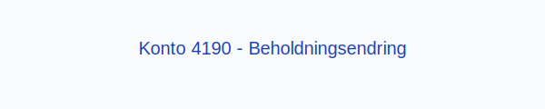

---
title: "Konto 4190 - Beholdningsendring"
seoTitle: "Konto 4190 | Beholdningsendring"
description: "Konto 4190 brukes til å registrere endringer i varelagerets beholdning i resultatregnskapet, altså forskjellen mellom lagerverdi ved periodens slutt og begynnelse."
summary: "Kort forklart: Konto 4190 viser periodens lagerendring og påvirker driftsresultatet."
---

**Konto 4190 - Beholdningsendring** er en konto i Norsk Standard Kontoplan som brukes til å registrere **endringer i varelagerets beholdning** i resultatregnskapet.

## Hva er beholdningsendring?

*Beholdningsendring* (også kalt lagerendring) viser differansen mellom verdien av varelageret ved periodens slutt og ved periodens begynnelse. Formelt kan dette uttrykkes slik:

> **Beholdningsendring = Varelager ved periodens slutt − Varelager ved periodens begynnelse**

En positiv beholdningsendring indikerer at lagerbeholdningen har økt i perioden, mens en negativ beholdningsendring viser at lagerbeholdningen har blitt redusert.

## Hvordan beregnes beholdningsendring?

For å beregne beholdningsendring kan du følge disse trinnene:

* Fastslå varelagerets verdi ved periodens begynnelse.
* Fastslå varelagerets verdi ved periodens slutt.
* Subtraher begynnelsesverdien fra sluttsverdien.

## Regnskapsføring

| Transaksjon           | Debet                                                                                                                                                                                           | Kredit                            |
|-----------------------|-------------------------------------------------------------------------------------------------------------------------------------------------------------------------------------------------|-----------------------------------|
| Økning i varelager    | [Konto 1400 - Råvarer og innkjøpte halvfabrikater](/blogs/kontoplan/1400-raavarer-og-innkjopte-halvfabrikater "Konto 1400 - Råvarer og innkjøpte halvfabrikater"), [Konto 1420 - Varer under utvikling](/blogs/kontoplan/1420-varer-under-utvikling "Konto 1420 - Varer under utvikling"), [Konto 1440 - Ferdige egentilvirkede varer](/blogs/kontoplan/1440-ferdige-egentilvirkede-varer "Konto 1440 - Ferdige egentilvirkede varer"), [Konto 1460 - Innkjøpte varer for videresalg](/blogs/kontoplan/1460-innkjopte-varer-for-videresalg "Konto 1460 - Innkjøpte varer for videresalg") | Konto 4190 - Beholdningsendring |
| Reduksjon i varelager | Konto 4190 - Beholdningsendring                                                                                                                                                                 | [Konto 1400 - Råvarer og innkjøpte halvfabrikater](/blogs/kontoplan/1400-raavarer-og-innkjopte-halvfabrikater "Konto 1400 - Råvarer og innkjøpte halvfabrikater"), [Konto 1420 - Varer under utvikling](/blogs/kontoplan/1420-varer-under-utvikling "Konto 1420 - Varer under utvikling"), [Konto 1440 - Ferdige egentilvirkede varer](/blogs/kontoplan/1440-ferdige-egentilvirkede-varer "Konto 1440 - Ferdige egentilvirkede varer"), [Konto 1460 - Innkjøpte varer for videresalg](/blogs/kontoplan/1460-innkjopte-varer-for-videresalg "Konto 1460 - Innkjøpte varer for videresalg") |

## Vurderingsmetoder for varelager

Valg av **vurderingsmetode** påvirker periodens beholdningsendring. De vanligste metodene er:

* **FIFO (First In, First Out)**
* **LIFO (Last In, First Out)**
* **Veiet gjennomsnittskost**

For mer om lagervurdering, se [Hva er Varelager?](/blogs/regnskap/hva-er-varelager "Hva er Varelager? Komplett Guide til Lagerføring og Verdivurdering").

## Eksempler på beholdningsendring

1. **Positiv beholdningsendring:** Hvis varelageret på kr 100 000 øker til kr 120 000, blir beholdningsendringen **+ kr 20 000**.
2. **Negativ beholdningsendring:** Hvis varelageret på kr 150 000 reduseres til kr 130 000, blir beholdningsendringen **− kr 20 000**.

## Praktiske tips

* **Dokumentasjon:** Sørg for nøyaktige varetellinger og verdivurdering ved periodens slutt.
* **Sikkerhetslager:** Ha buffer for å unngå produksjonsstans på grunn av mangel.
* **Avstemming:** Sammenlign regnskapsført beholdning med fysisk telling jevnlig.

## Intern lenking og relaterte kontoer

* [Konto 1400 - Råvarer og innkjøpte halvfabrikater](/blogs/kontoplan/1400-raavarer-og-innkjopte-halvfabrikater "Konto 1400 - Råvarer og innkjøpte halvfabrikater")
* [Konto 1420 - Varer under utvikling](/blogs/kontoplan/1420-varer-under-utvikling "Konto 1420 - Varer under utvikling")
* [Konto 1440 - Ferdige egentilvirkede varer](/blogs/kontoplan/1440-ferdige-egentilvirkede-varer "Konto 1440 - Ferdige egentilvirkede varer")
* [Konto 1460 - Innkjøpte varer for videresalg](/blogs/kontoplan/1460-innkjopte-varer-for-videresalg "Konto 1460 - Innkjøpte varer for videresalg")
* [Hva er Varelager?](/blogs/regnskap/hva-er-varelager "Hva er Varelager? Komplett Guide til Lagerføring og Verdivurdering")
* [Hva er en Kontoplan?](/blogs/regnskap/hva-er-kontoplan "Hva er en Kontoplan? Komplett Guide til Kontoplaner i Norsk Regnskap")
* [Konto 4390 - Beholdningsendring](/blogs/kontoplan/4390-beholdningsendring "Konto 4390 - Beholdningsendring")
* [Konto 4590 - Beholdningsendring](/blogs/kontoplan/4590-beholdningsendring "Konto 4590 - Beholdningsendring")
* [Konto 4990 - Beholdningsendring](/blogs/kontoplan/4990-beholdningsendring "Konto 4990 - Beholdningsendring")
* [Konto 7900 - Beholdningsendring anlegg under utførelse](/blogs/kontoplan/7900-beholdningsendring-anlegg-under-utforelse "Konto 7900 - Beholdningsendring anlegg under utførelse")
* [Konto 7910 - Ukurante varer](/blogs/kontoplan/7910-ukurante-varer "Konto 7910 - Ukurante varer")

