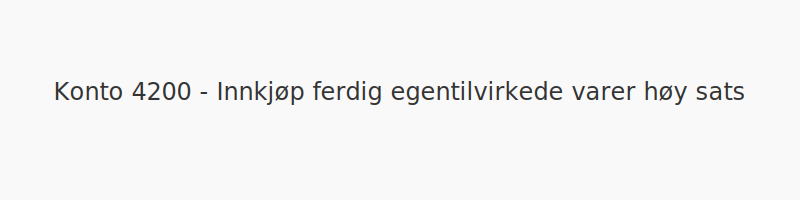
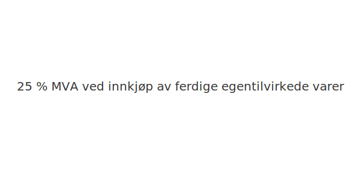

---
title: "Konto 4200 - Innkjøp ferdig egentilvirkede varer høy sats"
meta_title: "4200-innkjop-ferdig-egentilvirkede-varer"
meta_description: '**Konto 4200 - Innkjøp ferdig egentilvirkede varer høy sats** er en konto i Norsk Standard Kontoplan som brukes til å registrere **kjøp av ferdige egentilvi...'
slug: 4200-innkjop-ferdig-egentilvirkede-varer
type: blog
layout: pages/single
---

**Konto 4200 - Innkjøp ferdig egentilvirkede varer høy sats** er en konto i Norsk Standard Kontoplan som brukes til å registrere **kjøp av ferdige egentilvirkede varer** som er **avgiftspliktige med høy MVA-sats (25 %)**.

## Hva er Innkjøp ferdig egentilvirkede varer høy sats?

*Innkjøp ferdig egentilvirkede varer høy sats* omfatter anskaffelser av varer som er fullført gjennom egen produksjon og der leveransen er underlagt **25 % MVA**.

| Konto | Beskrivelse                                           | MVA-sats |
|-------|-------------------------------------------------------|----------|
| 4200  | Innkjøp ferdig egentilvirkede varer høy sats          | 25 %     |

## Regnskapsføring

| Transaksjon                                   | Debet                                                        | Kredit                           |
|-----------------------------------------------|--------------------------------------------------------------|----------------------------------|
| Kjøp av ferdige egentilvirkede varer           | Konto 4200 - Innkjøp ferdig egentilvirkede varer høy sats     | Konto 2400 - Leverandørgjeld     |
| Inngående merverdiavgift høy sats              | Konto 1611 - Inngående merverdiavgift høy sats               | Konto 2400 - Leverandørgjeld     |
| Betaling til leverandør                        | Konto 2400 - Leverandørgjeld                                 | Konto 1920 - Bankinnskudd        |

## Eksempel på bokføring

Anta at en bedrift kjøper ferdige varer for **NOK 20 000** ekskl. MVA med høy sats. Bokføringen blir:

| Beskrivelse                                   | Debet                                                        | Kredit                                      |
|-----------------------------------------------|--------------------------------------------------------------|----------------------------------------------|
| Innkjøp ferdige varer (ekskl. MVA)             | Konto 4200 - Innkjøp ferdig egentilvirkede varer høy sats     | **NOK 20 000**                              |
| Inngående merverdiavgift (25 %)               | Konto 1611 - Inngående merverdiavgift høy sats               | **NOK 5 000**                               |
| Leverandørgjeld                               |                                                              | Konto 2400 - Leverandørgjeld (**NOK 25 000**) |

## Vurdering og lagerbehandling

Kjøpene bokføres som varekostnad når varene forbrukes eller distribueres. For vurdering av ferdige varer og lageroppgjør, se [Konto 1440 - Ferdige egentilvirkede varer](/blogs/kontoplan/1440-ferdige-egentilvirkede-varer "Konto 1440 - Ferdige egentilvirkede varer").

## Intern lenking og relaterte kontoer

* [Konto 1400 - Råvarer og innkjøpte halvfabrikater](/blogs/kontoplan/1400-raavarer-og-innkjopte-halvfabrikater "Konto 1400 - Råvarer og innkjøpte halvfabrikater")
* [Konto 1420 - Varer under utvikling](/blogs/kontoplan/1420-varer-under-utvikling "Konto 1420 - Varer under utvikling")
* [Konto 1440 - Ferdige egentilvirkede varer](/blogs/kontoplan/1440-ferdige-egentilvirkede-varer "Konto 1440 - Ferdige egentilvirkede varer")
* [Konto 1460 - Innkjøpte varer for videresalg](/blogs/kontoplan/1460-innkjopte-varer-for-videresalg "Konto 1460 - Innkjøpte varer for videresalg")
* [Konto 4300 - Innkjøp varer for videresalg høy sats](/blogs/kontoplan/4300-innkjop-varer-for-videresalg-hoy-sats "Konto 4300 - Innkjøp varer for videresalg høy sats")
* [Konto 4100 - Innkjøp varer under tilvirkning høy sats](/blogs/kontoplan/4100-innkjop-varer-under-tilvirkning-hoy-sats "Konto 4100 - Innkjøp varer under tilvirkning høy sats")
* [Konto 4130 - Innkjøp varer under tilvirkning middels sats](/blogs/kontoplan/4130-innkjop-varer-under-tilvirkning-middels-sats "Konto 4130 - Innkjøp varer under tilvirkning middels sats")
* [Konto 4200 - Innkjøp ferdig egentilvirkede varer høy sats](/blogs/kontoplan/4200-innkjop-ferdig-egentilvirkede-varer-hoy-sats "Konto 4200 - Innkjøp ferdig egentilvirkede varer høy sats")
* [Konto 4230 - Innkjøp ferdig egentilvirkede varer middels sats](/blogs/kontoplan/4230-innkjop-ferdig-egentilvirkede-varer-middels-sats "Konto 4230 - Innkjøp ferdig egentilvirkede varer middels sats")
* [Konto 4260 - Frakt, toll og spedisjon](/blogs/kontoplan/4260-frakt-toll-og-spedisjon "Konto 4260 - Frakt, toll og spedisjon")
* [Hva er Varelager?](/blogs/regnskap/hva-er-varelager "Hva er Varelager? Komplett Guide til Lagerføring og Verdivurdering")
* [Hva er en Kontoplan?](/blogs/regnskap/hva-er-kontoplan "Hva er en Kontoplan? Komplett Guide til Kontoplaner i Norsk Regnskap")

**Korrekt bokføring** av kjøp og MVA sikrer nøyaktig regnskapsføring og rett skattemelding.

