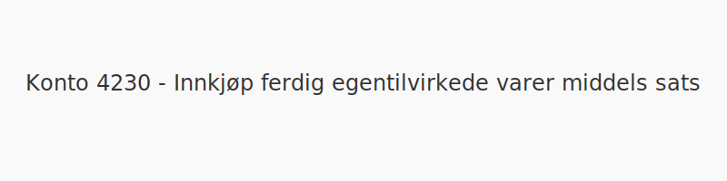
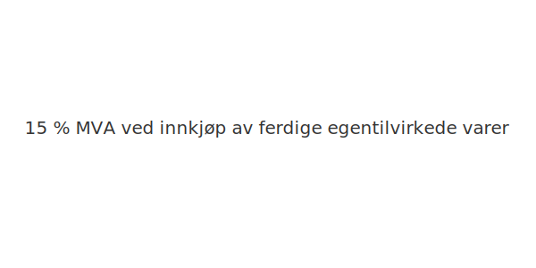

---
title: "Konto 4230 - Innkjøp ferdig egentilvirkede varer middels sats"
seoTitle: "Konto 4230 | Innkjøp ferdig egentilvirkede varer middels sats"
description: "Konto 4230 brukes til å registrere kjøp av ferdige egentilvirkede varer med middels MVA-sats (15 %), der varekostnad og inngående MVA føres separat."
summary: "Kort forklart: Konto 4230 gjelder innkjøp av ferdige egentilvirkede varer med middels MVA-sats."
---

**Konto 4230 - Innkjøp ferdig egentilvirkede varer middels sats** er en konto i Norsk Standard Kontoplan som brukes til å registrere **kjøp av ferdige egentilvirkede varer** som er **avgiftspliktige med middels MVA-sats (15 %)**.

## Hva er Innkjøp ferdig egentilvirkede varer middels sats?

*Innkjøp ferdig egentilvirkede varer middels sats* omfatter anskaffelser av varer som er fullført gjennom egen produksjon og der leveransen er underlagt **15 % MVA**.

| Konto | Beskrivelse                                           | MVA-sats |
|-------|-------------------------------------------------------|----------|
| 4230  | Innkjøp ferdig egentilvirkede varer middels sats      | 15 %     |

## Regnskapsføring

| Transaksjon                                   | Debet                                                        | Kredit                        |
|-----------------------------------------------|--------------------------------------------------------------|-------------------------------|
| Kjøp av ferdige egentilvirkede varer          | Konto 4230 - Innkjøp ferdig egentilvirkede varer middels sats | Konto 2400 - Leverandørgjeld  |
| Inngående merverdiavgift middels sats         | Konto 1613 - Inngående merverdiavgift middels sats           | Konto 2400 - Leverandørgjeld  |
| Betaling til leverandør                        | Konto 2400 - Leverandørgjeld                                 | Konto 1920 - Bankinnskudd     |

## Eksempel på bokføring

Anta at en bedrift kjøper ferdige varer for **NOK 20 000** ekskl. MVA med middels sats. Bokføringen blir:

| Beskrivelse                                   | Debet                                                         | Kredit                                          |
|-----------------------------------------------|---------------------------------------------------------------|-------------------------------------------------|
| Innkjøp ferdige varer (ekskl. MVA)            | Konto 4230 - Innkjøp ferdig egentilvirkede varer middels sats  | **NOK 20 000**                                  |
| Inngående merverdiavgift (15 %)               | Konto 1613 - Inngående merverdiavgift middels sats            | **NOK 3 000**                                   |
| Leverandørgjeld                               |                                                               | Konto 2400 - Leverandørgjeld (**NOK 23 000**)    |

## Vurdering og lagerbehandling

Kjøpene bokføres som varekostnad når varene forbrukes eller distribueres. For vurdering av ferdige varer og lageroppgjør, se [Konto 1440 - Ferdige egentilvirkede varer](/blogs/kontoplan/1440-ferdige-egentilvirkede-varer "Konto 1440 - Ferdige egentilvirkede varer").

## Intern lenking og relaterte kontoer

* [Konto 1400 - Råvarer og innkjøpte halvfabrikater](/blogs/kontoplan/1400-raavarer-og-innkjopte-halvfabrikater "Konto 1400 - Råvarer og innkjøpte halvfabrikater")
* [Konto 1420 - Varer under utvikling](/blogs/kontoplan/1420-varer-under-utvikling "Konto 1420 - Varer under utvikling")
* [Konto 1440 - Ferdige egentilvirkede varer](/blogs/kontoplan/1440-ferdige-egentilvirkede-varer "Konto 1440 - Ferdige egentilvirkede varer")
* [Konto 1460 - Innkjøpte varer for videresalg](/blogs/kontoplan/1460-innkjopte-varer-for-videresalg "Konto 1460 - Innkjøpte varer for videresalg")
* [Konto 4100 - Innkjøp varer under tilvirkning høy sats](/blogs/kontoplan/4100-innkjop-varer-under-tilvirkning-hoy-sats "Konto 4100 - Innkjøp varer under tilvirkning høy sats")
* [Konto 4130 - Innkjøp varer under tilvirkning middels sats](/blogs/kontoplan/4130-innkjop-varer-under-tilvirkning-middels-sats "Konto 4130 - Innkjøp varer under tilvirkning middels sats")
* [Konto 4200 - Innkjøp ferdig egentilvirkede varer høy sats](/blogs/kontoplan/4200-innkjop-ferdig-egentilvirkede-varer-hoy-sats "Konto 4200 - Innkjøp ferdig egentilvirkede varer høy sats")
* [Konto 4230 - Innkjøp ferdig egentilvirkede varer middels sats](/blogs/kontoplan/4230-innkjop-ferdig-egentilvirkede-varer-middels-sats "Konto 4230 - Innkjøp ferdig egentilvirkede varer middels sats")
* [Konto 4260 - Frakt, toll og spedisjon](/blogs/kontoplan/4260-frakt-toll-og-spedisjon "Konto 4260 - Frakt, toll og spedisjon")

* [Hva er Varelager?](/blogs/regnskap/hva-er-varelager "Hva er Varelager? Komplett Guide til Lagerføring og Verdivurdering")
* [Hva er en Kontoplan?](/blogs/regnskap/hva-er-kontoplan "Hva er en Kontoplan? Komplett Guide til Kontoplaner i Norsk Regnskap")

**Korrekt bokføring** av kjøp og MVA sikrer nøyaktig regnskapsføring og rett skattemelding.

