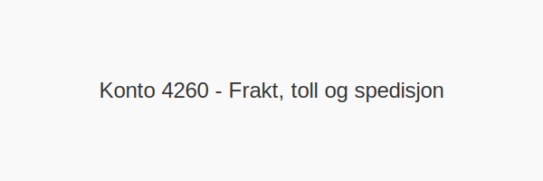

---
title: "Konto 4260 - Frakt, toll og spedisjon"
seoTitle: "4260-frakt-toll-og-spedisjon"
description: '**Konto 4260 - Frakt, toll og spedisjon** er en konto i Norsk Standard Kontoplan som brukes til å registrere **transportkostnader**, **importavgifter** og **hÃ...'
---

**Konto 4260 - Frakt, toll og spedisjon** er en konto i Norsk Standard Kontoplan som brukes til å registrere **transportkostnader**, **importavgifter** og **håndteringsgebyrer** knyttet til **kjøp av ferdige varer**.

## Hva er Frakt, toll og spedisjon for ferdige varer?

*Frakt, toll og spedisjon* omfatter kostnader ved **transport av ferdigvarer**, **tollbehandling** og **spedisjonsoppdrag** når varer kjøpes ferdig produsert.

| Konto | Beskrivelse              |
|-------|--------------------------|
| 4260  | Frakt, toll og spedisjon |

## Når skal konto 4260 benyttes?

* Når virksomheten kjøper **ferdigproduserte varer** og pådrar seg **transport- og tollkostnader**.
* Ved registrering av utgifter til frakt og spedisjon for varer som leveres ferdig til lager eller kunde.

## Regnskapsføring

| Transaksjon                          | Debet                                    | Kredit                       |
|--------------------------------------|------------------------------------------|------------------------------|
| Frakt-, toll- og spedisjonskostnader | Konto 4260 - Frakt, toll og spedisjon    | Konto 2400 - Leverandørgjeld |
| Betaling til transportør/leverandør  | Konto 2400 - Leverandørgjeld             | Konto 1920 - Bankinnskudd    |

## Eksempel på bokføring

| Beløp ekskl. MVA | MVA (25 %) | Total inkl. MVA |
|------------------|------------|-----------------|
| 1 500 NOK        | 375 NOK    | 1 875 NOK       |

## Fordeler ved korrekt bruk

* **Nøyaktig kostnadsfordeling** for ferdigvarer
* **Bedre lagerstyring** og kostnadskontroll
* **Riktig rapportering** av toll- og spedisjonsutgifter

## Intern lenking og relaterte kontoer

* [Konto 4200 - Innkjøp ferdig egentilvirkede varer høy sats](/blogs/kontoplan/4200-innkjop-ferdig-egentilvirkede-varer-hoy-sats "Konto 4200 - Innkjøp ferdig egentilvirkede varer høy sats")
* [Konto 4230 - Innkjøp ferdig egentilvirkede varer middels sats](/blogs/kontoplan/4230-innkjop-ferdig-egentilvirkede-varer-middels-sats "Konto 4230 - Innkjøp ferdig egentilvirkede varer middels sats")
* [Konto 4060 - Frakt, toll og spedisjon](/blogs/kontoplan/4060-frakt-toll-og-spedisjon "Konto 4060 - Frakt, toll og spedisjon")
* [Konto 6100 - Frakt, transportkostnad og forsikring](/blogs/kontoplan/6100-frakt-transportkostnad-og-forsikring "Konto 6100 - Frakt, transportkostnad og forsikring")
* [Konto 6110 - Toll og spedisjonskostnad](/blogs/kontoplan/6110-toll-og-spedisjonskostnad "Konto 6110 - Toll og spedisjonskostnad")
* [Hva er en Kontoplan?](/blogs/regnskap/hva-er-kontoplan "Hva er en Kontoplan? Komplett Guide til Kontoplaner i Norsk Regnskap")

**Korrekt bokføring** av frakt-, toll- og spedisjonskostnader ved kjøp av ferdige varer sikrer nøyaktig regnskap og riktig rapportering.

