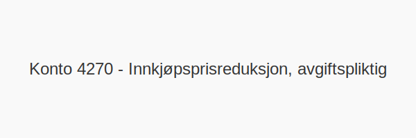

---
title: "Konto 4270 - Innkjøpsprisreduksjon, avgiftspliktig"
seoTitle: "Konto 4270 | Innkjøpsprisreduksjon, avgiftspliktig"
description: "Konto 4270 brukes til å registrere avgiftspliktige prisavslag fra leverandører på kjøp av varer og tjenester, inkludert nødvendig justering av inngående MVA."
summary: "Kort forklart: Konto 4270 føres når prisavslag på avgiftspliktige innkjøp mottas og både kostnad og MVA må justeres."
---

**Konto 4270 - Innkjøpsprisreduksjon, avgiftspliktig** er en konto i Norsk Standard Kontoplan som brukes til å registrere **avgiftspliktige prisavslag** fra leverandører på kjøp av varer og tjenester.

## Hva er innkjøpsprisreduksjon, avgiftspliktig?

*Innkjøpsprisreduksjon, avgiftspliktig* omfatter **prisavslag** fra leverandører på anskaffelser som er **underlagt merverdiavgift** (MVA).

| Konto | Beskrivelse                           | MVA-sats |
|-------|---------------------------------------|----------|
| 4270  | Innkjøpsprisreduksjon, avgiftspliktig | Varierer |

## Når skal konto 4270 benyttes?

* Når virksomheten mottar **prisavslag** fra leverandør på **avgiftspliktige** kjøp av varer eller tjenester.
* Ved korrigering av kostnadsføring for anskaffelser hvor **MVA** også må justeres.

## Regnskapsføring

| Transaksjon                                              | Debet                                         | Kredit                       |
|----------------------------------------------------------|-----------------------------------------------|------------------------------|
| Innkjøpsprisreduksjon ekskl. MVA                         | Konto 4270 - Innkjøpsprisreduksjon, avgiftspliktig | Konto 2400 - Leverandørgjeld |
| Justering inngående merverdiavgift                       | Konto 2400 - Leverandørgjeld                  | Konto 1610/1613 - Inngående merverdiavgift |
| Betaling etter prisreduksjon                             | Konto 2400 - Leverandørgjeld                  | Konto 1920 - Bankinnskudd    |

## Eksempel på bokføring

| Beløp ekskl. MVA | MVA (25 %) | Total inkl. MVA |
|------------------|------------|-----------------|
| 1 000 NOK        | 250 NOK    | 1 250 NOK       |

## Intern lenking og relaterte kontoer

* [Konto 4070 - Innkjøpsprisreduksjon](/blogs/kontoplan/4070-innkjopsprisreduksjon "Konto 4070 - Innkjøpsprisreduksjon")
* [Konto 4000 - Innkjøp av råvarer og halvfabrikata høy sats](/blogs/kontoplan/4000-innkjop-av-raavarer-og-halvfabrikata-hoy-sats "Konto 4000 - Innkjøp av råvarer og halvfabrikata høy sats")
* [Konto 4030 - Innkjøp av råvarer og halvfabrikata middels sats](/blogs/kontoplan/4030-innkjop-av-raavarer-og-halvfabrikata-middels-sats "Konto 4030 - Innkjøp av råvarer og halvfabrikata middels sats")
* [Konto 4060 - Frakt, toll og spedisjon](/blogs/kontoplan/4060-frakt-toll-og-spedisjon "Konto 4060 - Frakt, toll og spedisjon")
* [Hva er en Kontoplan?](/blogs/regnskap/hva-er-kontoplan "Hva er en Kontoplan? Komplett Guide til Kontoplaner i Norsk Regnskap")

Korrekt **bokføring** av avgiftspliktige prisavslag sikrer riktig kostnads- og MVA-håndtering i regnskapet.

