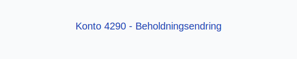

**Konto 4290 - Beholdningsendring** er en konto i Norsk Standard Kontoplan som brukes til å registrere **endringer i beholdningen av ferdige varer** i resultatregnskapet.

## Hva er beholdningsendring for ferdige varer?

*Beholdningsendring* refererer til differansen mellom verdien av ferdige varer på lager ved periodens slutt og ved periodens begynnelse.

Formelt kan endringen uttrykkes slik:

> **Beholdningsendring = Varelager ved periodens slutt − Varelager ved periodens begynnelse**

## Regnskapsføring

| Transaksjon             | Debet                                                                                                                                                                                           | Kredit                          |
|-------------------------|-------------------------------------------------------------------------------------------------------------------------------------------------------------------------------------------------|---------------------------------|
| Økning i ferdige varer  | [Konto 1400 - Råvarer og innkjøpte halvfabrikater](/blogs/kontoplan/1400-raavarer-og-innkjopte-halvfabrikater "Konto 1400 - Råvarer og innkjøpte halvfabrikater"), [Konto 1420 - Varer under utvikling](/blogs/kontoplan/1420-varer-under-utvikling "Konto 1420 - Varer under utvikling"), [Konto 1440 - Ferdige egentilvirkede varer](/blogs/kontoplan/1440-ferdige-egentilvirkede-varer "Konto 1440 - Ferdige egentilvirkede varer"), [Konto 1460 - Innkjøpte varer for videresalg](/blogs/kontoplan/1460-innkjopte-varer-for-videresalg "Konto 1460 - Innkjøpte varer for videresalg") | Konto 4290 - Beholdningsendring |
| Reduksjon i ferdige varer | Konto 4290 - Beholdningsendring                                                                                                                                                                 | [Konto 1400 - Råvarer og innkjøpte halvfabrikater](/blogs/kontoplan/1400-raavarer-og-innkjopte-halvfabrikater "Konto 1400 - Råvarer og innkjøpte halvfabrikater"), [Konto 1420 - Varer under utvikling](/blogs/kontoplan/1420-varer-under-utvikling "Konto 1420 - Varer under utvikling"), [Konto 1440 - Ferdige egentilvirkede varer](/blogs/kontoplan/1440-ferdige-egentilvirkede-varer "Konto 1440 - Ferdige egentilvirkede varer"), [Konto 1460 - Innkjøpte varer for videresalg](/blogs/kontoplan/1460-innkjopte-varer-for-videresalg "Konto 1460 - Innkjøpte varer for videresalg") |

## Vurderingsmetoder for varelager

Valg av **vurderingsmetode** påvirker periodens beholdningsendring. De vanligste metodene er:

* **FIFO (First In, First Out)**
* **LIFO (Last In, First Out)**
* **Veiet gjennomsnittskost**

For mer om lagervurdering, se [Hva er Varelager?](/blogs/regnskap/hva-er-varelager "Hva er Varelager? Komplett Guide til Lagerføring og Verdivurdering").

## Eksempler på beholdningsendring

1. **Positiv beholdningsendring:** Hvis beholdningen av ferdige varer øker fra kr 200 000 til kr 230 000, blir beholdningsendringen **+ kr 30 000**.
2. **Negativ beholdningsendring:** Hvis beholdningen av ferdige varer reduseres fra kr 250 000 til kr 220 000, blir beholdningsendringen **− kr 30 000**.

## Praktiske tips

* **Nøyaktige tellinger:** Sørg for korrekte og dokumenterte varetellinger ved rapportering.
* **Periodisering:** Avstem lagerbeholdning med regnskapsført verdi regelmessig.
* **Analyse:** Bruk beholdningsendringer til å følge produksjons- og salgstrender.

## Intern lenking og relaterte kontoer

* [Konto 1400 - Råvarer og innkjøpte halvfabrikater](/blogs/kontoplan/1400-raavarer-og-innkjopte-halvfabrikater "Konto 1400 - Råvarer og innkjøpte halvfabrikater")
* [Konto 1420 - Varer under utvikling](/blogs/kontoplan/1420-varer-under-utvikling "Konto 1420 - Varer under utvikling")
* [Konto 1440 - Ferdige egentilvirkede varer](/blogs/kontoplan/1440-ferdige-egentilvirkede-varer "Konto 1440 - Ferdige egentilvirkede varer")
* [Konto 1460 - Innkjøpte varer for videresalg](/blogs/kontoplan/1460-innkjopte-varer-for-videresalg "Konto 1460 - Innkjøpte varer for videresalg")
* [Konto 4300 - Innkjøp varer for videresalg høy sats](/blogs/kontoplan/4300-innkjop-varer-for-videresalg-hoy-sats "Konto 4300 - Innkjøp varer for videresalg høy sats")
* [Konto 4090 - Beholdningsendring](/blogs/kontoplan/4090-beholdningsendring "Konto 4090 - Beholdningsendring")
* [Konto 4190 - Beholdningsendring](/blogs/kontoplan/4190-beholdningsendring "Konto 4190 - Beholdningsendring")
* [Konto 4590 - Beholdningsendring](/blogs/kontoplan/4590-beholdningsendring "Konto 4590 - Beholdningsendring")
* [Konto 4990 - Beholdningsendring](/blogs/kontoplan/4990-beholdningsendring "Konto 4990 - Beholdningsendring")
* [Konto 7900 - Beholdningsendring anlegg under utførelse](/blogs/kontoplan/7900-beholdningsendring-anlegg-under-utforelse "Konto 7900 - Beholdningsendring anlegg under utførelse")
* [Konto 7910 - Ukurante varer](/blogs/kontoplan/7910-ukurante-varer "Konto 7910 - Ukurante varer")
* [Hva er Varelager?](/blogs/regnskap/hva-er-varelager "Hva er Varelager? Komplett Guide til Lagerføring og Verdivurdering")
* [Hva er en Kontoplan?](/blogs/regnskap/hva-er-kontoplan "Hva er en Kontoplan? Komplett Guide til Kontoplaner i Norsk Regnskap")

Beholdningsendringer for **ferdige varer** gir viktig innsikt i produksjonens fullføring og lagerstyring.
