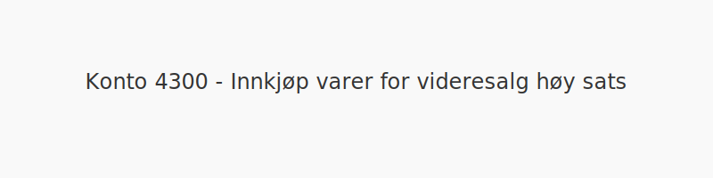
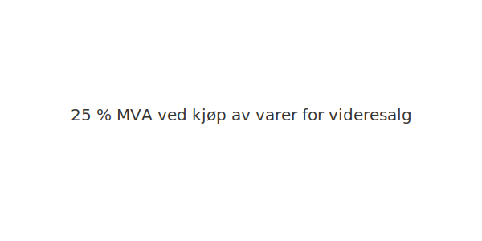

---
title: "4300-innkjop-varer-for-videresalg-hoy-sats"
meta_title: "4300-innkjop-varer-for-videresalg-hoy-sats"
meta_description: "**Konto 4300 - Innkjøp varer for videresalg høy sats** er en konto i Norsk Standard Kontoplan som brukes til å registrere **kjøp av varer for videresalg** s..."
slug: 4300-innkjop-varer-for-videresalg-hoy-sats
type: blog
layout: pages/single
---

**Konto 4300 - Innkjøp varer for videresalg høy sats** er en konto i Norsk Standard Kontoplan som brukes til å registrere **kjøp av varer for videresalg** som er **avgiftspliktige med høy MVA-sats (25 %)**.

## Hva er Innkjøp varer for videresalg høy sats?

*Innkjøp varer for videresalg høy sats* omfatter anskaffelser av handelsvarer for videresalg hvor leveransen er underlagt **25 % MVA**.

| Konto | Beskrivelse                          | MVA-sats |
|-------|--------------------------------------|----------|
| 4300  | Innkjøp varer for videresalg høy sats | 25 %     |

## NÃ¥r skal konto 4300 benyttes?

* Ved kjøp av innkjøpte varer til videresalg med **25 % MVA**
* Når leverandørfaktura inneholder standard MVA-sats på handelsvarer

## Regnskapsføring

| Transaksjon                      | Debet                                            | Kredit                           |
|----------------------------------|--------------------------------------------------|----------------------------------|
| Kjøp av varer for videresalg     | Konto 4300 - Innkjøp varer for videresalg høy sats | Konto 2400 - Leverandørgjeld     |
| Inngående merverdiavgift høy sats| Konto 1611 - Inngående merverdiavgift høy sats    | Konto 2400 - Leverandørgjeld     |
| Betaling til leverandør          | Konto 2400 - Leverandørgjeld                      | Konto 1920 - Bankinnskudd        |

## Vurdering og lageroppgjør

Kjøpene bokføres som varekostnad når varene forbrukes eller videreselges. For lageroppgjør og vurdering av varelager, se [Konto 1460 - Innkjøpte varer for videresalg](/blogs/kontoplan/1460-innkjopte-varer-for-videresalg "Konto 1460 - Innkjøpte varer for videresalg").

## Intern lenking og relaterte kontoer

Andre kontoer i NS 4102 som ofte benyttes sammen med konto 4300:

* [Konto 1400 - Råvarer og innkjøpte halvfabrikater](/blogs/kontoplan/1400-raavarer-og-innkjopte-halvfabrikater "Konto 1400 - Råvarer og innkjøpte halvfabrikater")
* [Konto 1460 - Innkjøpte varer for videresalg](/blogs/kontoplan/1460-innkjopte-varer-for-videresalg "Konto 1460 - Innkjøpte varer for videresalg")
* [Konto 1611 - Inngående merverdiavgift høy sats](/blogs/kontoplan/1611-inngaaende-merverdiavgift-hoy-sats "Konto 1611 - Inngående merverdiavgift høy sats")
* [Konto 2400 - Leverandørgjeld](/blogs/kontoplan/2400-leverandorgjeld "Konto 2400 - Leverandørgjeld")
* [Konto 1920 - Bankinnskudd](/blogs/kontoplan/1920-bankinnskudd "Konto 1920 - Bankinnskudd")
* [Konto 4200 - Innkjøp ferdig egentilvirkede varer høy sats](/blogs/kontoplan/4200-innkjop-ferdig-egentilvirkede-varer-hoy-sats "Konto 4200 - Innkjøp ferdig egentilvirkede varer høy sats")
* [Konto 4100 - Innkjøp varer under tilvirkning høy sats](/blogs/kontoplan/4100-innkjop-varer-under-tilvirkning-hoy-sats "Konto 4100 - Innkjøp varer under tilvirkning høy sats")
* [Konto 4330 - Innkjøp varer for videresalg middels sats](/blogs/kontoplan/4330-innkjop-varer-for-videresalg-middels-sats "Konto 4330 - Innkjøp varer for videresalg middels sats")
* [Konto 4360 - Frakt, toll og spedisjon](/blogs/kontoplan/4360-frakt-toll-og-spedisjon "Konto 4360 - Frakt, toll og spedisjon")
* [Konto 4370 - Innkjøpsprisreduksjon](/blogs/kontoplan/4370-innkjopsprisreduksjon "Konto 4370 - Innkjøpsprisreduksjon")
