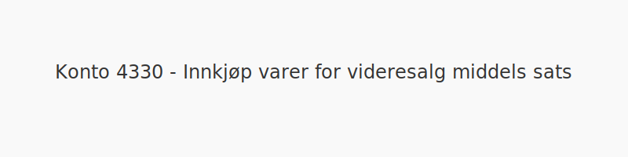
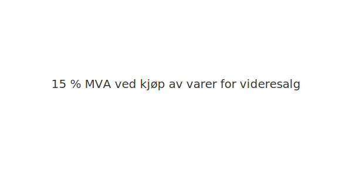

---
title: "Konto 4330 - Innkjøp varer for videresalg middels sats"
meta_title: "4330-innkjop-varer-for-videresalg-middels-sats"
meta_description: '**Konto 4330 - Innkjøp varer for videresalg middels sats** er en konto i Norsk Standard Kontoplan som brukes til å registrere **kjøp av varer for videresalg*...'
slug: 4330-innkjop-varer-for-videresalg-middels-sats
type: blog
layout: pages/single
---

**Konto 4330 - Innkjøp varer for videresalg middels sats** er en konto i Norsk Standard Kontoplan som brukes til å registrere **kjøp av varer for videresalg** som er **avgiftspliktige med middels MVA-sats (15 %)**.

## Hva er Innkjøp varer for videresalg middels sats?

*Innkjøp varer for videresalg middels sats* omfatter anskaffelser av handelsvarer for videresalg hvor leveransen er underlagt **15 % MVA**.

| Konto | Beskrivelse                                 | MVA-sats |
|-------|---------------------------------------------|----------|
| 4330  | Innkjøp varer for videresalg middels sats   | 15 %     |

## NÃ¥r skal konto 4330 benyttes?

* Ved kjøp av innkjøpte varer til videresalg med **15 % MVA**
* Når leverandørfaktura inneholder middels MVA-sats på handelsvarer

## Regnskapsføring

| Transaksjon                      | Debet                                           | Kredit                           |
|----------------------------------|-------------------------------------------------|----------------------------------|
| Kjøp av varer for videresalg     | Konto 4330 - Innkjøp varer for videresalg middels sats | Konto 2400 - Leverandørgjeld     |
| Inngående merverdiavgift middels sats | Konto 1613 - Inngående merverdiavgift middels sats | Konto 2400 - Leverandørgjeld   |
| Betaling til leverandør          | Konto 2400 - Leverandørgjeld                     | Konto 1920 - Bankinnskudd        |

## Vurdering og lageroppgjør

Kjøpene bokføres som varekostnad når varene forbrukes eller videreselges. For lageroppgjør og vurdering av varelager, se [Konto 1460 - Innkjøpte varer for videresalg](/blogs/kontoplan/1460-innkjopte-varer-for-videresalg "Konto 1460 - Innkjøpte varer for videresalg").

## Intern lenking og relaterte kontoer

Andre kontoer i NS 4102 som ofte benyttes sammen med konto 4330:

* [Konto 1400 - Råvarer og innkjøpte halvfabrikater](/blogs/kontoplan/1400-raavarer-og-innkjopte-halvfabrikater "Konto 1400 - Råvarer og innkjøpte halvfabrikater")
* [Konto 1460 - Innkjøpte varer for videresalg](/blogs/kontoplan/1460-innkjopte-varer-for-videresalg "Konto 1460 - Innkjøpte varer for videresalg")
* [Konto 1613 - Inngående merverdiavgift middels sats](/blogs/kontoplan/1613-inngaaende-merverdiavgift-middels-sats "Konto 1613 - Inngående merverdiavgift middels sats")
* [Konto 2400 - Leverandørgjeld](/blogs/kontoplan/2400-leverandorgjeld "Konto 2400 - Leverandørgjeld")
* [Konto 1920 - Bankinnskudd](/blogs/kontoplan/1920-bankinnskudd "Konto 1920 - Bankinnskudd")
* [Konto 4230 - Innkjøp ferdig egentilvirkede varer middels sats](/blogs/kontoplan/4230-innkjop-ferdig-egentilvirkede-varer-middels-sats "Konto 4230 - Innkjøp ferdig egentilvirkede varer middels sats")
* [Konto 4100 - Innkjøp varer under tilvirkning middels sats](/blogs/kontoplan/4130-innkjop-varer-under-tilvirkning-middels-sats "Konto 4130 - Innkjøp varer under tilvirkning middels sats")
* [Konto 4360 - Frakt, toll og spedisjon](/blogs/kontoplan/4360-frakt-toll-og-spedisjon "Konto 4360 - Frakt, toll og spedisjon")
* [Konto 4370 - Innkjøpsprisreduksjon](/blogs/kontoplan/4370-innkjopsprisreduksjon "Konto 4370 - Innkjøpsprisreduksjon")

* [Hva er Varelager?](/blogs/regnskap/hva-er-varelager "Hva er Varelager? Komplett Guide til Lagerføring og Verdivurdering")
* [Hva er en Kontoplan?](/blogs/regnskap/hva-er-kontoplan "Hva er en Kontoplan? Komplett Guide til Kontoplaner i Norsk Regnskap")

**Korrekt bokføring** av kjøp og MVA sikrer nøyaktig regnskapsføring og rett skattemelding.

