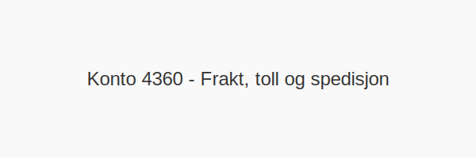

**Konto 4360 - Frakt, toll og spedisjon** er en konto i Norsk Standard Kontoplan som brukes til å registrere **frakt, toll og spedisjon** knyttet til kjøp av varer for videresalg.

## Hva er Frakt, toll og spedisjon for varer for videresalg?

*Frakt, toll og spedisjon for videresalg* omfatter **transportkostnader**, **importavgifter**, **tollbehandling** og **spedisjonsgebyrer** knyttet til innkjøp av handelsvarer for videresalg.

| Konto | Beskrivelse                         |
|-------|-------------------------------------|
| 4360  | Frakt, toll og spedisjon            |

## NÃ¥r skal konto 4360 benyttes?

* Når virksomheten kjøper **varer for videresalg** med tilleggsutgifter for **transport**, **toll og spedisjon**.
* Når frakt-, toll- eller spedisjonskostnaden belastes på lagerverdi for videresalg.
* Ved egenføring av **innkjøpskostnader** knyttet til lagerførte handelsvarer.

## Regnskapsføring

| Transaksjon                          | Debet                                     | Kredit                        |
|--------------------------------------|-------------------------------------------|-------------------------------|
| Frakt-, toll- og spedisjonskostnader | Konto 4360 - Frakt, toll og spedisjon     | Konto 2400 - Leverandørgjeld  |
| Betaling til transportør/leverandør  | Konto 2400 - Leverandørgjeld              | Konto 1920 - Bankinnskudd     |

## Eksempel på bokføring

| Beløp ekskl. MVA | MVA (25 %) | Total inkl. MVA |
|------------------|------------|-----------------|
| 2 000 NOK        | 500 NOK    | 2 500 NOK       |

## Fordeler ved korrekt bruk

* **Nøyaktig kostnadsfordeling** for handelsvarer
* **Korrekte lagerverdier** ved rapporteringen
* **Effektiv sporing** av transport- og tollkostnader

## Intern lenking og relaterte kontoer

* [Konto 4300 - Innkjøp varer for videresalg høy sats](/blogs/kontoplan/4300-innkjop-varer-for-videresalg-hoy-sats "Konto 4300 - Innkjøp varer for videresalg høy sats")
* [Konto 4330 - Innkjøp varer for videresalg middels sats](/blogs/kontoplan/4330-innkjop-varer-for-videresalg-middels-sats "Konto 4330 - Innkjøp varer for videresalg middels sats")
* [Konto 2400 - Leverandørgjeld](/blogs/kontoplan/2400-leverandorgjeld "Konto 2400 - Leverandørgjeld")
* [Konto 1920 - Bankinnskudd](/blogs/kontoplan/1920-bankinnskudd "Konto 1920 - Bankinnskudd")
* [Konto 4370 - Innkjøpsprisreduksjon](/blogs/kontoplan/4370-innkjopsprisreduksjon "Konto 4370 - Innkjøpsprisreduksjon")
* [Konto 4500 - Fremmedytelser og underentreprise](/blogs/kontoplan/4500-fremmedytelser-og-underentreprise "Konto 4500 - Fremmedytelser og underentreprise")
* [Konto 6100 - Frakt, transportkostnad og forsikring](/blogs/kontoplan/6100-frakt-transportkostnad-og-forsikring "Konto 6100 - Frakt, transportkostnad og forsikring")
* [Konto 6110 - Toll og spedisjonskostnad](/blogs/kontoplan/6110-toll-og-spedisjonskostnad "Konto 6110 - Toll og spedisjonskostnad")
* [Hva er en Kontoplan?](/blogs/regnskap/hva-er-kontoplan "Hva er en Kontoplan? Komplett Guide til Kontoplaner i Norsk Regnskap")

**Korrekt bokføring** av frakt-, toll- og spedisjonskostnader ved kjøp av varer for videresalg sikrer nøyaktig regnskap og riktig lagerverdi.
